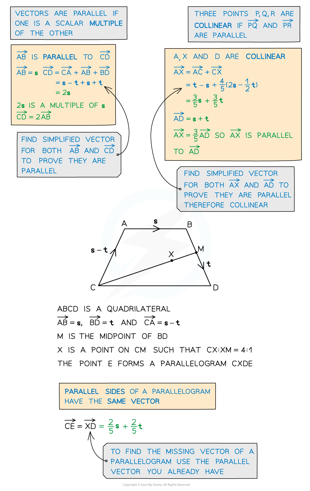
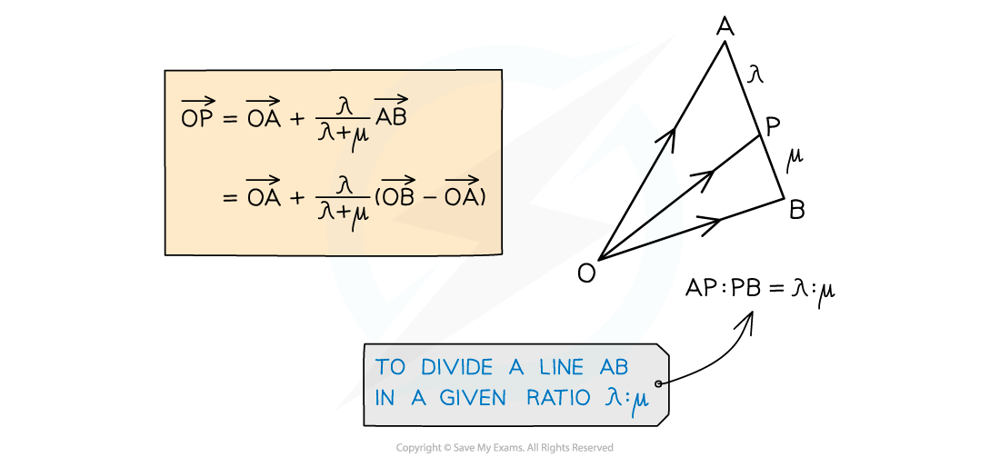
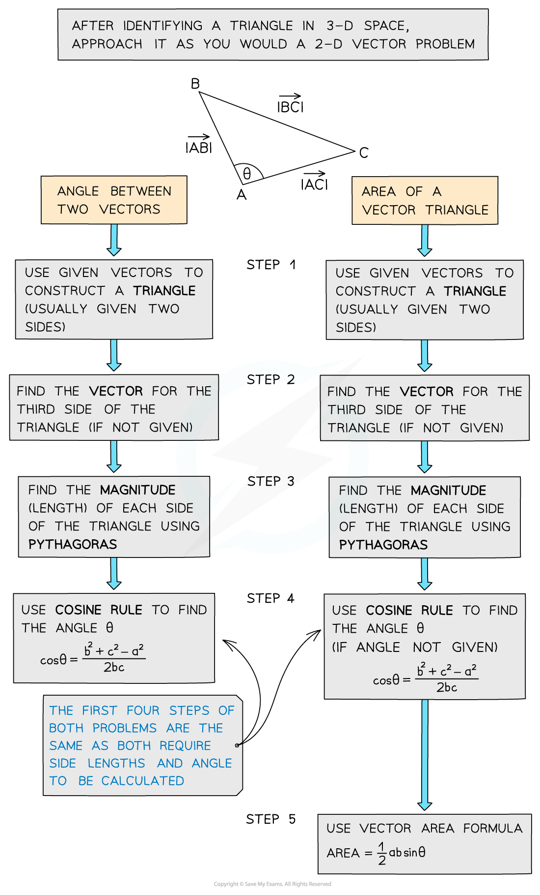

# Problem Solving using Vectors

## Problem Solving using Vectors

> **Spec point** — `spcpt_Fj2Hmc45nNr3xrF3`

## Problem solving using vectors

### How are vectors used for problem solving?

- Vectors can be used to prove two lines are **parallel **(see Vector Addition)
- They can also be used to show points are **collinear **(lie on the same straight line)
- Vectors can be used to find missing vertices of a given shape
- You will need a good understanding of how to divide a line segment into a given ratio

### When do I use trigonometry in vector problems?

- When problem-solving with vectors, trigonometry can help us:

  - convert between **component form** and magnitude/direction form (see Magnitude Direction)
  - find the **angle between two vectors** using **Cosine Rule **(see Non-Right-Angled Triangles)
  - find the **area of a triangle** using a variation of **Area Formula **(see Non-Right-Angled Triangles)

> **Exam Hint**
> - Think of vectors like a journey from one place to another – you may have to take a detour eg. A to B might be A to O then O to B.
> - Diagrams can help, if there isn’t one, draw one. For a given diagram labelling all known vectors and quantities will help.

> **Worked Example**
> 
