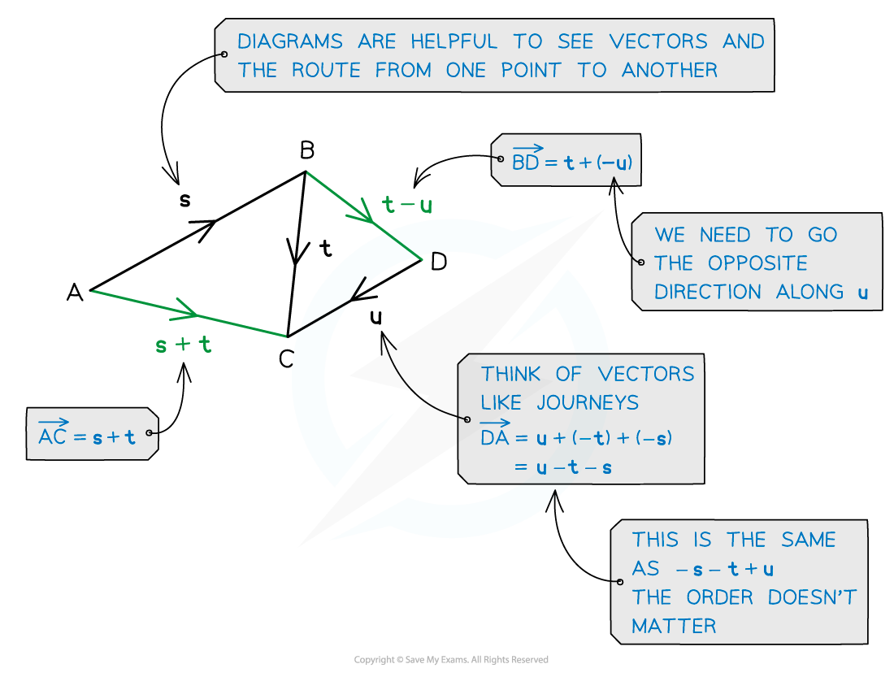
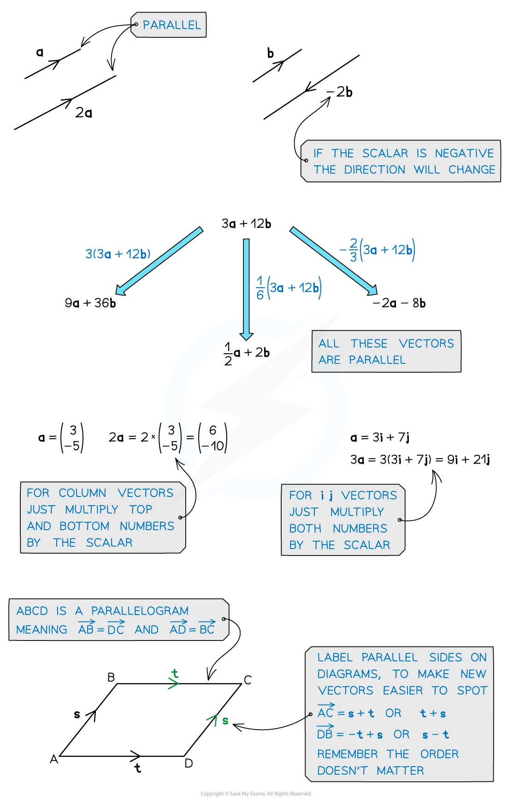

# Vector Addition

## Vector Addition

> **Spec point** — `spcpt_2HRssHdD9m3yg6JN`

## Vector addition

### What is vector addition?

- **Adding** vectors together lets us describe the **movement between two points**
- The **single** vector this creates is called the **resultant** vector
- **Subtracting** a vector is the same as **adding the negative** vector
- Adding the vectors** PQ **and **QP **gives the zero vector, denoted by a bold zero **0**

** **

- You can add and subtract vectors in any of the forms previously described:

** **

### Scalars and parallel vectors

- Multiplying by a positive **scalar** only changes the **size** of a vector, not its **direction**
- Two vectors are **parallel** if and only if one is a **scalar multiple** of the other

> **Exam Hint**
> - Think of vectors like a journey from one place to another – you may have to take a detour eg. A to B might be A to O then O to B.
> - Diagrams can help, so if there isn’t one, draw one. If there are any, labelling parallel vectors will help.

> **Worked Example**
> 
