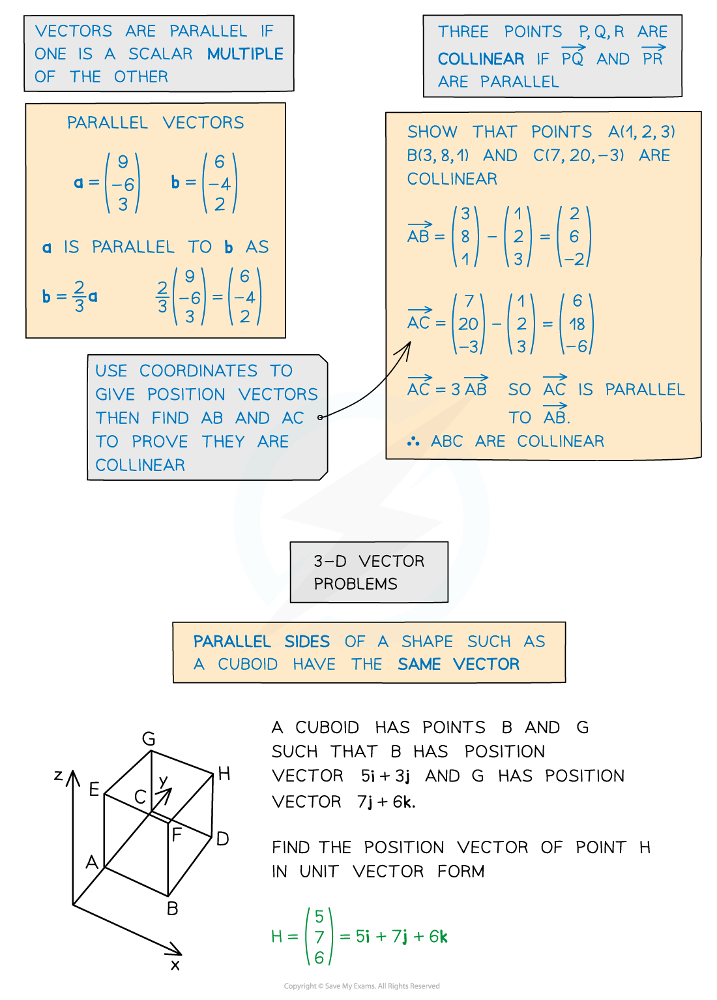
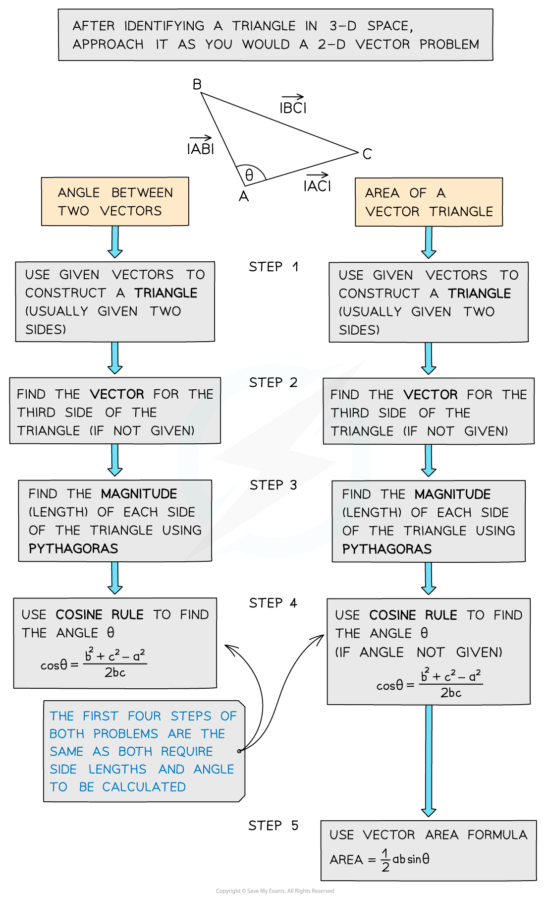

# Problem Solving using 3D Vectors

## Problem Solving using 3D Vectors

> **Spec point** — `spcpt_2PGdnfT8zrW4HcHn`

## Problem solving using 3D vectors

### How are 3D vectors used for problem solving?

- 3D vector problems can be solved using the same principles as **2D vector problems **(see Problem Solving using Vectors)
- Vectors can be used to prove two lines are **parallel**, to show points are **collinear** (lie on the same straight line) or to find missing vertices of a given shape

### When do I use trigonometry in 3D vector problems?

- 3D vector problems can also involve using trigonometry to:

  - find the **angle between two vectors** using **Cosine Rule**
  - find the **area of a triangle** using a variation of **Area Formula**

- You can find the angle between a vector and any one of the coordinate axes by using the following formulae

** **

** **

- These formulae are not in the exam formulae book
- However, they may be derived using SOHCAHTOA as shown in the diagram
- The formulae also work for vectors in two dimensions

> **Exam Hint**
> - If there is a diagram, labelling all known vectors and quantities will help, and don’t worry about trying to make your diagram 3-D, as long as you label it well.

> **Worked Example**
> 
