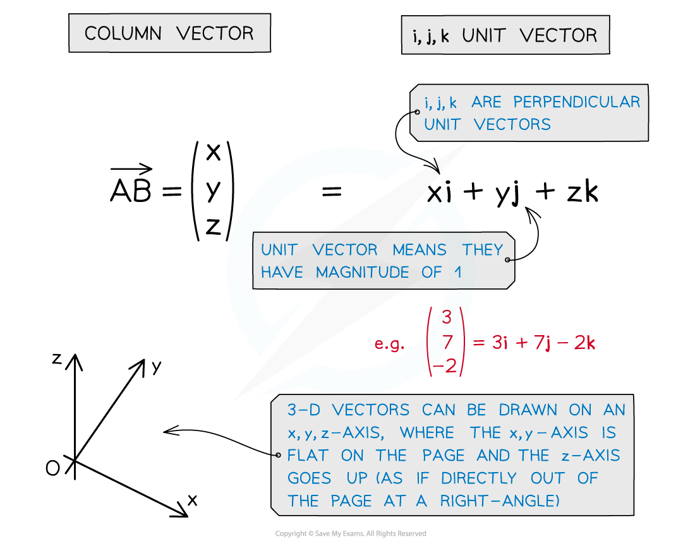
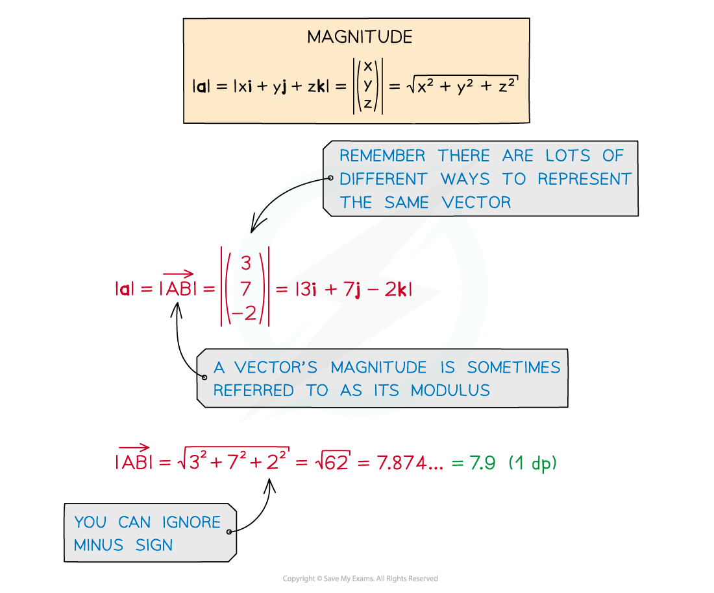
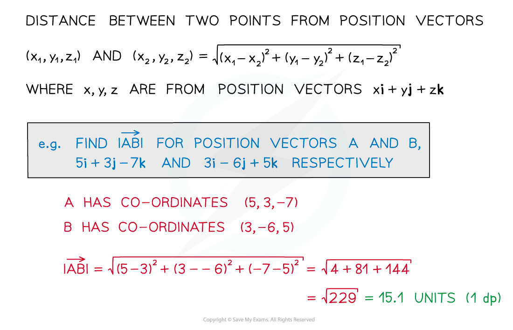
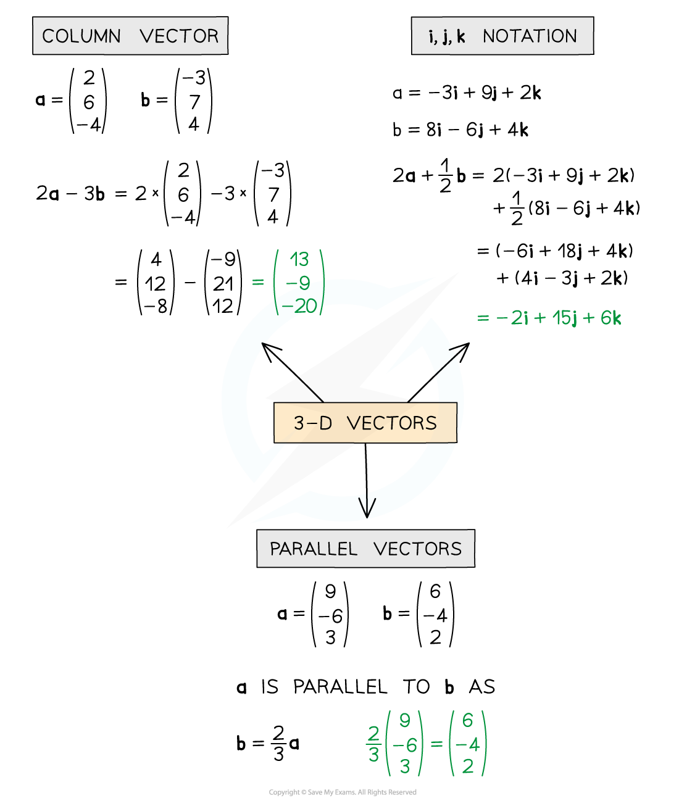
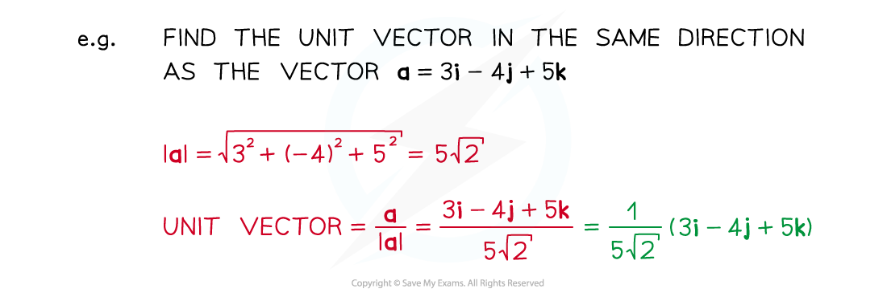

# Vectors in 3 Dimensions

## Vectors in 3 Dimensions

> **Spec point** — `spcpt_XrvxCtZwqGx2bXZq`

## Vectors in 3 dimensions

### What is a 3D vector?

- Vectors represent a movement of a certain **magnitude** (size) in a given **direction** You should have already come across (2D) **vectors** at AS (see Basic Vectors)
- 3D vectors describe the **position of a point** in a 3D space in relation to the *origin*
- They can be represented in different ways such as a **column vector** or in **i, j, k unit vector form**

### Magnitude of a 3D vector

- The magnitude of a 3D vector is simply its size
- Like 2D vectors we can find the **magnitude** using Pythagoras’ theorem (see Magnitude Direction)

- For 3D **position vectors** we can find the distance between two points
- By using the respective co-ordinates we can calculate the magnitude of the vector between them:

### 3D vector addition, scalars, parallel vectors and unit vectors

- 3D vectors work in the same way as 2D vectors, just in three dimensions rather than two
- **Vector addition** and subtraction and scalar multiplication can be carried out in exactly the same way, this time involving **i, j **and** k** or x, y and z
- 3D vectors are also **parallel** if one is a **multiple** of the other

** **

- **Unit vectors** in 3D are found in exactly the same way as in 2D

** **

> **Worked Example**
> 
