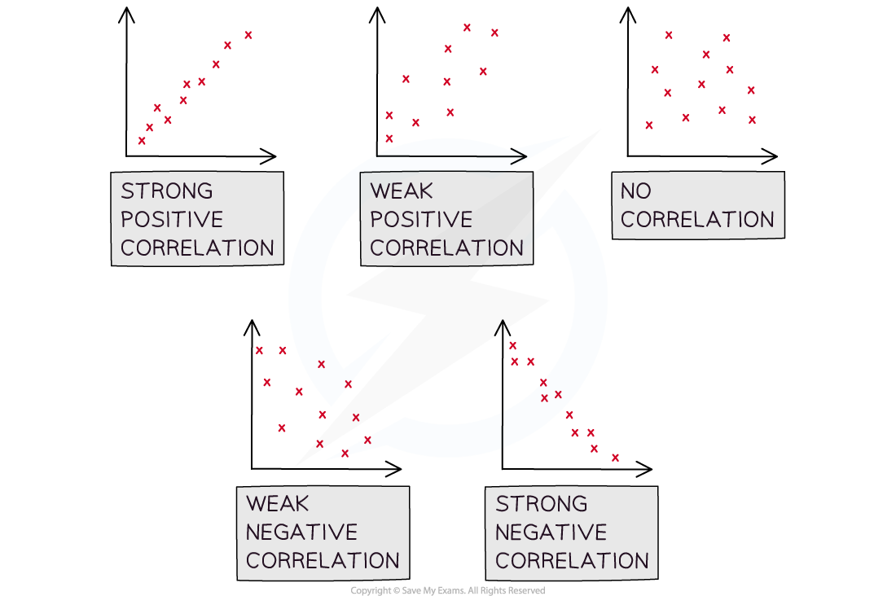

# Scatter Diagrams

## Scatter Diagrams

> **Spec point** — `spcpt_X9fNG9FC69h9J6CP`

## Scatter Diagrams

#### What does bivariate data mean?

- A lot of statistics is about looking at how different factors, or **variables** change how data behaves
- **Bivariate data **is data which is collected on two variables and looks at how one of the factors affects the other

  - Each data value from one variable will be paired with a data value from the other variable
  - The two variables are often related, but do not have to be

#### What is a scatter diagram?

- A **scatter diagram **is a way of graphing bivariate data

  - You may be asked to plot, or add to, a scatter diagram
  - One variable will be on the $x$ – axis and the other will be on the  $y$– axis
  - The variable that can be **controlled** in the data collection is known as the **independent **or **explanatory variable** and is plotted on the $x$ – axis
  - The variable that is **measured** or discovered in the data collection is known as the **dependent **or **response variable** and is plotted on the $y$ – axis
- Scatter diagrams allow statisticians to look for relationships between the two variables

  - Some scatter diagrams will show a clear relationship know as **correlation **(see below)
  - Others will not display on obvious relationship
  - If a scatter diagram shows a relationship you may be asked to identify ***outliers***

> **Worked Example**
> The scatter diagram below shows the number of Save My Exams question packs completed by a group of students and the percentage score they received in their A-Level Statistics exam.
> 
> 
> 
> (i) State which of the variables is the explanatory variable and which is the response variable.
> 
> (ii) Explain why the number of question packs completed is on the $x$– axis.
> 
> (iii) Another student completed 50 question packs and scored 80% on their A Level Statistics exam, add this data to the scatter diagram.
> 
> **Answer:**
> 
> 
> 
> 

> **Exam Hint**
> - Learn the vocabulary for the types of variables as you could be asked a question on this. Make sure you check the scales carefully when plotting any points.

## Correlation

> **Spec point** — `spcpt_GVvzRKhmwGbc8Mz4`

## Correlation

#### What is correlation?

- **Correlation** is how the relationship between the two variables is described
- **Perfect linear correlation **means that the bivariate data will all lie on a straight line on a scatter diagram
- Linear correlation can be **positive **or **negative **and it can be **strong **or **weak**

  - **Positive correlation **describes a data set where both variables are increasing
  - **Negative correlation **describes a data set where one variable is increasing and the other is decreasing
- When describing correlation you should say whether it is positive or negative and also say whether it is strong or weak
- If correlation exists then there could be outliers, these will be data points that do not fit the pattern seen on the graph

  - There will likely be a maximum of one or two outliers on any scatter diagram
  - You may be asked to identify the outliers

#### What is the difference between correlation and causation?

- It is important to be aware that just because correlation exists, it does not mean that the change in one of the variables is **causing** the change in the other variable

  - Correlation does not imply causation!
- If a change in one variable **causes** a change in the other then the two variables are said to have a **causal relationship**

  - Observing correlation between two variables does **not always** mean that there is a causal relationship
  - Look at the two variables in question and consider the context of the question to decide if there could be a causal relationship
  
    - If the two variables are temperature and number of ice creams sold at a park then it is likely to be a causal relationship
    - Correlation may exist between global temperatures and the number of monkeys kept as pets in the UK but they are unlikely to have a causal relationship
  - Observing a relationship between two variables can allow you to create a hypothesis about those two variables

> **Worked Example**
> The scatter diagram below shows the number of Save My Exams question packs completed by a group of students and the percentage score they received in their A-Level Statistics exam.
> 
> 
> 
> (i) Describe the correlation shown in the scatter diagram.
> 
> (ii) Decide if you think there could be a causal relationship between the two variables and explain your reasoning.
> 
> **Answer:**
> 
> 

## Linear Regression

> **Spec point** — `spcpt_dgjvmYBCVV34z5fM`

## Linear Regression

#### What is linear regression?

- If strong linear correlation exists on a scatter diagram, then a** line of best fit **can be drawn

  - This is a **linear graph** added to the scatter diagram that best approximates the relationship between the two variables
  - Previously will have been drawn by eye as a line that fits closest to the data values
  - The data can be used to calculate the equation of the straight line that represents the best fit of the relationship between the two variables
- The **least squares regression line **is the line of best fit that minimises the **sum of the squares **of the gap between the line and each data value

  - This is usually called the regression line and can be calculated either by looking at the vertical or the horizontal distances between the line and the data values
  - If the regression line is calculated by looking at the vertical distances it is called the **regression line of y on x**
  - If the regression line is calculated by looking at the horizontal distances it is called the **regression line of x on y**
  
    - The regression line of x on y is rarely used and you are unlikely to come across it at this level
- The **regression line of y on x **is written in the form $y=a+bx$

  - *b* is the **gradient** of the line and represents the change in $y$ for each individual unit change in $x$
  - *a* is the y – intercept and shows the value of $y$ for which $x$ is zero
  - It is useful to know that the point $(\overline{x},\overline{y})$  will lie on the regression line

#### How to use a regression line?

- Drawing a regression line is done in the same way as drawing a straight line graph, substitute some values from the **independent data set** to help you
- The regression line can be used to decide what type of correlation there is if there is no scatter diagram

  - If b is positive then the data set has **positive correlation **and if b is negative then the data set has **negative correlation**
- The value of *b* can be used to interpret how the data is changing

  - *b* is the ***gradient*** of the line and represents the change in *y * for each individual unit change in $x$
- The regression line can also be used to **predict** the value of a **dependent variable** from an **independent variable**

  - Predictions should only be made for values of the dependent variable that are within the range of the given data
  - Making a prediction within the range of the given data is called **interpolation**
  - Making a prediction outside of the range of the given data is called **extrapolation **and is much less reliable
  - The prediction will be more reliable if the number of data values in the original sample set is bigger

> **Worked Example**
> The scatter diagram below shows the number of Save My Exams question packs completed by a group of students, $x,$ and the percentage score they received in their A-Level Statistics exam, $y$.
> 
> 
> 
> The equation of the regression line of $y$ on $x$ is $y=18+1.3x$
> 
> (i) Draw the regression line onto the scatter diagram.
> 
> (ii) Interpret the meaning of the values 18 and 1.3 in the scatter diagram.
> 
> (iii) Explain why the regression line given should not be used to estimate the percentage when someone has completed 80 question packs.
> 
> **Answer:**
> 
> 
> 
> 

> **Exam Hint**
> - Remember that the value of b is the gradient of the regression line, a greater value of b **does not** mean stronger correlation. When using a regression line to make a prediction make sure that the value you are predicting from falls within the range of the data used to calculate the regression line.
