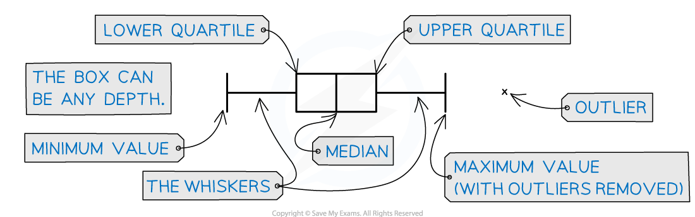

# Box Plots

## Box Plots

> **Spec point** — `spcpt_krJj9pCY9WhNrtc4`

## Box plots

### What is a box plot?

- A box plot is a graph that clearly shows key statistics from a data set

  - It shows the **median, quartiles, minimum **and **maximum values **and **outliers**
  - It does not show any other individual data items
- The middle 50% of the data will be represented by the box section of the graph and the lower and upper 25% of the data will be represented by each of the whiskers
- Any outliers are represented with a cross on the outside of the whiskers

  - If there is an outlier then the whisker will end at the value before the outlier
- Only one axis is used when graphing a box plot

  - It is still important to make sure the axis has a clear, even scale and is labelled with units
- Box plots are often used for comparing two sets of data

  - Both box plots will be drawn one above the other on the same scale on the x-axis
  - They are useful for **comparing data** because it is easy to see the main shape of the distribution of the data from a box plot

***The key features of a box plot***

> **Worked Example**
> The incomplete box plot below shows the tail lengths in cm of some students’ pets.
> 
> 
> 
> (a) Given that the median tail length was 21 cm, complete the box plot.
> 
> (b) Find the range and interquartile range of the tail lengths.
> 
> **Answer:**
> 
> 
> 
> 

> **Exam Hint**
> - Remember a box plot is a graph and should be treated like one, even though there is only one axis. It should have a title, a clear, even scale that is labelled with units if there are any. If drawing two box plots on the same axis label each one clearly.

## Cumulative Frequency

> **Spec point** — `spcpt_scsQmXgJygJKWzhy`

## Cumulative frequency

### What is a cumulative frequency graph?

- A cumulative frequency graph is used with data that has been organised into a **grouped frequency **table
- The cumulative frequency graph can be used to find estimates of percentiles and quartiles

  - As the data is grouped, it is not possible to find the actual values of these statistics

### What are the main features of a cumulative frequency graph?

- A cumulative frequency graph considers how much data there is up to a certain value, including the data in that group and the one below
- Cumulative frequency will always be plotted on the y – axis

  - Consider the scale carefully because this will usually be a large number
  - You may be asked to add to one or both axes, remember to label both axes clearly and include units on the x – axis if they are needed
- The cumulative frequency is calculated by adding the frequency in each group, or class, to the frequency in the ones before

  - This is essentially accumulating the frequencies as you go
- The cumulative frequency for each class must be plotted against the **upper boundary** of each corresponding class

  - The cumulative frequency that corresponds with each upper boundary will not only consider the frequency of the data in that class, but all of the data in the groups below it too
- When the points have been plotted they should be joined up with a smooth curve

  - However, some may be joined with straight lines from point to point

### How do we read statistics from a cumulative frequency graph?

- Quartiles and percentiles can be read from a cumulative frequency graph

  - The median, *Q*2 is read from the y – axis scale at the $\frac{n}{2}$th value
  - The lower quartile, *Q**1* ,is read from the $\frac{n}{4}$th value and the upper quartile, *Q*3 is read from the $\frac{3n}{4}$th value
  - Any percentile can be read from the graph by finding the percent of the total frequency and reading from the value on the y - axis
- To read the corresponding data value once the position on the y – axis is known, use a ruler to draw a line from the y – axis to the graph and then down to the x – axis
- Sometimes the frequency of values greater than or less than a particular data value will need to be found, this time you will have to read from the x – axis to the y – axis

  - Take particular care if the question asks for a frequency greater than a particular data value, the value found from the y – axis will need to be subtracted from the total frequency

> **Worked Example**
> The cumulative frequency graph below shows the lengths in cm, $l$ , of a group of puppies in a training group.
> 
> 
> 
> (i) Given that the group $40<l\leq45$ was one of the groups used in the data collection, find the number of puppies that were in this group.
> 
> (ii) Use the graph to find an estimate for the interquartile range of the puppies.
> 
> (iii) $x$ % of the puppies are greater than $53.5$cm long, use your graph to find an estimate for the value of $x$.
> 
> **Answer:**
> 
> 
> 
> 
> 
> 

> **Exam Hint**
> - If you are asked to read values from your graph make sure you use a ruler and mark the lines on clearly to show where you took your readings from. Remember that the graph shows the accumulated frequencies so if you need only the frequency you may need to subtract the previous value.
