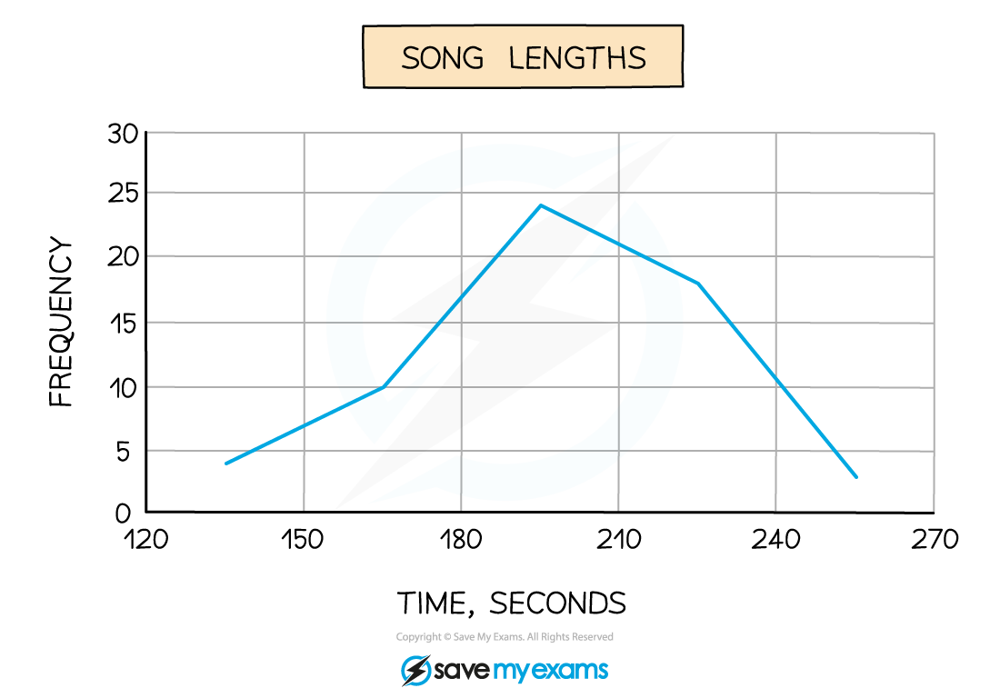

# Histograms

## Histograms

> **Spec point** — `spcpt_TSZNDk4FzrJGTnBy`

## Histograms

### What is a histogram?

- A histogram is similar to a bar chart but with some **key differences**

  - A histogram is for displaying **grouped continuous data **whereas a bar chart is for **discrete** or **qualitative data**
  - There will never be any gaps between the bars of adjacent groups in a histogram
  - Whilst in a bar chart the frequency is read from the **height **of the bar, in a histogram the height of the bar is the **frequency density**
- On a histogram **frequency density** is plotted on the y – axis

  - This allows a histogram to be plotted for **unequal class intervals**
  - It is particularly useful if data is spread out at either or both ends
- The **area** of each bar on a histogram will be **proportional **to the frequency in that class

### What are the key features of a histogram?

- You will not be asked to draw a histogram but you may have to add information to one so you should make sure you are familiar with the process for drawing one
- **Step 1.**  Always check that there are no gaps between the upper boundary of a class and the lower boundary of the next class

  - If there are gaps you will need to close them by changing the boundaries before carrying out any calculations
  
    - Consider whether the values are rounded or truncated before closing the gaps
- **Step 2.**  Find the **class width **of each group by subtracting the lower boundary from the upper boundary
- **Step 3**.  Calculate the **frequency density** for each group using the formula:

$\mathrm{frequency} \mathrm{density}=k\times\frac{\mathrm{frequency}}{\mathrm{class} \mathrm{width}}$

- **Step 4.  **The histogram will be drawn with the data values on the x – axis and frequency density on the y – axis

  - Remember that the scale on both axes must be even, although the class widths may be uneven
  
    - Both axes should be clearly labelled and units included on the x – axis
  - Most often, the bars will have different widths
- Occasionally you will be asked to add a **frequency polygon** to the histogram

  - This is done by joining up the midpoints at the top of each bar
  - You should not join up the first or last midpoint to the x – axis (it is not really a polygon!)

### How do I interpret a histogram?

- It is important to remember that the y – axis does not tell us the frequency of each bar in the histogram
- The **area **of the bar gives information about the frequency

  - Most of the time, the frequency will be the area of the bar and is found by multiplying the class width by the frequency density
  - Occasionally, the frequency will be proportional to the area of the bar
  
    - Frequency = $k\times\mathrm{area}$
    - In these cases more information will be given to help you find the value of *k*
- You may be asked to find the frequency of part of a bar within a histogram

  - Find the area of that section of the bar using any information you have already found out
  - You will need to have found the value of *k* first

### What are frequency polygons?

- **Frequency** **polygons** are a very simple way of showing frequencies/frequency densities for **continuous**, **grouped** data and give a quick guide to how frequencies change from one class to the next

### What do I need to know about frequency polygons?

- Apart from plotting and joining up points with straight lines there are 2 rules for frequency polygons:

  - Plot points at the **MIDPOINT** of class intervals
  - Unless one of the frequencies/densities is 0 do not join the frequency polygon to the x-axis, and do not join the first point to the last one
- The result is not actually a polygon but more of an open one that ‘floats’ in mid-air!
- You may be asked to draw a frequency polygon and/or use it to make comments and compare data

> **Worked Example**
> The table below and its corresponding histogram show the mass, in kg, of some new born bottlenose dolphins.
> 
> | **Mass, **$m$ **kg** | **Frequency** |
> |---|---|
> | $4\leqm<8$ | 4 |
> | $8\leqm<10$ | 15 |
> | $10\leqm<12$ | 19 |
> | $12\leqm<15$ |   |
> | $15\leqm<30$ | 6 |
> 
> 
> 
> (i) Use the histogram to find the value of $k$ in the formula $\mathrm{frequency} \mathrm{density}=k\times\frac{\mathrm{frequency}}{\mathrm{class} \mathrm{width}}$
> 
> (ii) Estimate the number of dolphins whose weight is greater than 13 kg.
> 
> **Answer:**
> 
> 
> 
> 

> **Exam Hint**
> - Remember that the area of a bar in a histogram is not always the frequency itself but could be proportional to the frequency. Look carefully at the scales on the axes, it will rarely be a simple 1 unit to 1 square.
