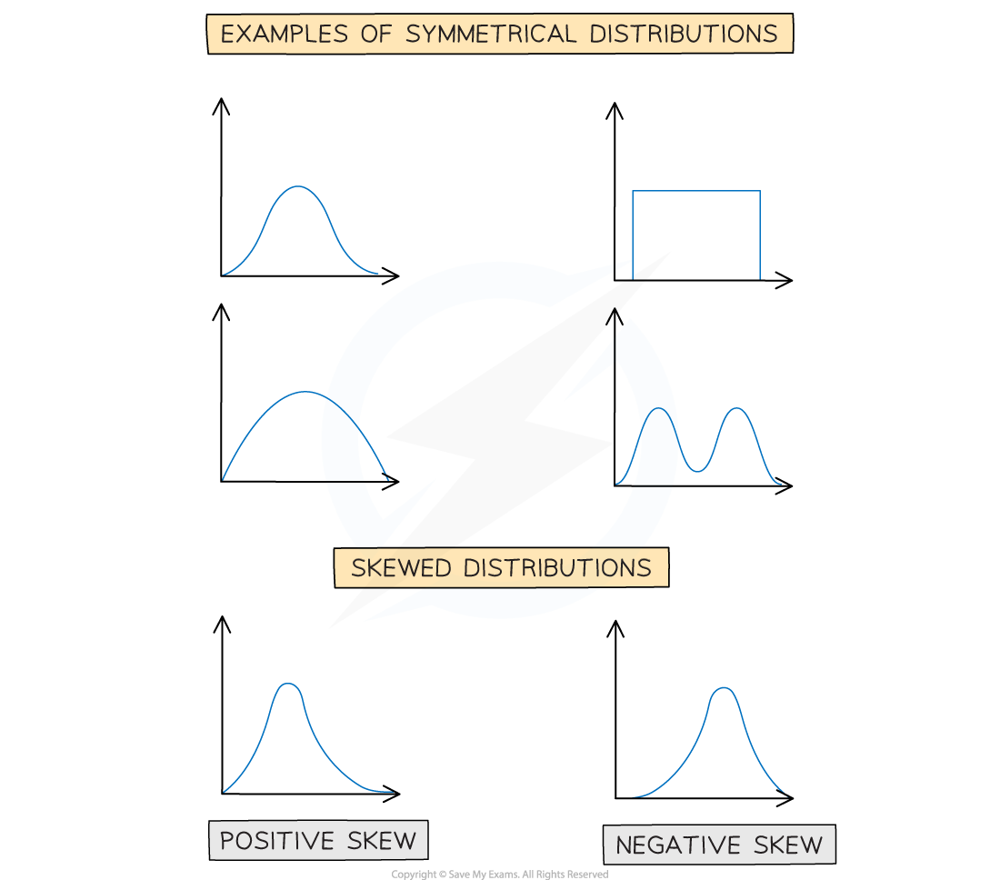
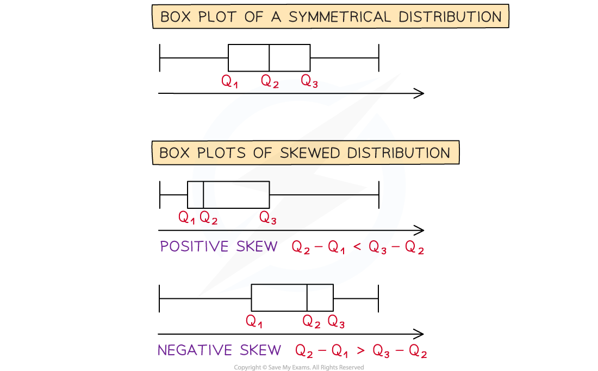
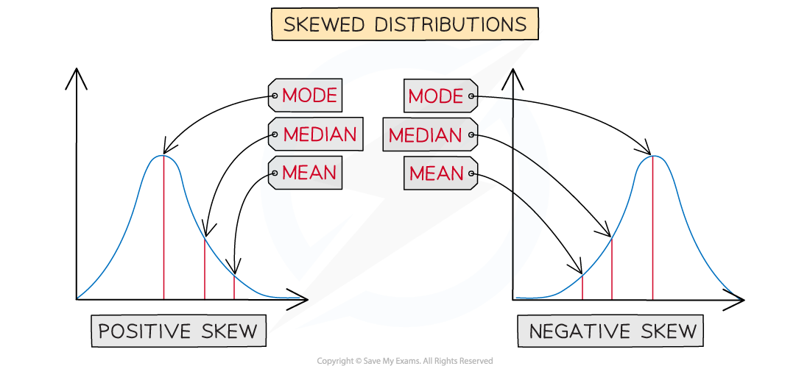

# Skewness

## Skewness

> **Spec point** — `spcpt_3pFxhzpdSvQ8YGSD`

## Skewness

The distribution of a data set is either symmetrical or it has skewness.

#### What is skewness?

- Skewness describes the way in which data in a non – symmetrical distribution is leaning

- A distribution that has its tail on the right side has **positive skew**
- A distribution that has its tail on the left side has **negative skew**

- If the distribution is shown on a box plot looking at the difference between the quartiles can help decide how it is skewed

  - If the median is closer to the lower quartile then the distribution has **positive skew**
  
    - *Q**3** -  Q**2* > *Q**2**- Q**1*
  - If the median is closer to the upper quartile then the distribution has **negative skew**
  
    - *Q**3** -  Q**2* < *Q**2** - Q**1*

- Looking at the values of the statistics can help you decide whether distribution is positively skewed or negatively skewed

  - In a positively skewed distribution
  
    - Mode < median < mean
  - In a negatively skewed distribution
  
    - Mean < median < mode

> **Exam Hint**
> - It can help to comment on skewness when asked to compare distributions.
