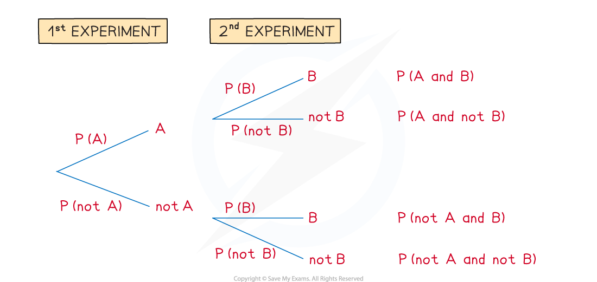
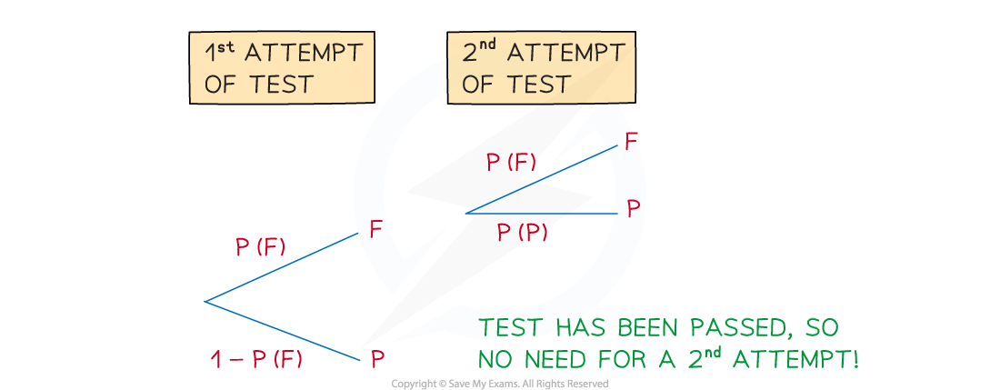

# Tree Diagrams

## Tree Diagrams

> **Spec point** — `spcpt_Q9VkVVBtSYX8n8rN`

## Tree diagrams

### What is a tree diagram?

- A **tree** **diagram** is used to

  - show the (combined) ***outcomes***** **of more than one ***event***** **that happen one after the other
  - help calculate probabilities when **AND** and/or **OR**’s are involved
- **Tree** **diagrams** are mostly used when there are only two **mutually** **exclusive** **outcomes** of interest

  - e.g. “*Rolling a 6 on a die*” and “*Not rolling a 6 on a die*”
- More than three outcomes per event can be shown on a tree diagram but they soon become difficult to draw and so lose their effectiveness
- **Tree** **diagrams** are very helpful when **probabilities** for a second event change **depending** on the first event

### How do I draw and label a tree diagram?

- In the second experiment, P(*B*)  may be different on the top set of branches than the bottom set

  - this is because the top set of branches follow on from **event A** but the bottom set of branches follow on from **event “**$notA$ **”**
  - e.g.     This is most commonly seen in drawing one item at random, not replacing it, then drawing another
- Sometimes a second branch may not be needed following a first event

  - e.g.     In aiming to pass a test (***experiment***) the event **fail **on the first attempt would require a second attempt but the event **pass** on the first attempt would not

### How do I find probabilities from tree diagrams?

- Interpret questions in terms of **AND** and/or **OR** (See 1 Basic Probability)
- Draw, or complete a given, tree diagram Determine any **missing** probabilities; often using $1-P(A)$ and considering if probabilities change depending on the outcome from the 1st experiment
- Write down the (final) outcome of the combined events and work out their probabilities – these are **AND** statements $P(A\mathrm{AND}B)=P(A)\timesP(B)$                                *(“Multiply along branches”)*

  - Do not simplify fractions yet – it’ll be easier to calculate with them later
  
    - you can of course use your calculator
- If more than one (final) outcome is required to answer a question then add their probabilities – these are **OR** statements $P(ABOR"notA""notB")=P(AB)+P("notA""notB")$    *(“Add outcomes”)*

  - This applies since all the (final) outcomes are **mutually** **exclusive**
  - Note that $AB,"notA""notB"$ are implied **AND** statements (for example *AB* means  *A* and *B*)
- When you are confident with tree diagrams you can just pull out the (final) outcome(s) you need to answer a question rather than routinely list all of them

> **Worked Example**
> A contestant on a game show has three attempts to hit a target in a shooting game. They have a maximum of three attempts to hit the target in order to win the star prize – a speedboat.  If they do not hit the target within three attempts, they do not win anything.
> 
> The probability of them hitting the target first time is 0.2.  With each successive attempt the probability of them failing to hit the target is halved.
> 
> Find the probability that a contestant wins the star prize of a speedboat.
> 
> **Answer:**
> 
> 

> **Exam Hint**
> - It can be tricky to get a tree diagram looking neat and clear first attempt – it can be worth drawing a rough one first, especially if there are more than two outcomes or more than two events; do keep an eye on the exam clock though!
> - Always worth another mention – tree diagrams make particularly frequent use of the result $P(\mathrm{not}A)=1-P(A)$
> - Tree diagrams have built-in checks
> 
>   - the probabilities for each pair of branches should add up to 1
>   - the probabilities for each outcome of combined events should add up to 1
