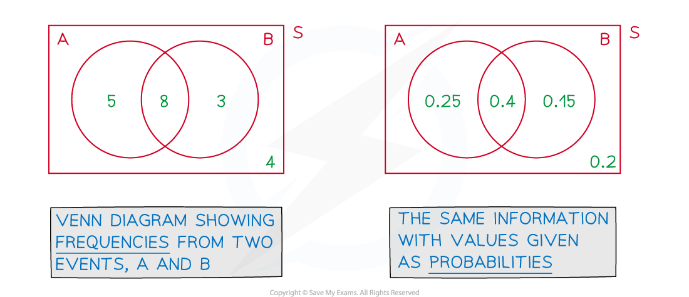
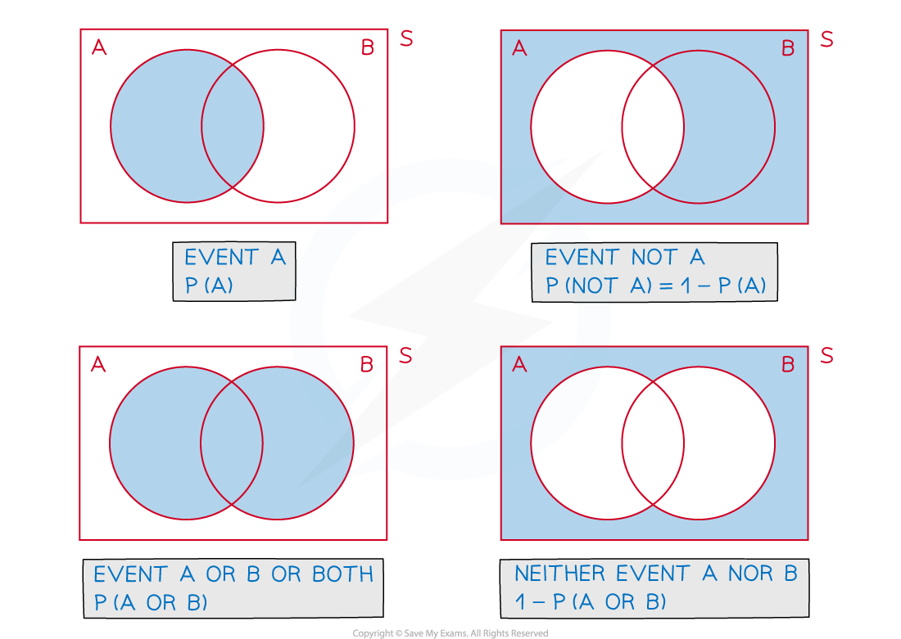
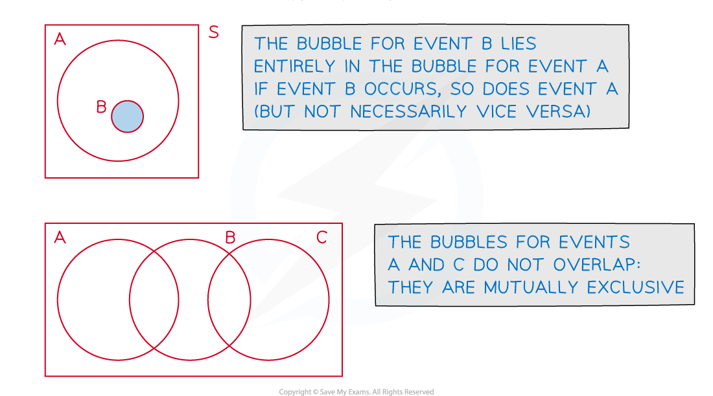

# Venn Diagrams

## Venn Diagrams

> **Spec point** — `spcpt_YrhS9dcy42xvf5Qf`

## Venn diagrams

### What is a Venn diagram?

- A Venn diagram is a way to illustrate ***events*** from an ***experiment*** and are particularly useful when there is an overlap (or lack of) between possible ***outcomes***
- A Venn diagram consists of

  - a **rectangle** representing the **sample** **space**
  - a **bubble** (usually drawn as a circle/ellipse/oval) for each **event**
  
    - Bubbles may or may not overlap depending on which **outcomes** are shared between **events**
    - Bubble(s) is not a technical term but we like it!

### How do I interpret a Venn diagram?

- The rectangle is usually labelled with an $S$ – as it represents the **sample** **space **(all possible **outcomes** from the **experiment)**

  - It is often referred to as the Universal Set and is commonly labelled with $S,U,ξ$ (the Greek lower case letter Xi) or $E$(Kunstler script font) There is no standardised symbol used for this purpose
- Bubbles are labelled with their event name (*A, B, etc)*
- The numbers inside a Venn diagram (there should be one in each region) will represent either a **frequency** or a **probability**

  - In the case of probabilities being shown, all values should total 1

### What do the different regions mean on a Venn diagram?

- This will depend on how many events there are and how the outcomes overlap
- Venn diagrams show ‘**AND’** and ‘**OR’** statements easily
- Venn diagrams also instantly show *mutually exclusive* events

  - ***Independence*** can be deduced from the probabilities involved

### How do I find probabilities from Venn diagrams?

- Draw, or add to a given Venn diagram, filling in as many values as possible from the information provided in the question
- It is usually helpful to work from the centre outwards

  - i.e. fill in **intersections** (overlaps) first
  - This is particularly crucial with Venn diagrams with three events
  
    - the **intersection** of events $A$ and $B$  will include the intersection of events *A*, *B*  and *C*
    - a question would make it clear if a given frequency or probability is only for events *A* and *B* , and ***not ****C*
- Any **frequencies** or **probabilities** **not** **given** may be able to be **calculated** from those that are

  - Use the results from Basic Probability to deduce missing frequencies or probabilities and answer questions
  
    - $P(\mathrm{not}A)=1-P(A)$
    
      - For **independent** events, $P(A\mathrm{and}B)=P(A)\timesP(B)$
      - For **mutually** **exclusive** events, $P(A\mathrm{or}B)=P(A)+P(B)$
- Check a completed Venn diagram that the **frequencies** **sum** to the **total** involved or that **probabilities** **sum** to **1**

> **Worked Example**
> 40 people were surveyed regarding which games consoles they owned.
> 
> 8 people said they owned a Playstation 5 ($P$ ) and an Xbox Series X ($X$ ); 11 people said they owned a Playstation 5 ($P$) and a Nintendo Switch ($N$); 7 people said they owned an Xbox Series X ($X$) and a Nintendo Switch ($N$).
> 
> 4 people said they owned none of these consoles whilst 2 people said they owned all 3.
> 
> Of those people that owned only one games console, twice as many owned a Nintendo Switch as a Playstation 5 and half as many owned an Xbox Series X as a Playstation 5.
> 
> (a) Draw a complete Venn diagram to illustrate the information given above.
> 
> (b) One of the 40 people is chosen at random. Find the probability that this person
> 
> (i) owns all three consoles,
> 
> (ii) owns exactly two consoles,
> 
> (iii) doesn’t own a Playstation 5.
> 
> (c) Determine if the events $X$ and $N$ are independent.
> 
> **Answer:**
> 
> 
> 
> 
> 
> 

> **Exam Hint**
> - Always draw the box in a Venn diagram; it represents all possible outcomes of the experiment so is a crucial part of the diagram, the bubbles merely represent the events we are particularly interested in
> - In complicated problems it can be helpful to draw a “mini-Venn” diagram for part of a question and shade/label the regions of the diagram that are relevant to that part
