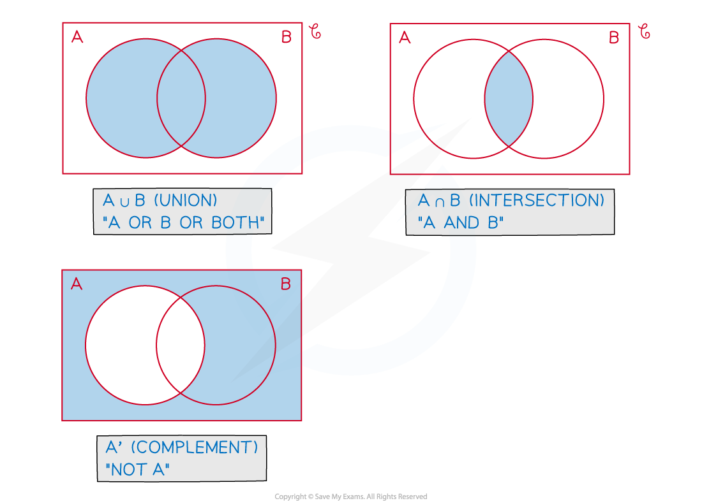
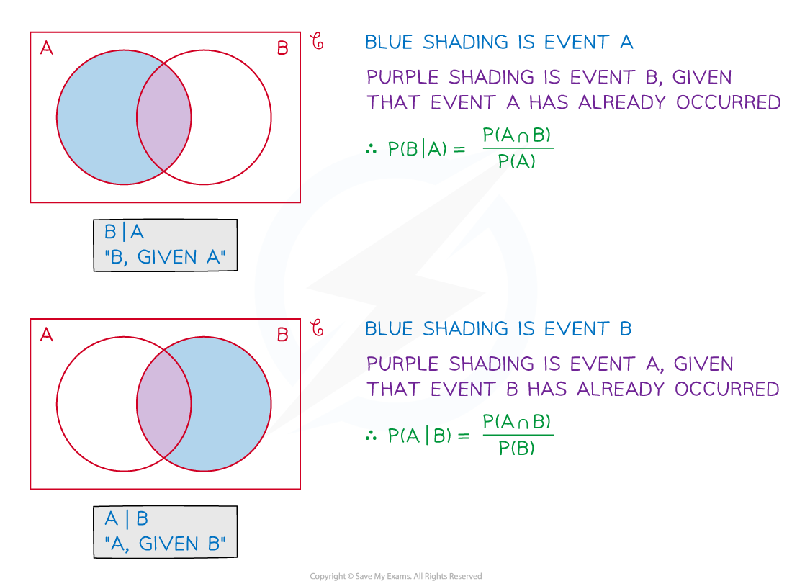
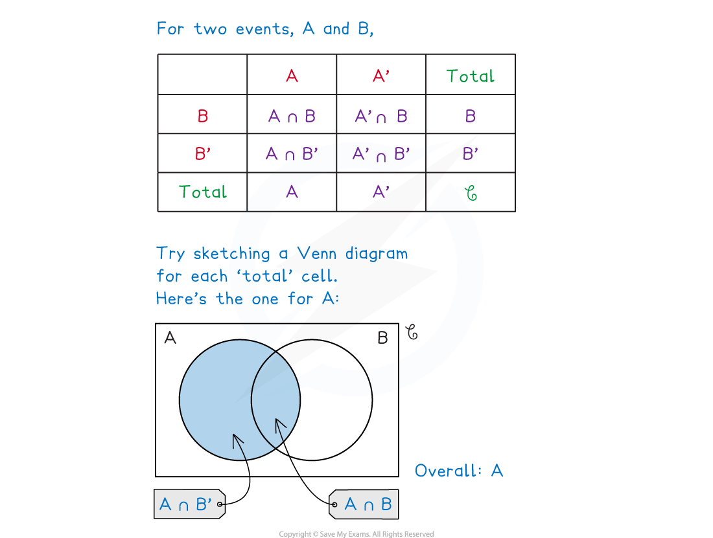

# Conditional Probability

## Set Notation

> **Spec point** — `spcpt_Gt3d7rKV2X8h4pwd`

## Set notation

### What is set notation?

- **Set** **notation** is a formal way of writing groups of numbers (or other mathematical entities such as shapes) that share a common feature – each number in a set is called an **element** of the set

  - You should have come across common sets of numbers such as the **natural** **numbers**, denoted by $ℕ$ , or the set of **real** **numbers**, denoted by $ℝ$
- In **probability**, set notation allows us to talk about the **sample** **space** and ***events***** **within in it

  - S, U, $ξ$ , $E$ are common symbols used for the Universal set In probability this is the entire sample space, or the rectangle in a **Venn diagram**
  - **Events** are denoted by capital letters, *A, B, C *etc
  - The **events **“$notA$ ”, “$notB$”, “$notC$” are denoted by $A',B',C'$ etc (Strictly pronounced “*A*  prime” but often called “*A*  dash”)  $A'$is called the **complement** of *A*
- In probability we are often looking at combined events

  - The event *A* and *B* is called the **intersection** of events *A* and *B* , and the symbol ∩  is used i.e.  *A* and *B*  is written as $A\capB$
  
    - On a **Venn** **diagram** this would be the **overlap** between the bubble for event *A *and the bubble for event $B$
    - From **Basic** **Probability**, for ***independent*** events

$P(A\capB)=P(A)\timesP(B)$

- The event *A *or *B* is called the **union** of events *A* and *B* , and the symbol $\cup$ is used i.e.  *A *or *B*  is written as $A\cupB$

  - On a **Venn** **diagram** this would be **both** the bubbles for event A and event B including their **overlap** (**intersection**)
  - From **Basic** **Probability**, for ***mutually**** ****exclusive*** events

$P(A\cupB)=P(A)+P(B)$

- The other set you may come across in probability is the **empty** **set** The **empty** **set** has no **elements** and is denoted by $\emptyset$
- The **intersection** of **mutually** **exclusive** events is the empty set, $\emptyset$

- And finally,  $P(A')=1-P(A)$

### How do I find probabilities from sets?

- Recognise the notation and symbols used and then interpret them in terms of **AND** ($\cap$), **OR** ($\cup$) and/or **NOT** (‘) statements
- Venn diagrams lend themselves particularly well to deducing which sets or parts of sets are involved- draw mini-Venn diagrams and shade them
- Practice shading various parts of Venn diagrams and then writing what you have shaded in set notation
- With combinations of **union**, **intersection** and **complement** there may be more than one way to write the set required

  - e.g.   $(A\cupB)'=A'\capB'$          $(A\capB)'=A'\cupB'$           Not convinced?  Sketch a Venn diagram and shade it in!
  - In such questions it can be the **unshaded** part that represents the solution

> **Worked Example**
> The members of a local tennis club can decide whether to play in a singles competition, a doubles competition, both or neither.
> 
> Once all members have made their choice the chairman of the club selects, at random, one member to interview about their decision.
> 
> $S$ is the event a member selected the singles competition.
> 
> $D$ is the event a member selected the doubles competition.
> 
> Given that $P(S)=2P(D),P(S\cupD)=0.9$and $P(S\capD)=0.3$ , find
> 
> (i)   $P(S')$
> 
> (ii)         $P(S'\capD)$
> 
> (iii)        $P(S\cupD')$
> 
> (iv)        $P((S\cupD)')$
> 
> **Answer:**
> 
> 
> 
> 
> 
> 

> **Exam Hint**
> - Do not try to do everything using a single diagram – whether given one in the question or using your own; use mini-Venn diagrams and shading for each part of a question
> - Do double check whether you are dealing with **union** ($\cup$) or **intersection** ($\cap$) (or both) – when these symbols are used several times near each other in a question, it is easy to get them muddled up or misread them

## Conditional Probability

> **Spec point** — `spcpt_mpb85fVZSQGr3tkK`

## Conditional probability

### What is conditional probability?

- **Conditional** **probability** is where the probability of an **event** happening can vary depending on the outcome of a prior event

- You have already been using **conditional** **probability** e.g.  drawing more than one counter/bead/etc from a bag **without** replacement

  - Note that, mathematically, that drawing one, not replacing then drawing another is the same as drawing two at the same time.
- Consider the following example

  - e.g.        Bag with 6 white and 3 red buttons. One is drawn at random and not  replaced.  A second button is drawn. The probability that the second button is white **given** **that** the first button is white is $\frac{5}{8}$.

- The key phrase here is “**given** **that**” – it essentially means something has already happened.

  - In set notation, “**given** **that**” is indicated by a vertical line ( **| **) so the above example would be written `text P( end text right enclose 2 to the power of nd space is space white end enclose space 1 to the power of st space is space white right parenthesis equals 5 over 8`
  - There are other phrases that imply or mean the same things as “given that”
- Venn diagrams are helpful again but beware – the denominator of fractional probabilities will no longer be the total of all the frequencies or probabilities shown

  - “**given** **that**” questions usually reduce the sample space as an event (a subset of the outcomes of the first event) has already occurred

- The diagrams above also show two more **conditional** **probability** results

  - `straight P left parenthesis A intersection B right parenthesis equals straight P left parenthesis A right parenthesis cross times straight P left parenthesis B vertical line A right parenthesis`
  - `straight P left parenthesis A intersection B right parenthesis equals straight P left parenthesis B right parenthesis cross times straight P left parenthesis A vertical line B right parenthesis`
  - These are essentially the same as letters are interchangeable

- For **independent** **events** we know $P(A\capB)=P(A)\timesP(B)$ so

  - `straight P left parenthesis B vertical line A right parenthesis equals fraction numerator horizontal strike straight P left parenthesis A right parenthesis end strike cross times straight P left parenthesis B right parenthesis over denominator horizontal strike straight P left parenthesis A right parenthesis end strike end fraction equals text P end text left parenthesis B right parenthesis`
- and similarly `straight P left parenthesis A vertical line B right parenthesis equals straight P left parenthesis A right parenthesis`
- The independent result should make sense logically – if events *A* and *B*   are independent then the fact that event *B*  has already occurred has no effect on the probability of event *A* happening

> **Worked Example**
> The Venn diagram below illustrates the probabilities of three events, $A,B\mathrm{and}C$.
> 
> 
> 
> (a) Find
> 
> (i) `straight P left parenthesis A vertical line B right parenthesis`
> 
> (ii) `straight P left parenthesis B vertical line A apostrophe right parenthesis`
> 
> (iii) `straight P left parenthesis C apostrophe vertical line A apostrophe right parenthesis`
> 
> (b) Show, in two different ways, that the events $B$and $C$ are independent.
> 
> **Answer:**
> 
> 
> 
> 
> 
> 

> **Exam Hint**
> - There are now several symbols used from set notation in probability – make sure you are familiar with them
> 
>   - **union** ($\cup$)
>   - **intersection** ($\cap$ )
>   - **not **(‘)
>   - **given that **( | )
> - If given a Venn diagram with all the separate probabilities you may find it easier to work out P(A), P(B) etc first

## Two-Way Tables

> **Spec point** — `spcpt_JT3NWnKdmfk6J6mh`

## Two-way tables

### What are two-way tables?

- In **probability**, **two**-**way** **tables** list the frequencies for the outcomes of two events – one event along the top (columns), one event down the side (rows)
- The frequencies, along with a “Total” row and “Total” column instantly show the values involved in finding probabilities

#### How do I find probabilities from two-way tables?

- Questions will usually be wordy – and may not even mention two-way tables

  - Questions will need to be interpreted in terms of **AND** ($\cap$ , **intersection**), **OR** ($\cup$, **union**), **NOT** (‘) and **GIVEN** **THAT** ( | )
- Complete as much of the table as possible from the information given in the question

  - If any empty cells remain, see if they can be calculated by looking for a row or column with just one missing value
- Each cell in the table is **similar** to a region in a Venn diagram

  - With event *A* outcomes on columns and event *B* outcomes on rows
  
    - $P\capQ$ (**intersection, AND**) will be the cell where outcome $P$  meets outcome $Q$
    - $P\cupQ$ (**union**, **OR**) will be all the cells for outcomes $P$ and $Q$ including the cell for both
  - Beware! As **union** includes the cell for **both** outcomes, avoid counting this cell **twice** when calculating **frequencies** or **probabilities**
  - (see Worked Example Q(b)(ii))

- You may need to use the results

  - `straight P left parenthesis A intersection B right parenthesis equals straight P left parenthesis A right parenthesis cross times straight P left parenthesis B vertical line A right parenthesis`
  - `straight P left parenthesis A vertical line B right parenthesis equals straight P left parenthesis A right parenthesis` (for independent events)

> **Worked Example**
> The incomplete two-way table below shows the type of main meal provided by 80 owners to their cat(s) or dog(s).
> 
> |   | Dry Food | Wet Food | Raw Food | **Total** |
> |---|---|---|---|---|
> | Dog | 11 |   | 8 |   |
> | Cat |   | 19 |   | 33 |
> | **Total** | 21 |   |   |   |
> 
> (a) Complete the two-way table
> 
> (b) One of the 80 owners is selected at random. Find the probability
> 
> (i) the selected owner has a cat and feeds it raw food for its main meal.
> 
> (ii) the selected owner has a dog or feeds it wet food for its main meal.
> 
> (iii) the owner feeds raw food to its pet, given it is a dog.
> 
> (iv) the owner has a cat, given that they feed it dry food.
> 
> **Answer:**
> 
> 

> **Exam Hint**
> - Ensure any table – given or drawn - has a “Total” row and a “Total” column
> - Do not confuse a two-way table with a **sample** **space** diagram – a two-way table does not necessarily display **all** **outcomes** from an **experiment**, just those (**events**) we are interested in
