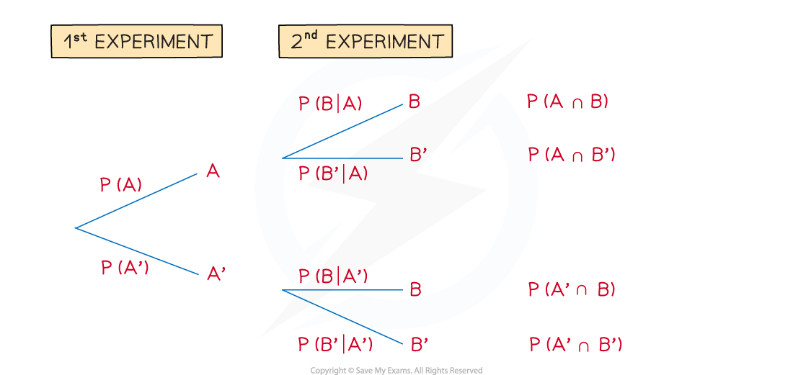

# Tree Diagrams with Conditional Probability

## Further Tree Diagrams

> **Spec point** — `spcpt_wDKP7rTqCr2Fj6QR`

## Tree diagrams with conditional probability

### How do I find conditional probabilities problems from tree diagrams?

- Interpreting questions in terms of **AND** ($\cap$), **OR** ($\cup$) and** complement** ( ‘ )
- **Conditional probability** may now be involved too - **“given that”** ( | )
- This makes it harder to know where to start and how to complete the probabilities on a tree diagram

  - e.g. If given, possibly in words, `P left parenthesis B vertical line A right parenthesis` then **event *****A*** has already occurred so start by looking for the branch **event *****A*** in the **1****st**** experiment, **and** **then there would be the** **branch** **for** event *****B***** ** in the **2****nd** **experiment**
- Similarly, `straight P left parenthesis B vertical line A apostrophe right parenthesis` would require starting with **event “**$notA$ **”** in the **1****st**** experiment** and **event *****B*** in the **2****nd**** experiment**

** **

- The diagram above gives rise to some probability formulae you will see in the next revision note
- `bold P bold left parenthesis bold italic B bold vertical line bold italic A bold right parenthesis` (“**given** **that**”) is the probability on the branch of the 2nd experiment
- However, the “**given** **that**” statement `bold P bold left parenthesis bold italic A bold vertical line bold italic B bold right parenthesis` is more complicated and a matter of working backwards

  - from Conditional Probability,  `straight P left parenthesis A vertical line B right parenthesis equals fraction numerator straight P left parenthesis A intersection B right parenthesis over denominator straight P left parenthesis B right parenthesis end fraction`
  - from the diagram above, $P(B)=P(A\capB)+P(A'\capB)$
  - leading to ** **`bold P bold left parenthesis bold italic A bold vertical line bold italic B bold right parenthesis bold equals fraction numerator bold P bold left parenthesis bold A bold intersection bold B bold right parenthesis over denominator bold P bold left parenthesis bold A bold intersection bold B bold right parenthesis bold plus bold P bold left parenthesis bold A bold apostrophe bold intersection bold B bold right parenthesis end fraction`
  - This is quite a complicated looking formula to try to remember so use the logical steps instead – and a clearly labelled tree diagram!

> **Worked Example**
> The event $F$ has a 75% probability of occurring.
> 
> The event $W$ follows event $F$, and if event $F$ has occurred, event $W$ has an 80% chance of occurring.
> 
> It is also known that $P(F'\capW)=0.15$ .
> 
> Find
> 
> (i) `straight P left parenthesis W vertical line F apostrophe right parenthesis`
> 
> (ii) `straight P left parenthesis F vertical line W apostrophe right parenthesis`
> 
> (iii) the probability that event $F$ didn’t occur, given that event $W$didn’t occur.
> 
> **Answer:**
> 
> 
> 
> 

> **Exam Hint**
> - It can be tricky to get a tree diagram looking neat and clear first attempt – it can be worth drawing a rough one first, especially if there are more than two outcomes or more than two events; do keep an eye on the exam clock though!
> - Always worth another mention – tree diagrams make particularly frequent use of the result $P(\mathrm{not}A)=1-P(A)$
> - Tree diagrams have built-in checks
> 
>   - the probabilities for each pair of branches should add up to 1
>   - the probabilities for each outcome of combined events should add up to 1
