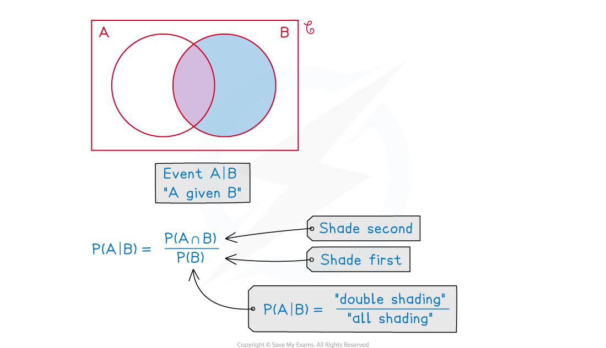

# Venn Diagrams with Conditional Probability

## Further Venn Diagrams

> **Spec point** — `spcpt_JfGQz47zpqCG2C9v`

## Venn diagrams with conditional probability

### How do I find conditional probabilities from a Venn diagram?

- Interpreting questions in terms of **OR** ($\cup$), **AND** ($\cap$),** complement** ( ‘ ) and **“given that”** ( | )
- **Conditional probability** may now be involved too
- Use mini-Venn diagrams to sketch and shade the regions you are dealing with – use different colours if available or different styles of shading if not

  - Shading can help you see the answer
- since `straight P left parenthesis A vertical line B right parenthesis equals fraction numerator straight P left parenthesis A italic intersection B right parenthesis over denominator straight P left parenthesis B right parenthesis end fraction` shade *B* first, then shade $A\capB$

  - the answer will then be $\frac{"\mathrm{double} \mathrm{shading}"}{"\mathrm{all} \mathrm{shading}"}$

> **Worked Example**
> Three events, $A,B$ and $C$ are such that
> 
> events $A$ and $C$ are mutually exclusive
> 
> $P(A\capB)=0.2\,P(B\capC)=0.3\,P((A\cupB\cupC)')=0.1\,P(B)=0.7\,P(A')=0.75.$
> 
> (a) Draw a complete Venn diagram to show the probabilities connecting the three events.
> 
> (b) Find
> 
> (i) `straight P left parenthesis A vertical line B right parenthesis`
> 
> (ii) `straight P left parenthesis A apostrophe vertical line C apostrophe right parenthesis`
> 
> (iii) `straight P left parenthesis C vertical line left parenthesis A union B right parenthesis apostrophe right parenthesis`
> 
> **Answer:**
> 
> 
> 
> 

> **Exam Hint**
> - Always draw the box in a Venn diagram; it represents all possible outcomes of the experiment so is a crucial part of the diagram, the bubbles merely represent the events we are particularly interested in
> - You may be able to answer some questions by applying formulae or you may prefer to use shaded mini-Venn diagrams; complicated questions tend to be easier with mini-Venn diagrams
