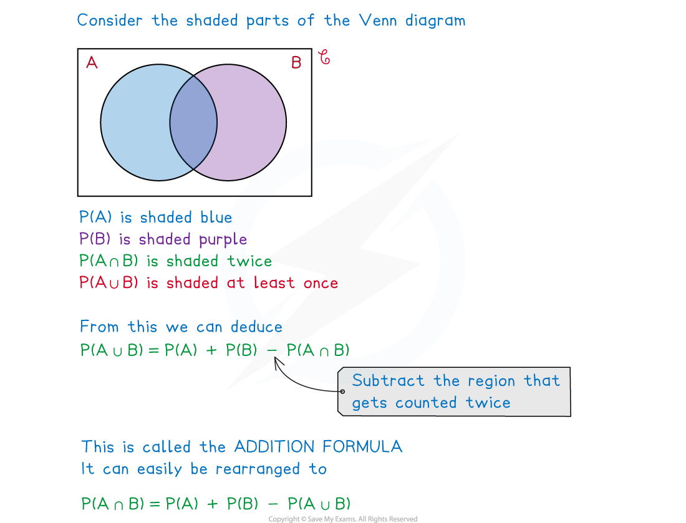
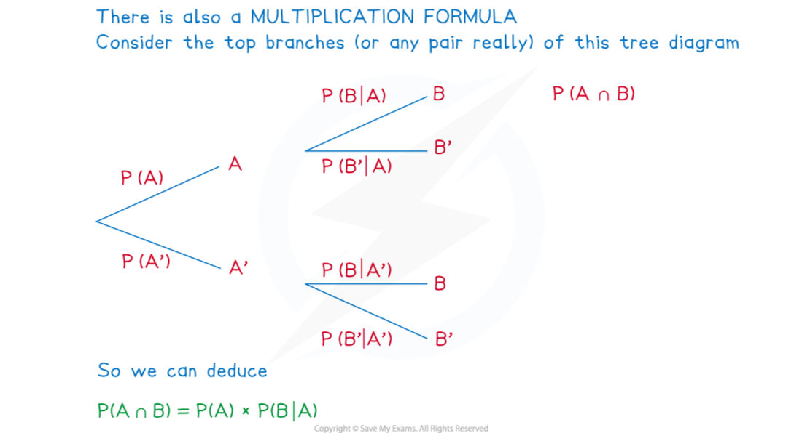

# Probability Formulae

## Probability Formulae

> **Spec point** — `spcpt_jgKvwpptbcVFZqgq`

## Probability formulae

### What are probability formulae?

- If you have seen any of the other Revision Notes on probability, almost every one contains a formula

  - These however are often disguised in Venn diagrams, tree diagrams etc
  - Sometimes a diagram can be easier to use than a formula
- This Revision Note rounds up all these formulae and introduces one or two new ones

### What probability formulae do I need to know?

- Some formulae only apply under certain conditions
- The formulae for probability you should’ve encountered so far

  - for **independent** events, $P(A\capB)=P(A)\timesP(B)$      **(“AND”, intersection)**
  - for **mutually** **exclusive** events, $P(A\cupB)=P(A)+P(B)$    **(“OR”, union)**
  - $P(A')=1-P(A)$**      (“NOT”, complement/prime/dash)**
  - `P left parenthesis A vertical line B right parenthesis equals fraction numerator P left parenthesis A intersection B right parenthesis over denominator P left parenthesis B right parenthesis end fraction`     or    `straight P left parenthesis A intersection B right parenthesis equals straight P left parenthesis B right parenthesis cross times straight P left parenthesis A vertical line B right parenthesis`                   **(“GIVEN THAT”) **           This second version in particular is referred to as the **MULTIPLICATION** **FORMULA** (see diagram below)
  - For **independent** events, `straight P left parenthesis A vertical line B right parenthesis space equals straight P left parenthesis A right parenthesis`

- All of the formulae above are given in the formulae booklet but some are “hidden”

  - e.g. The formulae booklet lists the **addition** **formula **$P(A\cupB)=P(A)+P(B)-P(A\capB)$
  - but it does not list the rearranged version of it
  - nor does it point out that if $A$ and $B$ are mutually exclusive then $P(A\capB)=0$
  
    - and so $P(A\cupB)=P(A)+P(B)$

### How do I use probability formulae?

- This is a combination of

  - Recognising the **set** **notation** used
  - Taking note of any ***independent***** **or ***mutually exclusive*** events
  - Using an appropriate diagram (Venn, mini-Venn, tree, two-way table)
  - Converting worded questions into **AND**, **OR**, **GIVEN THAT** etc statements
  - Knowing when a formula could be used and using the **formulae** **booklet** to double-check and confirm
- In the majority of cases a diagram can be used – so if you do not like using the formulae or find them confusing

  - For events that happen in succession, use a tree diagram; Venn diagrams suit most other purposes but two-way tables can be easier to follow
  - Of course, a question may give or demand the use of a particular diagram

> **Worked Example**
> In the fictional World Stare Out Championships players compete by staring at each other with the player blinking first losing.  A match cannot be drawn.
> 
> During each day of the championships three matches are scheduled to take place but if the first two matches both take more than an hour each, then the third match cannot take place that day.
> 
> A statistician notices from past fictional championship records that the probability of the first match taking longer than an hour is 0.15 and that the probability of only two matches taking place on any day is 0.06.  They also notice that the probability that at least one of the first two matches takes longer than an hour is 0.32.
> 
> Find the probability that
> 
> (i) the second match of a day takes longer than an hour to complete
> 
> (ii) the first match takes longer than an hour given that the second match takes longer than an hour.
> 
> **Answer:**
> 
> 
> 
> 

> **Exam Hint**
> - If in any doubt always start with a diagram
> 
>   - a **Venn** **diagram** can be used for most problems
>   - a **two**-**way** **table** can be easier to read if it’s possible to construct one
>   - a **tree** **diagram** is useful if you are looking at an event that follows another
> - Remember that all probability formulae are given in the formulae booklet but not necessarily in the most user-friendly way; a quick look could just be enough to jog your memory though!
