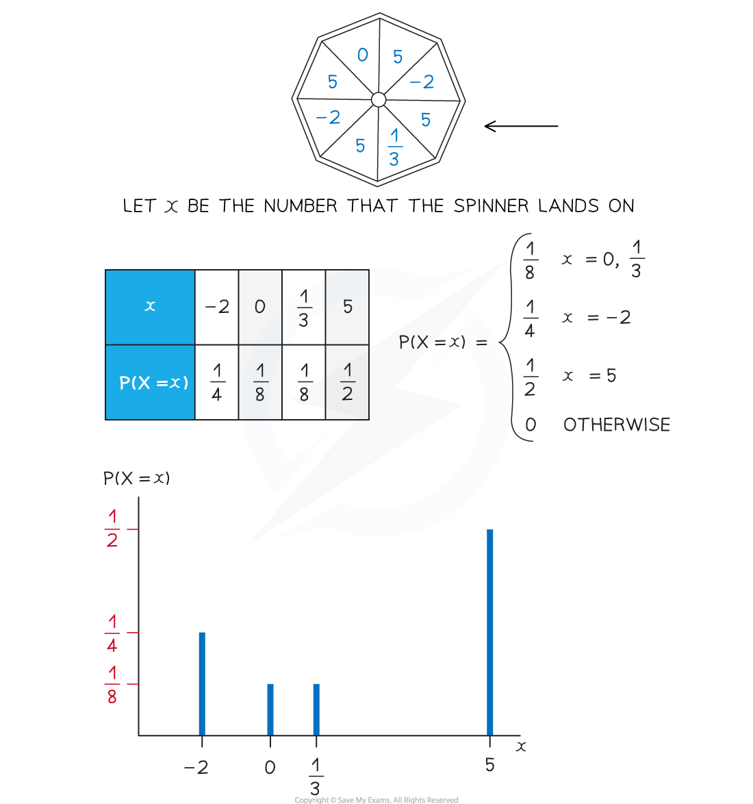

# Discrete Probability Distributions

## Discrete Random Variables

> **Spec point** — `spcpt_hNzSdgbyZxJrpzwx`

## Discrete Random Variables

#### What is a discrete random variable?

- A** random variable **is a variable whose value depends on the outcome of a **random event**

  - The value of the random variable is not known until the event is carried out (this is what is meant by 'random' in this case)
- **Random variables** are denoted using **upper case letters** (X , Y , etc )
- **Particular outcomes** of the event are denoted using **lower case letters** ( x, y, etc)
- $P(X=x)$ means "the probability of the random variable *X* taking the value $x$"
- A discrete random variable (often abbreviated to DRV) can only take **certain values** within a set

  - Discrete random variables **usually count** something
  - Discrete random variables usually can only take a finite number of values but it is possible that it can take an infinite number of values (see the examples below)
- **Examples** of discrete random variables include:

  - The number of times a coin lands on heads when flipped 20 times
  (this has a finite number of outcomes: 0,1,2,…,20)
  - The number of emails a manager receives within an hour
  (this has an infinite number of outcomes: 1,2,3,…)
  - The number of times a dice is rolled until it lands on a 6
  (this has an infinite number of outcomes: 1,2,3,…)
  - The number on a bingo ball when one is drawn at random
  (this has a finite number of outcomes: 1,2,3…,90)

## Probability Distributions (Discrete)

> **Spec point** — `spcpt_qBdSyWddQNFVvkBj`

## Probability Distributions (Discrete)

#### What is a probability distribution?

- A** discrete probability distribution **fully describes **all the values** that a discrete random variable can take along with their **associated probabilities**

  - This can be given in a **table** (similar to GCSE)
  - Or it can be given as a **function** (called a probability mass function)
  - They can be represented by **vertical line graphs** (the possible values for along the horizontal axis and the probability on the vertical axis)
- The **sum of the probabilities** of **all the values** of a discrete random variable is **1**

  - This is usually written $\mathrm{ΣP}(X=x)=1$
- A **discrete uniform distribution** is one where the random variable takes a finite number of values each with an **equal probability**

  - If there are n values then the probability of each one is $\frac{1}{n}$

## Cumulative Probabilities (Discrete)

> **Spec point** — `spcpt_zVjsVNNSk6nRc5FQ`

## Cumulative Probabilities (Discrete)

#### How do I calculate probabilities using a discrete probability distribution?

- For probability distributions that take a small number of values start by **drawing a table** to represent the probability distribution

  - If the distribution is given as a function then find each probability
  - If any probabilities are unknown then use algebra to represent them
  
    - **Form an equation** using $\sumP(X=x)=1$
- To find $P(X=k)$

  - If *k* is a possible value of the random variable *X* then $P(X=k)$ will be given in the table
  - If $k$is not a possible value then $P(X=k)=0$

#### What is the cumulative distribution function?

- The cumulative distribution function, denoted $\text{F(}\text{x}\text{)}$ , is the probability that the random variable takes a value less than or equal to x.

  - $F(x)=P(X\leqx)$
- You may be asked to draw a table for the cumulative distribution function

  - This will be similar to a probability distribution function but instead the bottom row will be F(x)  instead of P(*X = x*)

#### How do I calculate cumulative probabilities?

- To find $P(X\leqx)$ (equivalently F(x))

  - Identify all possible values, $x_{i}$, that *X* can take which satisfy $x_{i}\leqk$
  - Add together all their corresponding probabilities
  - $P(X\leqk)=\underset{x_{i}\leqk}{\sum}P(X=x_{i})$
- Using a similar method you can find $P(X<k),P(X\geqk)$and $P(X>k)$
- As all the probabilities add up to 1 you can form the following equivalent equations:

  - $P(X<k)+P(X=k)+P(X>k)=1$
  - $P(X>k)=1-P(X\leqk)$
  - $P(X\geqk)=1-P(X<k)$
- To calculate more complicated probabilities such as $P(X^{2}<4)$

  - Identify which values of the random variable satisfy the inequality or event in the brackets
  - Add together the corresponding probabilities

#### How do I know which inequality to use?

- $P(X\leqk)$would be used for phrases such as:

  - At most k, no greater than k, etc
- $P(X<k)$would be used for phrases such as:

  - Fewer than *k*
- $P(X\geqk)$would be used for phrases such as:

  - At least *k*  , no fewer than *k*, etc
- $P(X>k)$would be used for phrases such as:

  - Greater than *k*, etc

> **Worked Example**
> The probability distribution of the discrete random variable $X$ is given by the function
> 
> `P left parenthesis X equals x right parenthesis equals open curly brackets table row cell k x squared end cell cell x equals negative 3 comma negative 1 comma 2 comma 4 end cell row 0 otherwise end table close`
> 
> (a) Show that $k=\frac{1}{30}.$
> 
> (b) Calculate $F(3)$.
> 
> (c) Calculate $P(X^{2}<5)$.
> 
> **Answer:**
> 
> 
> 
> 
> 
> 

> **Exam Hint**
> - Try to draw a table if there are a finite number of values that the discrete random variable can take
> - When finding a probability, it will sometimes be quicker to subtract the probabilities of the unwanted values from 1 rather than adding together the probabilities of the wanted values
> - Always make sure that the probabilities are between 0 and 1, and that they add up to 1!
