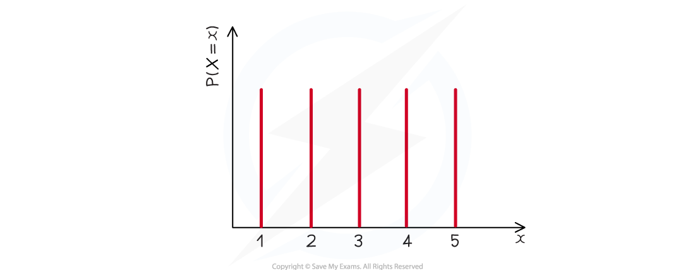

# Discrete Uniform Distribution

## Discrete Uniform Distribution

> **Spec point** — `spcpt_XNbkj4YzrTHZD8Wv`

## Discrete Uniform Distribution

#### What is a discrete uniform distribution?

- A discrete uniform distribution is a discrete probability distribution
- The **discrete random variable** *X* follows a **discrete uniform distribution** if

  - There are a **finite number** of distinct outcomes (*n*)
  - Each **outcome** is **equally likely**
- If there are n distinct outcomes,  $P(X=x)=\frac{1}{n}$
- In many cases the outcomes of *X* are the integers 1, 2, 3, .., *n*

  - $P(X=x)=\frac{1}{n}$ for $n=1,2,3,...,n$
  - 0 for any other value of X
- The distribution can be represented visually using a **vertical line graph** where the lines have **equal heights**

#### What is the mean and variance of a discrete uniform distribution?

- If the outcomes of *X* are the integers 1, 2, 3, …, n

  - The **expected value (mean)** is $\frac{n+1}{2}$
  - The **variance** is $\frac{n^{2}-1}{12}$
  
    - Square root to get the standard deviation
- The discrete uniform distribution is **symmetrical** so the median is the same as the mean

  - There is no mode as each value is equally likely

#### Do the outcomes have to be 1 to n?

- The numbers can be anything as long as they are equally likely
- The formulae for the mean and variance only apply when the values are the integers 1 to *n*
- If the outcomes form an **arithmetic sequence** then the distribution can be transformed to the distribution with the values 1 to *n*
- If *X *is the discrete uniform distribution using 1 to *n* and *Y* is a discrete uniform distribution whose outcomes form an arithmetic sequence then:

  - *Y *= *aX *+ *b*
- You can then use this formula to find the **mean** and **variance**

  - E(*Y*) = *a*E(*X*) + *b*
  - Var(*Y*) = *a*² Var(*X*)
- For example: *Y *= 2, 5, 8, 11 can be transformed to *X *= 1, 2, 3, 4 using *Y = *3*X* - 1

#### What can be modelled using a discrete uniform distribution?

- Anything which satisfies the **two conditions**

  - finite distinct outcomes and all equally likely
- For example, let *R *be the second digit of a number given by a random number generator

  - There are 10 distinct outcomes: 0, 1, 2, ..., 9
  - As it is a random number then each value is equally likely to be the second digit

#### What can not be modelled using a discrete uniform distribution?

- Anything where the number of outcomes is **infinite**

  - The number obtained when a person is asked to write down any integer
- Anything where the outcomes are **not equally likely**

  - The number obtained when one of the first 5 Fibonacci numbers is randomly selected
  
    - 1, 1, 2, 3, 5
    - 1 appears twice so is more likely to be picked than the rest

> **Worked Example**
> Each odd number from 1 to 99 is written on an individual tile and one is chosen at random. The random variable $T$ represents the number on the chosen tile.
> 
> (a)       Find $E(T)$.
> 
> (b)       Find $\mathrm{Var}(T)$.
> 
> **Answer:**
> 
> 
> 
> 
> 
> 

> **Exam Hint**
> - Always check your mean and variance makes sense. If the numbers go from 1 to 100 then a mean of 101 is not possible!
