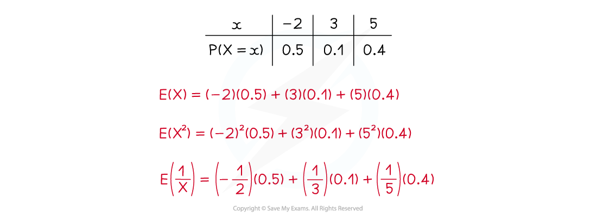

# E(X) & Var(X) (Discrete)

## E(X) & Var(X) (Discrete)

> **Spec point** — `spcpt_ZMNyvHd7JK6WfHTm`

## E(X) & Var(X) (Discrete)

#### What does E(X) mean and how do I calculate E(X)?

- **E(X) **means the **expected value** or the **mean** of a **random variable X**
- For a **discrete** random variable, it is calculated by:

  - **Multiplying each value** of $X$ with its corresponding **probability**
  - **Adding** all these terms together

$Σ$$xP(X=x)$

- Look out for **symmetrical** distributions (where the values of X are symmetrical and their probabilities are symmetrical) as the mean of these is the same as the median

  - For example if X can take the values 1, 5, 9 with probabilities 0.3, 0.4, 0.3 respectively then by symmetry the mean would be 5

#### How do I calculate E(X²)?

- **E(X²) **means the **expected value** or the **mean** of a **random variable **defined as **X²**
- For a **discrete** random variable, it is calculated by:

  - **Squaring** each value of X  to get the values of X2
  - **Multiplying each value** of X2 with its corresponding **probability**
  - **Adding** all these terms together

$Σ$$x^{2}P(X=x)$

- In a similar way E(f(x))  can be calculated for a discrete random variable by:

  - **Applying the function f** to each value of to get the values of f(*X*)
  - **Multiplying each value** of f(*X *) with its corresponding **probability**
  - **Adding** all these terms together

$Σ$$f(x)P(X=x)$

#### Is E(X²) equal to (E(X))²?

- **Definitely not!**

  - They are only equal if X can take only one value with probability 1
  
    - if this was the case it would no longer be a random variable
- E(X²) is the **mean** of the values of **X²**
- (E(X))² is the **square** of the **mean** of the values of **X**
- To see the difference

  - Imagine a random variable X that can only take the values 1 and -1 with equal chance
  - The mean would be 0 so the square of the mean would also be 0
  - The square values would be 1 and 1 so the mean of the squares would also be 1
- In general E(f(*X*)) **does not equal** f(E(X)) where f is a function

  - So if you wanted to find something like `begin mathsize 16px style E open parentheses 1 over x close parentheses end style` then you would have to use the definition and calculate:

$\underset{}{\sum\frac{1}{x}P(X=x)}$

#### What does Var(X) mean and how do I calculate Var(X)?

- **Var(X) **means the **variance** of a **random variable X**
- For **any** random variable this can be calculated using the formula

$E(X^{^{2}})-(E(X))^{2}$

- This is the **mean of the squares of *****X*** minus the **square of the mean of *****X***

  - Compare this to the definition of the **variance of a set of data**

- Var(X) is always positive
- The **standard deviation** of a random variable X is the **square root** of **Var(X)**

> **Worked Example**
> The discrete random variable $X$ has the probability distribution shown in the following table:
> 
> | $x$ | 2 | 3 | 5 | 7 |
> |---|---|---|---|---|
> | $P(X=x)$ | 0.1 | 0.3 | 0.2 | 0.4 |
> 
> (a) Find the value of $E(X)$.
> 
> (b) Find the value of $E(X^{2})$.
> 
> (c) Find the value of $\mathrm{Var}(X)$ .
> 
> **Answer:**
> 
> 
> 
> 
> 
> 

> **Exam Hint**
> - Check if your answer makes sense. The mean should fit within the range of the values of X.
