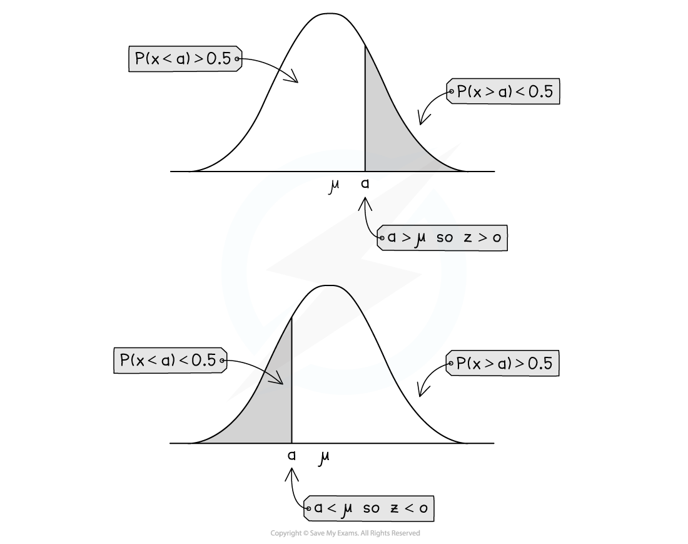
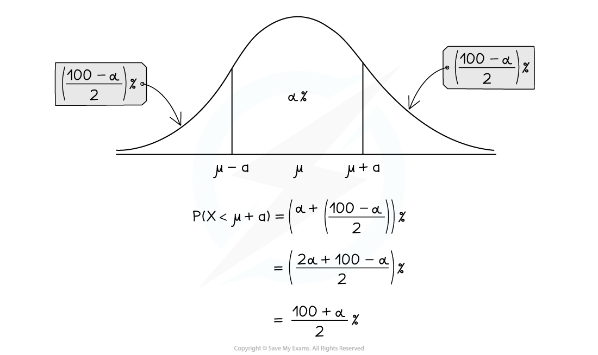

# Calculations with Normal Distributions

Throughout this section we will use the random variable `X tilde straight N left parenthesis mu comma space sigma squared right parenthesis` . For normal, $X$ can take any real number. Therefore any values mentioned in this section will be assumed to be any real number.

## Calculating Normal Probabilities

> **Spec point** — `spcpt_j6mhY3GsmrfJcws5`

## Calculating Normal Probabilities

#### How do I find probabilities using a normal distribution?

- The **area** **under a normal curve** between the points $x=a$ and $x=b$ is equal to the **probability **P(*a < X < b *)

  - Remember for a normal distribution $P(a\leqX\leqb)=P(a<X<b)$ so you do not need to worry about whether the inequality is strict (< or >) or weak (≤ or ≥)
- The equation of a normal distribution curve is complicated so the **area must be calculated numerically**
- You will be expected to** standardise **all normal distributions to $z$  and** use the table of the normal distribution **to find the probabilities

  - It is likely that your calculator has a function that can find normal probabilities, if so it is a good idea to learn to use it so that you can check your probabilities
  - However you **must** show your calculations to get the z values and use the tables to get all the marks

#### How do I calculate the probability for a normal distribution?

- A random variable `X tilde straight N left parenthesis mu comma sigma squared right parenthesis`  can be coded to model the standard normal distribution `equation` using the formula

$Z=\frac{X-μ}{σ}$

- You can calculate a probability $P(X<x)$ using the relationship `straight P left parenthesis X less than x right parenthesis equals straight P open parentheses Z less than fraction numerator x minus mu over denominator sigma end fraction close parentheses`
- **Always sketch** a quick diagram to visualise which area you are looking for
- Once you have determined the *z *value use the table of the normal distribution to find the probability

  - Refer to your sketch to decide if you need to subtract the probability from one
- The probability of a **single value** is **always zero** for a normal distribution

  - You can picture this as the area of a single line is zero
  - $P(X=x)=0$
- $P(X<μ)=P(X>μ)=0.5$

  - You can look at which side of the mean *x *is on and the direction of the inequality to decide if your answer should be greater or less than 0.5
- As $P(X=a)=0$ you can use:

  - $P(X<a)+P(X>a)=1$
  - `straight P left parenthesis X greater than a right parenthesis equals 1 minus straight P left parenthesis X less than a right parenthesis equals 1 minus straight capital phi open parentheses fraction numerator a minus mu over denominator sigma end fraction close parentheses`
  - `straight P left parenthesis a less than X less than b right parenthesis equals straight P left parenthesis X less than b right parenthesis minus straight P left parenthesis X less than a right parenthesis equals straight capital phi open parentheses fraction numerator b minus mu over denominator sigma end fraction close parentheses minus straight capital phi open parentheses fraction numerator a minus mu over denominator sigma end fraction close parentheses`

> **Worked Example**
> The random variable `X tilde straight N left parenthesis 20 comma 5 squared right parenthesis`. Calculate:
> 
> (a) $P(X\leq22)$,
> 
> (b) $P(18\leqX\leq27)$
> 
> **Answer:**
> 
> 
> 
> 

## Inverse Normal Distribution

> **Spec point** — `spcpt_GyGBcHPyjz7RJsv9`

## Inverse Normal Distribution

#### Given the value of P(X < a)  or P(X > a)  how do I find the value of a?

- Given a probability you will have to look through the table of the normal distribution to locate the *z*-value that corresponds with that probability
- Look at whether your probability is **greater or less than 0.5** and the **direction of the inequality** to determine whether your *z-*value will be positive or negative

  - If $P(X<a)$ is **more than 0.5** or $P(X>a)$ is **less than 0.5** then *a* should be **bigger than the mean**
  
    - *z *will be positive
  - If $P(X<a)$ is **less than 0.5** or $P(X>a)$ is **more than 0.5** then *a*  should be **smaller than the mean**
  
    - *z *will be negative
- You do not need to remember these, **a sketch will help you see it**

  - **Always sketch a diagram**

- If your probability is less than 0.5 you will need to **subtract it from one** to find the corresponding *z *value

  - Remember that the **position **of the z-value will not change, only the direction of the inequality
- Once you have the correct value substitute it into the formula** **$z=\frac{a-μ}{σ}$   and solve to find the value of *a*
- Always check that your answer makes sense by considering where *a* is in relation to the mean

#### Given the value of P(µ- a < X < µ + a) I find the value of a  ?

- A sketch making use of the symmetry of the graph is essential
- If you are given `P left parenthesis mu minus a less than X less than mu plus a right parenthesis equals alpha percent sign`  then $P(X<μ+a)$ will be `open parentheses fraction numerator 100 plus alpha over denominator 2 end fraction close parentheses percent sign`

  - This is easier to see from a sketch than to remember
  - You can then look through the tables for the corresponding z-value and substitute into the formula** ** $z=\frac{(μ+a)-μ}{σ}=\frac{a}{σ}$

> **Worked Example**
> The random variable  `W tilde straight N left parenthesis 50 comma 36 right parenthesis`.
> 
> Find the value of $w$ such that $P(W>w)=0.7673$
> 
> **Answer:**
> 
> 

> **Exam Hint**
> - The most common mistake students make when finding values from given probabilities is forgetting to check whether the *z-*value should be negative or not.  Avoid this by checking early on **using a sketch** whether *z *is positive or negative and writing a note to yourself before starting the other calculations.
