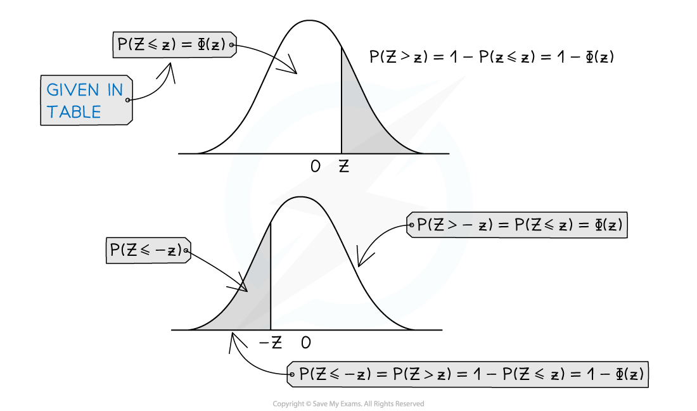

# Standard Normal Distribution

## Standard Normal Distribution

> **Spec point** — `spcpt_gmwKSJM4VXDr4T7d`

## Standard Normal Distribution

#### What is the standard normal distribution?

- The **standard normal distribution** is a normal distribution where the **mean is 0** and the **standard deviation is 1**

  - It is denoted by *Z*
  - `begin mathsize 16px style Z tilde straight N left parenthesis 0 comma 1 squared right parenthesis end style`

#### Why is the standard normal distribution important?

- Calculating probabilities for the normal distribution can be difficult and lengthy due to its complicated probability density function
- The probabilities for the **standard normal distribution** have been calculated and laid out in the **table of the normal distribution** which can be found in your formula booklet

  - Nowadays, many calculators can calculate probabilities for any normal distribution, if yours does then the tables can be used as a check
- It is possible to map any normal distribution onto the standard normal distribution curve
- Mapping different normal distributions to the standard normal distribution allows distributions with different means and standard deviations to be compared with each other

#### How is any normal distribution mapped to the standard normal distribution?

- Any **normal distribution curve** can be transformed to the standard normal distribution curve by a **horizontal translation** and a **horizontal stretch**

  - Therefore, for `begin mathsize 16px style X tilde straight N left parenthesis mu comma sigma squared right parenthesis end style`  and `equation`, we have the relationship:

$Z=\frac{X-μ}{σ}$

- Probabilities are related by:

  - `begin mathsize 16px style straight P left parenthesis X less than a right parenthesis equals straight P open parentheses Z less than fraction numerator a minus mu over denominator sigma end fraction close parentheses end style`
  - This is a very useful relationship for calculating probabilities for any normal distribution
  - As the normal distribution is a continuous distribution $P(z_{1}\leqZ\leqz_{2})=P(z_{1}<Z<z_{2})$ so you do not need to worry about whether the inequality is strict (< or >) or weak (≤ or ≥)
- A value of z = 1 corresponds with the *x*-value that is 1 standard deviation above the mean and a value of z = -1 corresponds with the *x*-value that is 1 standard deviation below the mean
- If a value of** *****x***** **is** less than the mean** then the *z* **-value will be negative**
- The function $Φ(z)$ is used to represent $P(Z<z)$

#### How is the table of the normal distribution function used?

- In your formula booklet you have the table of the normal distribution which provides probabilities for the standard normal distribution

  - The probabilities are provided for $Φ(z)=P(Z\leqz)=P(Z<z)$
  - To find other probabilities you should use the symmetry property of the normal distribution curve
- The table gives probabilities for values of *z* between 0 and 4

  - For negative values of *z*, the symmetry property of the normal distribution is used
  - For values greater than *z* = 4 the probabilities are small enough to be considered negligible
- The tables give the probabilities to 4 decimal places
- To read probabilities from the normal distribution table for a *z *value :

  - Find the *z* value in a column labelled *z *at the top
  - The probability $Φ(z)$ will be the probability directly to the right of the *z *value
  - So the value of $Φ(1.23)=P(Z\leq1.23)$ would be found to the right of 1.23
  
    - $P(Z\leq1.23)=0.8907$
- If the value of *z *is not listed then find the closest value on the table

  - *z *= 3.14 is not listed so use *z *= 3.15
  - *z *= 2.25 is not listed so use *z *= 2.24 or *z *= 2.26

#### How is the table used to find probabilities that are not listed?

- The property that the area under the graph is 1 allows probabilities to be found for P( *Z > z*)

  - Use the formula $P(Z>z)=1-Φ(z)$
- The symmetrical property of the normal distribution gives the following results:

  - $P(Z\leqz)=P(Z\geq-z)$
  - $P(Z\geqz)=P(Z\leq-z)$
- This allows probabilities to be found for negative values of *z *or for $P(Z>z)$

  - $Φ(-z)=1-Φ(z)$
  - $P(Z>z)=1-Φ(z)$
- In summary

  - $P(Z<z)=Φ(z)$
  - $P(Z>z)=1-Φ(z)$
  - $P(Z<-z)=1-Φ(z)$
  - $P(Z>-z)=Φ(z)$
- Drawing a sketch of the normal distribution will help find equivalent probabilities

  - Always consider whether the probability should be bigger or smaller then 0.5

#### How are z values found from the table of the normal distribution function?

- To find the value of *z *for which $P(Z\leqz)=p$ look for the value of *p *from within the table and find the corresponding value of *z*

  - If the probability is given to 4 decimal places most of the time the value will exist somewhere in the tables
- If your probability is 0.5 or greater look through the tables to find the corresponding *z *value

  - For $P(Z<z)\geq0.5$  use the z value found in the table
  - For $P(Z>z)\geq0.5$ take the negative of the z value found in the table
- If the probability is less than 0.5 you will need to **subtract it from one** before using the tables to find the corresponding *z *value

  - For $P(Z<z)<0.5$  take the negative of the z value found in the table
  - For $P(Z>z)<0.5$ use the z value found in the table
- **Always draw a sketch **so that you can see these clearly
- The formula booklet also contains a **table of the critical values of *****z ***for $P(Z>z)=p$

  - This gives *z *values to 4 decimal places for common probabilities
  - The probabilities in this table are 0.5, 0.4, 0.3, 0.2, 0.15, 0.1, 0.05, 0.025, 0.01, 0.005, 0.001 and 0.0005.

> **Worked Example**
> (a) By sketching a graph and using the table of the normal distribution, find the following:
> 
> (i) $P(Z\leq0.96)$
> 
> (ii) $P(Z>0.96)$
> 
> (iii) $P(Z\leq-0.96)$
> 
> (iv) $P(-0.96<Z\leq0.96)$
> 
> (b) Find the value of $z$ such that $P(Z<z)=0.7$
> 
> **Answer:**
> 
> 
> 
> 
> 
> 

> **Exam Hint**
> - A sketch will always help you to visualise the required probability and can be used to check your answer
> - Check whether the area shaded is more or less than 50% and compare this with your answer
