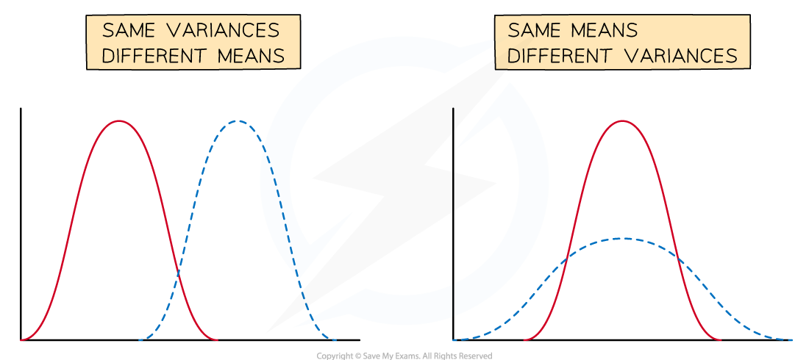
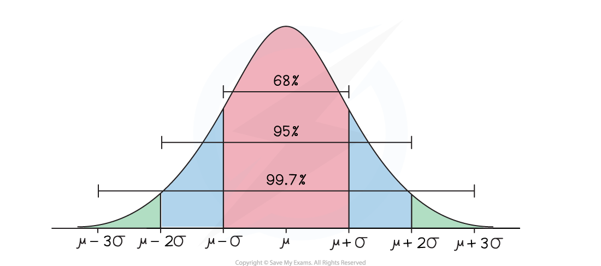

# The Normal Distribution

## Properties of Normal Distribution

> **Spec point** — `spcpt_HS83hxfdbps62xPW`

## Properties of a normal distribution

The binomial distribution is an example of a discrete probability distribution. The normal distribution is an example of a **continuous** probability distribution.

### What is a continuous random variable?

- A continuous random variable (often abbreviated to CRV) is a random variable that can take **any value** within a range of infinite values

  - Continuous random variables **usually measure** something
  - For example, height, weight, time, etc

### What is a continuous probability distribution?

- A continuous probability distribution is a probability distribution in which the random variable *X* is continuous
- The probability of *X* being a **particular value is always zero**

  - **P(*****X = k*****) = 0** for any value *k*
  - Instead we define the ***probability density function***** **f(*x*) for a specific value
  - We talk about the **probability** of $X$ being within a **certain range**
- A continuous probability distribution can be represented by a continuous graph (the values for *X* along the horizontal axis and probability **density** on the vertical axis)
- The **area under the graph** between the points *x = a* and *x = b* is equal to **P(*****a ≤ X ≤ b*****)**

  - The** total area under the graph equals 1**
- As P(*X = k*) = 0 for any value $k$, it does not matter if we use strict or weak inequalities

  - P(X ≤ k) = P(X < k) for any value *k*

### What is a normal distribution?

- A normal distribution is a **continuous probability distribution**
- The **continuous random variable** can follow a normal distribution if:

  - The distribution is **symmetrical**
  - The distribution is **bell-shaped**
- If *X* follows a normal distribution then it is denoted `X tilde N left parenthesis mu comma space sigma squared right parenthesis`

  - μ is the mean
  - σ2 is the variance
  - σ  is the standard deviation
- If the **mean** changes then the graph is **translated horizontally**
- If the **variance** changes then the graph is **stretched horizontally**

  - A small variance leads to a tall curve with a narrow centre
  - A large variance leads to a short curve with a wide centre

### What are the important properties of a normal distribution?

- The **mean** is μ
- The **variance** is σ2

  - If you need the standard deviation remember to square root this
- The normal distribution is symmetrical about *x = μ*

  - Mean = Median = Mode = *μ*
- The normal distribution curve has two *points of inflection*

  - x = *μ ±  σ *(one standard deviation away from the mean)
- There are the results:

  - Approximately **two-thirds (68%)** of the data lies within **one standard deviation** of the mean (*μ ±  σ*)
  - Approximately **95%** of the data lies within **two standard deviations** of the mean (*μ ± 2σ*)
  - Nearly **all of the data (99.7%)** lies within **three standard deviations** of the mean (*μ ± 3σ)*
- For any value *x* a z-score (or z-value) can be calculated which measures how many standard deviations *x* is away from the mean

  - $z=\frac{x-μ}{σ}$

## Modelling with Normal Distribution

> **Spec point** — `spcpt_V6WDFPgHhTqd5tyN`

## Modelling with a normal distribution

### What situations can be modelled by a normal distribution?

- A lot of real-life continuous variables can be modelled by a normal distribution provided that the population is large enough and that the variable is **symmetrical** with **one mode**
- For a normal distribution *X* can take any real value, however values far from the mean (more than 4 standard deviations away from the mean) have a probability density of practically zero

  - This fact allows us to model variables that are not defined for all real values such as height and weight

### What situations can not be modelled by a normal distribution?

- Variables which have **more than one mode** or **no mode**

  - For example, the number given by a random number generator
- Variables which are **not symmetrical**

  - For example, how long a human lives for

> **Worked Example**
> The random variable *S* represents the speeds (mph) of a certain species of cheetahs when they run. The variable is modelled using N(40, 100).
> 
> (a) Write down the mean and standard deviation of the running speeds of cheetahs.
> 
> (b) State the two assumptions that have been made in order to use this model.
> 
> **Answer:**
> 
> 
> 
> 

> **Exam Hint**
> Remember the second number in N(*x, y*) is the variance, if you want the standard deviation then you need to square root it.
