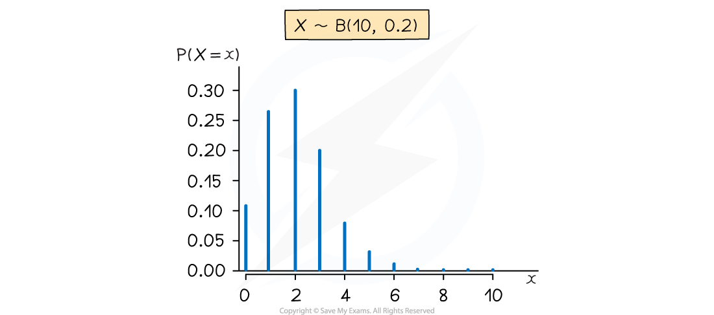
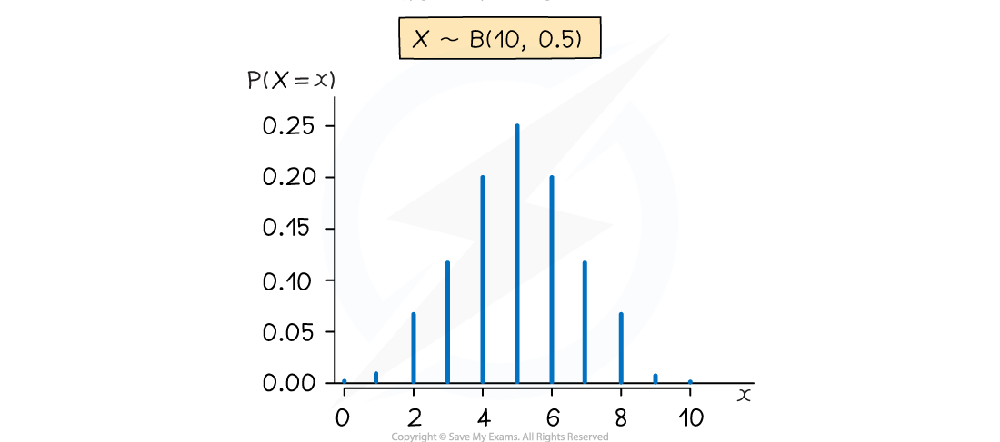
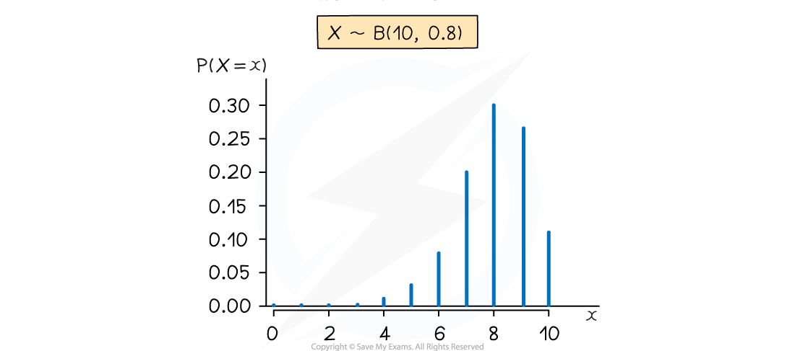

# The Binomial Distribution

## Properties of Binomial Distribution

> **Spec point** — `spcpt_CFPBfrF9PVcrbCk6`

## Properties of Binomial Distribution

#### What is a binomial distribution?

- A binomial distribution is a **discrete probability distribution**
- The **discrete random variable *****X*** follows a **binomial distribution** if it **counts the number of successes** when an experiment satisfies the conditions:

  - There are a **fixed finite number of trials **$(n)$
  - The outcome of each trial is **independent **of the outcomes of the other trials
  - There are **exactly two outcomes** of each trial (**success or failure**)
  - The **probability of success (*****p*****) is constant**
- If *X* follows a binomial distribution then it is denoted `begin mathsize 16px style X tilde B left parenthesis n comma p right parenthesis end style`

  - $n$ is the number of trials
  - $p$ is the probability of success
- The **probability of failure is 1-*****p ***which is sometimes denoted as ***q***
- The formula for the probability of *r* successful trials is given by:

  - `begin mathsize 16px style P equals left parenthesis X equals r right parenthesis equals open parentheses table row n row r end table close parentheses space p to the power of r space left parenthesis 1 minus p right parenthesis to the power of n minus r end exponent end style` for *r = *0, 1, 2,..*..,n*
  - This is equal to the term which includes $p^{r}$ in the expansion of $(p+q)^{n}$ where $q=1-p$ (this shows the link with the Binomial Expansion)

#### What are the important properties of a binomial distribution?

- The **expected number (mean)** of successful trials is $np$
- The **variance** of the number of successful trials is $np(1-p)$

  - Square root to get the standard deviation
- The distribution can be represented visually using a vertical line graph

  - If *p *is **close to 0** then the graph has a **tail to the right**
  - If *p *is **close to 1** then the graph has a **tail to the left**
  - If *p *is **close to 0.5** then the graph is **roughly symmetrical**
  - **If *****p = *****0.5 **then the graph is **symmetrical**

## Modelling with Binomial Distribution

> **Spec point** — `spcpt_cBCMfVF2MRC2fhZS`

## Modelling with Binomial Distribution

#### How do I set up a binomial model?

- **Identify** what a **trial** is in the scenario

  - For example: rolling a dice, flipping a coin, checking hair colour
- **Identify** what the **successful outcome** is in the scenario

  - For example: rolling a 6, landing on tails, having black hair
- Make sure you **clearly state** what your **random variable** is

  - For example, let *X*  be the number of students in a class of 30 with black hair

#### What can be modelled using a binomial distribution?

- Anything that satisfies the **four conditions**
- For example, let $T$ be the number of times a fair coin lands on tails when flipped 20 times: `T tilde straight B open parentheses 20 comma 1 half close parentheses`

  - A trial is flipping a coin: There are 20 trials so *n* =20
  - We can assume each coin flip does not affect subsequent coin flips: They are independent
  - A success is when the coin lands on tails: Two outcomes - tails or not tails (heads)
  - The coin is fair: The probability of tails is constant with $p=\frac{1}{2}$
- Sometimes it might seem like there are more than two outcomes

  - For example, let *Y*  be the number of yellow cars that are in a car park full of 100 cars
  - Although there are more than two possible colours of cars, here the trial is whether a car is yellow so there are two outcomes (yellow or not yellow)
  - *Y* would still need to fulfil the other conditions in order to follow a binomial distribution
- Sometimes a sample may be taken from a population

  - For example, 30% of people in a city have blue eyes, a sample of 30 people from the city is taken and *X*  is the number of them with blue eyes
  - As long as the population is large and the sample is random then it can be assumed that each person has a 30% chance of having blue eyes

#### What can not be modelled using a binomial distribution?

- Anything where the number of trials is **not fixed** or is **infinite**

  - The number of emails received in an hour
  - The number of times a coin is flipped until it lands on heads
- Anything where the outcome of **one trial affects** the outcome of the **other trials**

  - The number of caramels that a person eats when they eat 5 sweets from a bag containing 6 caramels and 4 marshmallows
  
    - If you eat a caramel for your first sweet then there are less caramels left in the bag when you choose your second sweet
- Anything where there are **more than two outcomes** of a trial

  - A person's shoe size
  - The number a dice lands on when rolled
- Anything where the **probability of success changes**

  - The number of times that a person can swim a length of a swimming pool in under a minute when swimming 50 lengths
  
    - The probability of swimming a lap in under a minute will decrease as the person gets tired

> **Worked Example**
> It is known that 8% of a large population are immune to a particular virus. Mark takes a sample of 50 people from this population. Mark uses a binomial model for the number of people in his sample that are immune to the virus
> 
> (a) State the distribution that Mark uses.
> 
> (b) State the two assumptions that Mark must make in order to use a binomial model.
> 
> **Answer:**
> 
> 
> 
> 

> **Exam Hint**
> - If you are asked to criticise a binomial model always consider whether the trials are independent, this is usually the one that stops a variable from following a binomial distribution!
