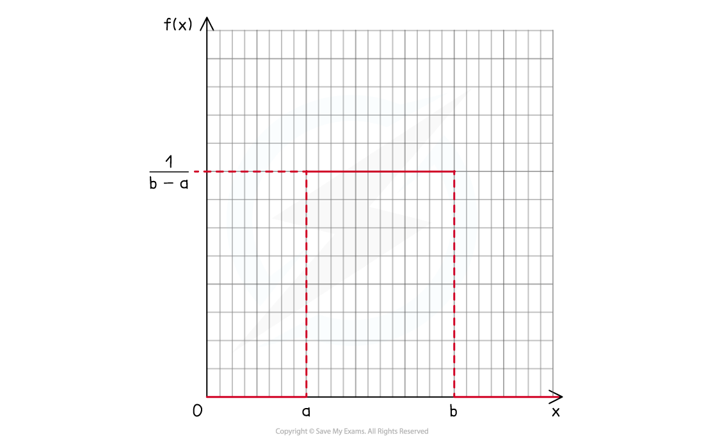

# Continuous Uniform Distribution

## Continuous Uniform Distribution

> **Spec point** — `spcpt_fpRcGzr3vWBCjwQV`

## Continuous Uniform Distribution

#### What is meant by the continuous uniform distribution?

- This is a special case of a probability density function for a continuous random variable

  - The **normal** **distribution** is another special case covered in S1
- The **uniform**, or **rectangular**, **distribution** is a p.d.f. that is **constant** and **non**-**zero** over a range of values but zero everywhere else

- Since the area under the graph has to total 1, the height of the uniform distribution would be

$\frac{1}{b-a}$

- Therefore the probability density function is given by `straight f left parenthesis x right parenthesis equals open curly brackets table row cell fraction numerator 1 over denominator b minus a end fraction end cell cell a less or equal than x less or equal than b end cell row cell space space space space 0 end cell otherwise end table close`

#### How do I find probabilities for a continuous uniform distribution?

- **Sketch** the graph of y= f(x)
- Probabilities are the **area** **under** the **graph**, all such **areas** will now be **rectangles**

  - Finding the area of a rectangle is likely to be easier than integration!
- The **symmetrical** properties of rectangles may also be used to find probabilities

#### How do I find the mean, median, mode and variance of a continuous uniform distribution?

- The **mean**, or expected value, is given by

** ** ** **$E(X)=\frac{1}{2}(a+b)$

- This is the (vertical) **axis** of **symmetry** of the **rectangle**
- Should the above be forgotten, `begin mathsize 16px style E left parenthesis X right parenthesis equals integral subscript a superscript b x straight f left parenthesis x right parenthesis space straight d x end style` can still be applied

  - You be may asked to use this to prove the result
- The **median** can also be found by **symmetry** and will be **equal** to the **mean**
- There is **no** **mode** as f(x) is equal - and so at its greatest - for all values of x
- The **variance** is given by

** ** ** **$\mathrm{Var}(X)=\frac{1}{12}(b-a)^{2}$

- Should the above be forgotten, `begin mathsize 16px style Var left parenthesis X right parenthesis equals integral subscript negative infinity end subscript superscript infinity x squared straight f left parenthesis x right parenthesis space straight d x minus open square brackets E open parentheses X close parentheses close square brackets squared end style` or `begin mathsize 16px style V a r left parenthesis X right parenthesis equals E left parenthesis X squared right parenthesis minus open square brackets E open parentheses X close parentheses close square brackets squared end style` can still be applied

  - You may be asked to use this to prove the result
  - The **standard** **deviation** is the **square** **root** of the **variance**

> **Worked Example**
> A continuous random variable, $X$ , is modelled by the uniform distribution such that
>  $f(x)=0.4$ for $a\leqx\leq4$ and $f(x)=0$  otherwise.
>  a is a constant.
> 
> (a) Show that the value of a is 1.5 .
> 
> (b) Find
> 
> (i) $P(2.5\leqX\leq3)$
> 
> (ii) $E(X)$
> 
> (c) Find the standard deviation of *X*, giving your answer in the form $a\sqrt{3}$, where a is a rational number.
> 
> **Answer:**
> 
> 
> 
> 
> 
> 

> **Exam Hint**
> - A **sketch** of the graph of a uniform distribution is quick and will highlight the **symmetry** in a uniform distribution
> - Use **areas** of **rectangles** to find **probabilities** rather than integrating
