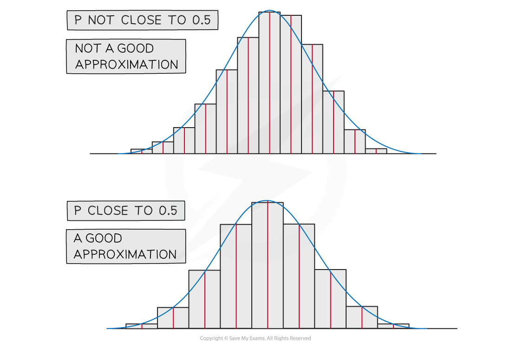
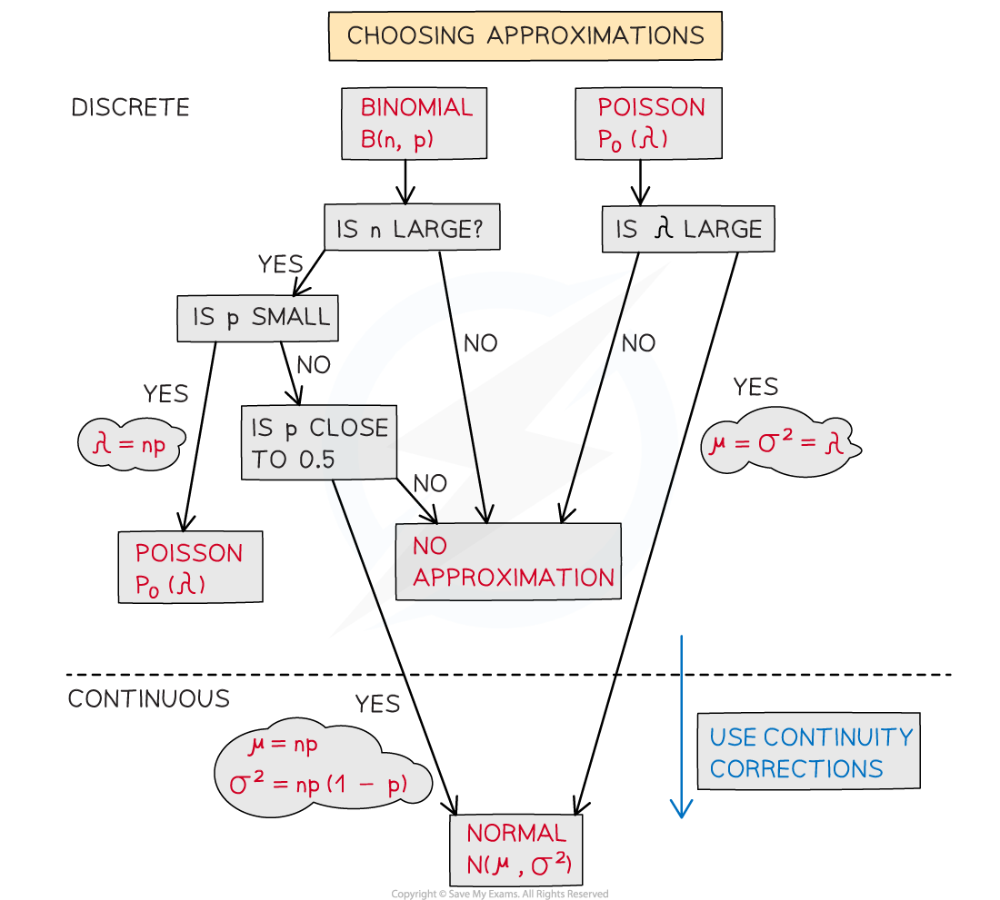

# Approximating the Binomial Distribution

## Normal Approximation of Binomial

> **Spec point** — `spcpt_YY4h2CNvvKYfq4Sk`

## Normal Approximation of Binomial

#### When can I use a normal distribution to approximate a binomial distribution?

- A binomial distribution `begin mathsize 16px style X tilde straight B left parenthesis n comma p right parenthesis end style` can be **approximated** by a normal distribution `begin mathsize 16px style X subscript N tilde straight N left parenthesis mu comma sigma squared right parenthesis end style`  provided

  - ***n***** is large**
  - ***p***** is close to 0.5**
- The mean and variance of a binomial distribution can be calculated by:

  - $μ=np$
  - $σ^{2}=np(1-p)$

#### Why do we use approximations?

- If there are a large number of values for a binomial distribution there could be a lot of calculations involved and it is inefficient to work with the binomial distribution

  - These days calculators can calculate binomial probabilities so approximations are no longer necessary
  - However it is **easier** to work with a normal distribution
  
    - You can calculate the probability of a range of values quickly
    - You can use the inverse normal distribution function (most calculators don't have an inverse binomial distribution function)

#### Do I need to use continuity corrections?

- Yes!
- As the binomial distribution is discrete and normal distribution  is continuous you will need to use continuity corrections
- $P(X=k)\approxP(k-0.5<X_{N}<k+0.5)$
- $P(X\leqk)\approxP(X_{N}<k+0.5)$
- $P(X<k)\approxP(X_{N}<k-0.5)$
- $P(X\geqk)\approxP(X_{N}>k-0.5)$
- $P(X>k)\approxP(X_{N}>k+0.5)$

#### How do I approximate a probability?

- **STEP 1**: Find the **mean** and **variance** of the approximating distribution

  - $μ=np$
  - $σ^{2}=np(1-p)$
- **STEP 2**: Apply **continuity corrections** to the inequality
- **STEP 3**: Find the **probability** of the new corrected inequality

  - Find the standard normal probability and use the **table of the normal distribution**
  
    - Find the standard normal probability and use the **table of the normal distribution**
- The probability will not be exact as it is an approximate but provided n is large and p is close to 0.5 then it will be a close approximation

> **Worked Example**
> The random variable `X tilde straight B left parenthesis 1250 comma 0.4 right parenthesis`.
> 
> Use a suitable approximating distribution to approximate $P(485\leqX\leq530)$.
> 
> **Answer:**
> 
> 

## Poisson Approximation of Binomial

> **Spec point** — `spcpt_PhRPk9SkcSgp9q8p`

## Poisson Approximation of Binomial

#### When can I use a Poisson distribution to approximate a binomial distribution?

- A binomial distribution X~B(*n, p*)can be **approximated** by a Poisson distribution `X subscript p tilde P o open parentheses lambda close parentheses` provided

  - ***n***** is large **( typically >  50 )
  - ***p***** is small**
- The mean of a binomial distribution can be calculated by:

  - $λ=np$
- The Poisson distribution is derived from the binomial distribution for conditions where *n* is becoming infinitely large and *p* is becoming infinitely small

#### Do I need to use continuity corrections?

- No!
- As both the binomial distribution and Poisson distribution are discrete there is no need for continuity corrections

> **Worked Example**
> It is known that one person in a thousand who checks a revision website will choose to subscribe. Given that the website received 3000 hits yesterday, use a suitable approximation to find the probability that more than 5 people subscribed.
> 
> **Answer:**
> 
> 

## Choosing the Approximation

> **Spec point** — `spcpt_dhBtPN6YhDdPNKHp`

## Choosing the Approximation

#### How will I choose which approximation to use?

- When deciding what approximating distribution to use first make sure you know the reason why you cannot find the probability using the original distribution

  - Is the value of *n *or *λ *too large?
  - Will it take too long to carry out the calculations?
- Make sure you know what distribution you are approximating **from**

  - If your distribution is a binomial distribution, you could either use a Poisson (if p is small) or a normal approximation (if p is close to 0.5)
  - If your distribution is a Poisson distribution, you will use a normal approximation
- Use the conditions for approximations to decide which approximation is appropriate
- Calculate the parameters for the approximating distribution

> **Exam Hint**
> - If you are asked to approximate the binomial distribution but are unsure whether to use Poisson or normal, then calculate the mean and see if it is one of the possible values for *λ* in the table
