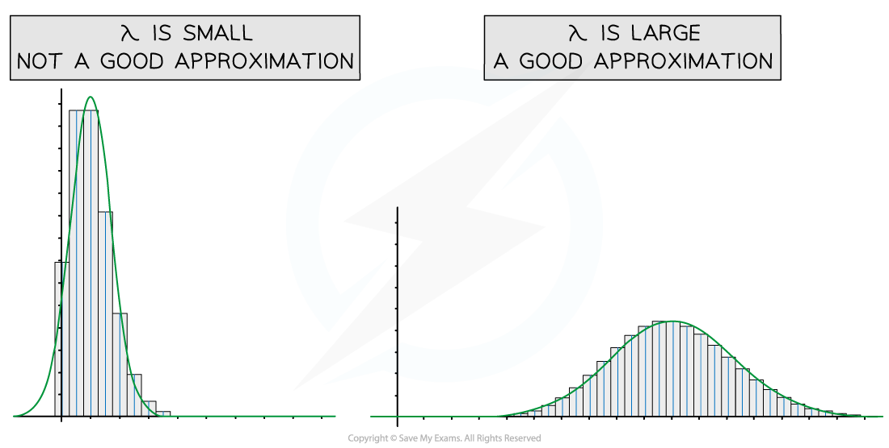

# Approximating the Poisson Distribution

Calculating probabilities using a binomial or Poisson distribution can take a while. Under certain conditions we can use a normal distribution to approximate these probabilities. As we are going from a discrete distribution (binomial or Poisson) to a continuous distribution (normal) we need to apply continuity corrections.

## Continuity Corrections

> **Spec point** — `spcpt_PjFxtJZSDVwMp4RJ`

## Continuity Corrections

#### What are continuity corrections?

- The **binomial **and **Poisson distribution are discrete** and the **normal distribution is continuous**
- A **continuity correction** takes this into account when using a normal approximation
- The probability being found will need to be changed from a discrete variable, X to a continuous variable, *X**N*

  - For example, *X* = 4 for Poisson can be thought of as $3.5\leqX_{N}<4.5$  for normal as every number within this interval rounds to 4
  - Remember that for a normal distribution the probability of a single value is zero so $P(3.5\leqX_{N}<4.5)=P(3.5<X_{N}<4.5)$

#### How do I apply continuity corrections?

- Think about what is **largest/smallest integer** that can be included in the inequality for the discrete distribution and then find its **upper/lower bound**
- $P(X=k)\approxP(k-0.5<X_{N}<k+0.5)$
- $P(X\leqk)\approxP(X_{N}<k+0.5)$

  - You add 0.5 as you want to include $k$ in the inequality
- $P(X<k)\approxP(X_{N}<k-0.5)$

  - You subtract 0.5 as you don't want to include $k$ in the inequality
- $P(X\geqk)\approxP(X_{N}>k-0.5)$

  - You subtract 0.5 as you want to include $k$ in the inequality
- $P(X>k)\approxP(X_{N}>k+0.5)$

  - You add 0.5 as you don't want to include $k$ in the inequality
- For a closed inequality such as $P(a<X\leqb)$

  - Think about each inequality separately and use above
  - $P(X>a)\approxP(X_{N}>a+0.5)$
  - $P(X\leqb)\approxP(X_{N}>b+0.5)$
  - Combine to give
  - $P(a+0.5<X_{N}<b+0.5)$

## Normal Approximation of Poisson

> **Spec point** — `spcpt_YkKMWYDSjftxhVK2`

## Normal Approximation of Poisson

#### When can I use a normal distribution to approximate a Poisson distribution?

- A Poisson distribution `X tilde P o left parenthesis lambda right parenthesis`  can be **approximated** by a normal distribution `X subscript N tilde N left parenthesis mu comma sigma squared right parenthesis`  provided

  - $λ$** is large**
- Remember that the mean and variance of a Poisson distribution are approximately equal, therefore the parameters of the approximating distribution will be:

  - $μ=λ$
  - $σ^{2}=λ$
  - $σ=\sqrt{λ}$
- The greater the value of *λ* in a Poisson distribution, the more symmetrical the distribution becomes and the closer it resembles the bell-shaped curve of a normal distribution

#### Why do we use approximations?

- If there are a large number of values for a Poisson distribution there could be a lot of calculations involved and it is inefficient to work with the Poisson distribution

  - These days calculators can find Poisson probabilities so approximations are no longer necessary
  - However it can still be **easier** to work with a normal distribution
  
    - You can calculate the probability of a range of values quickly
    - You can use the inverse normal distribution function (most calculators don't have an inverse Poisson distribution function)

#### How do I approximate a probability?

- **STEP 1**: Find the **mean** and **variance** of the approximating distribution

  - $μ=σ^{2}=λ$
- **STEP 2**: Apply **continuity corrections** to the inequality
- **STEP 3**: Find the **probability** of the new corrected inequality

  - Find the standard normal probability and use the **table of the normal distribution**
- The probability will not be exact as it is an approximation but provided *λ* is large enough then it will be a close approximation

> **Worked Example**
> The number of hits on a revision web page per hour can be modelled by the Poisson distribution with a mean of 40.  Use a normal approximation to find the probability that there are more than 50 hits on the webpage in a given hour.
> 
> **Answer:**
> 
> 

> **Exam Hint**
> - The question will make it clear if an approximation is to be used, *λ* will be bigger than the values in the formula booklet.
