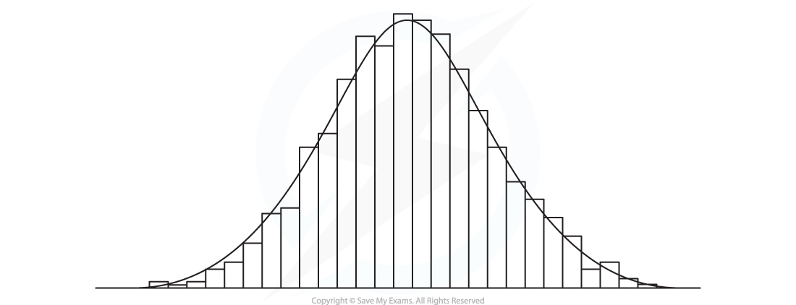

# Modelling with Distributions

## Modelling with Distributions

> **Spec point** — `spcpt_BSThwNTGCsyfmCbs`

## Modelling with Distributions

#### When should I use a binomial distribution?

- A random variable that follows a **binomial distribution** is a **discrete random variable**
- A binomial distribution is used when the random variable **counts something**

  - The number of successful trials
  - The number of members of a sample that satisfy a criterion (satisfying the criteria can be seen as a successful trial)
- There are **four conditions** that *X* must fulfil to follow a binomial distribution

  - There is a **fixed finite number of trials (*****n*****)**
  - The trials are **independent**
  - There are **exactly two outcomes** of each trial (**success or failure**)
  - The **probability of success (*****p*****) ** **is constant**

#### When should I use a Poisson distribution?

- A random variable that follows a **Poisson distribution** is a **discrete random variable**
- A Poisson distribution is used when the random variable **counts something**

  - The number of occurrences of an event in a given interval of time or space
- There are three conditions that *X*  must fulfil to follow a Poisson distribution

  - The **mean **number of occurrences is **known **and** finite *****(λ)***
  - The events occur at **random**
  - The events occur **singly **and **independently**

#### When should I use a normal distribution?

- A random variable that follows a **normal distribution** is a **continuous random variable**
- A normal distribution is used when the random variable **measures something** and the distribution is:

  - **Symmetrical**
  - **Bell-shaped**
- A normal distribution can be used to model real-life data provided the **histogram** for this data is **roughly symmetrical and bell-shaped**

  - If the variable is normally distributed then as more data is collected the outline of the histogram should get smoother and resemble a normal distribution curve

#### Can the binomial or Poisson distribution and the normal distribution be used in the same question?

- Some questions might require you to **first use the normal distribution** to find the **probability of success** and then use a **discrete distribution**

  - Remember a discrete distribution is either a binomial or Poisson distribution
- The key is to make sure you are very clear about what each **parameter/variable represents**

> **Worked Example**
> In a population of cows, the masses of the cows can be modelled using a normal distribution with mean 550 kg and standard deviation 80 kg. A farmer classifies cows as *beefy* if they weigh more than 700 kg. The farmer takes a random sample of 10 cows and weighs them.
> 
> Find the probability that at most one cow is *beefy*.
> 
> **Answer:**
> 
> 

> **Exam Hint**
> - Always state what your variables and parameters represent.  Make sure you know the conditions for when each distribution is (or is not) a suitable model.
