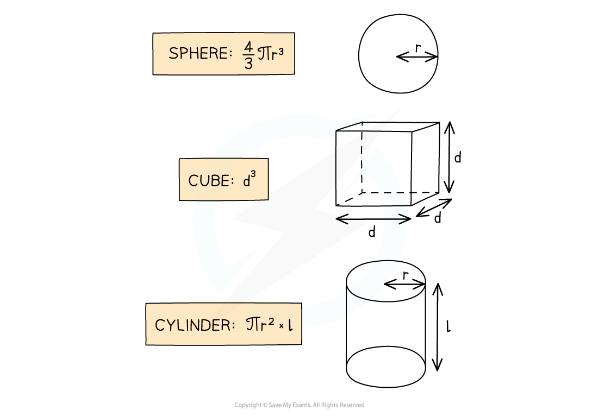

# Density

## Density

> **Spec point** — `spcpt_Z7rxw4cRym4D2YFy`

## Density

- Density is the **mass per unit volume **of an object

  - Objects made from low-density materials typically have a lower mass
  - For example, a balloon is less dense than a small bar of lead despite occupying a larger volume
- The units of density depend on the units used for mass and volume:

  - If the mass is measured in *g* and volume in **cm****3**, then the density will be in **g / cm****3**
  - If the mass is measured in *kg* and volume in **m****3**, then the density will be in **kg / m****3**

***Gases are less dense than a solid***

- The volume of an object may not always be given directly, but can be calculated with the appropriate equation depending on the object’s shape

***Volumes of common 3D shapes***

> **Worked Example**
> A paving slab has a mass of 73 kg and dimensions 40 mm × 500 mm × 850 mm.
> 
> Calculate the density, in kg m-3 of the material from which the paving slab is made.
> 
> 
> 
> **Answer:**
> 
> 

> **Exam Hint**
> - When converting a **larger** unit to a **smaller** one, you **multiply (×)**
> 
>   - E.g. 125 m = 125 × 100 = 12 500 cm
> - When you convert a **smaller** unit to a **larger** one, you **divide (÷)**
> 
>   - E.g. 5 g = 5 / 1000 = 0.005 or 5 × 10-3 kg
> - When dealing with squared or cubic conversions, cube or square the conversion factor too
> 
>   - E.g. 1 mm3 = 1 / (1000)3 = 1 × 10-9 m3
>   - E.g. 1 cm3 = 1 / (100)3 = 1 × 10-6 m3
