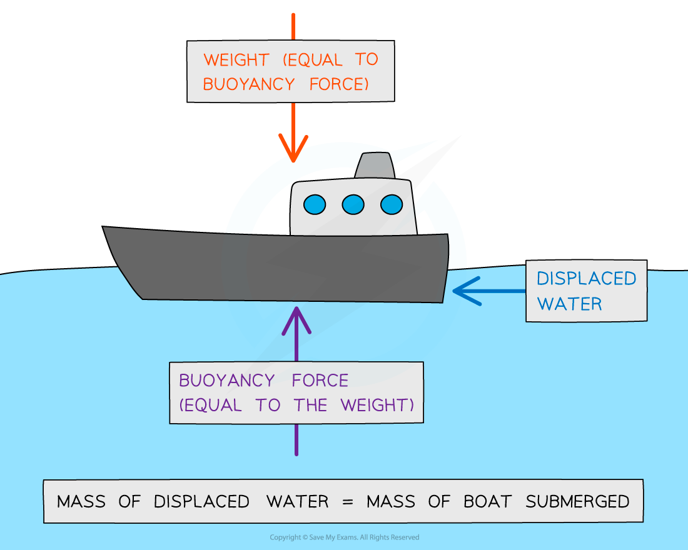

# Upthrust

## Upthrust

> **Spec point** — `spcpt_HxmTDH3PMpwcMzgt`

## Upthrust

#### Archimedes' Principle

- Archimedes’ principle states: **An object submerged in a fluid at rest has an upward buoyancy force (upthrust) equal to the weight of the fluid displaced by the object**
- The object sinks until the weight of the fluid displaced is equal to its own weight

  - Therefore the object floats when the magnitude of the upthrust equals the weight of the object

- The magnitude of upthrust can be calculated in steps by:

  - Find the volume of the submerged object, which is also the volume of the displaced fluid
  - Find the weight of the displaced fluid
  - Since *m* = *ρV *(density × volume), upthrust is equal to *F* = *mg* which is the weight of the fluid displaced by the object

- Archimedes’ Principle explains how ships float:

***Boats float because they displace an amount of water that is equal to their weight***

> **Worked Example**
> Atmospheric pressure at sea level has a value of 100 kPa. The density of sea water is 1020 kg m-3.
> 
> At what depth in the sea would the total pressure be 250 kPa?
> 
> **A. **20 m
> 
> **B.** 9.5 m
> 
> **C.** 18 m
> 
> **D.** 15 m
> 
> 

> **Worked Example**
> Icebergs typically float with a large volume of ice beneath the water. Ice has a density of 917 kg m-3 and a volume of Vi.
> 
> The density of seawater is 1020 kg m-3.What fraction of the iceberg is above the water?
> 
> **A. **0.10 Vi
> 
> **B.** 0.90 Vi
> 
> **C.** 0.97 Vi
> 
> **D.** 0.20 Vi
> 
> 
> 
> 

> **Exam Hint**
> Don't get confused by the two step process to find upthrust.
> 
> - Step 1: You need the volume of the submerged object, but **only **because you want to know **how much fluid was displaced**
> - Step 2: What you **really **want to know is the **weight of the displaced fluid**.
> 
> A couple of familiar equations will help;
> 
> - ***m = ρV ***to get mass (and that's the V from step 1 out of the way),
> 
> then
> 
> - ***W = mg*** to get weight
> 
> If you are feeling particularly mathematical, you can combine your equations, so that ***W = ρVg***
