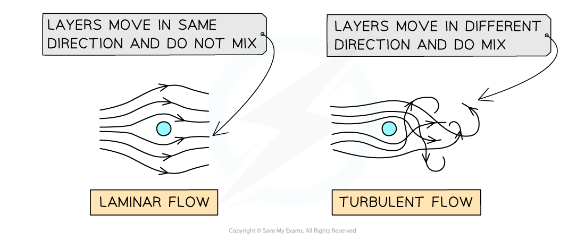

# Viscous Drag

## Stokes' Law

> **Spec point** — `spcpt_4c6DcWyyT9sgWdRM`

## Stoke's Law

### Viscous drag

- Viscous drag is defined as:

**The frictional force between an object and a *****fluid***** which opposes the motion between the object and the fluid**

- The viscous drag on a small sphere can be calculated using Stokes’ law:

$F=6πηrv$

- Where

  - *F* = viscous drag force (N)
  - *η* = coefficient of viscosity of the fluid (N s m−2 *or* Pa s)
  - *r *= radius of the object (m)
  - *v* = velocity of the object (m s−1)

- The viscosity of a fluid can be thought of as its thickness, or how much it resists flowing

  - Fluids with **low viscosity** are **easy** to pour, while those with **high viscosity** are **difficult** to pour

- The** coefficient of viscosity** is a property of the fluid (at a given temperature) that indicates how much it will resist flow

  - **The rate of flow** of a fluid is inversely proportional to the coefficient of viscosity

### Terminal velocity of a sphere in a fluid

- When an object falls through a fluid (e.g. a skydiver falling through the air), it reaches **terminal velocity**
- This occurs when the **weight **of the object balances with the *upthrust*** **and the **viscous drag **force

weight =  upthrust + viscous drag

$W=U+F_{d}$

#### Forces acting on a sphere falling through a fluid

***At terminal velocity, the forces on the sphere are balanced: W (downwards) = F******d****** + U (upwards)***

- Consider a small, solid sphere of radius $r$ moving slowly at terminal velocity through a fluid of viscosity $η$
- The upthrust $U$ on the sphere is equal to the weight of the fluid displaced

$W_{s}=W_{f}+6πηrv_{\mathrm{term}}$

$m_{s}g=m_{f}g+6πηrv_{\mathrm{term}}$

- Where

  - $m_{s}$ = mass of the sphere (kg)
  - $m_{f}$ = mass of the fluid displaced (kg)
  - $g$ = acceleration due to gravity (m s−2)
  - $v_{\mathrm{term}}$ = terminal velocity of the sphere (m s−1)
- Using the density equation, the mass $m_{s}$ of the **sphere **is given by:

$m_{s}=ρ_{s}V=\frac{4}{3}πr^{3}ρ_{s}$

- Where:

  - $ρ_{s}$ = density of the sphere (kg m–3)
- The **volume of displaced fluid** is the** same** as the** volume of the sphere**
- Therefore, the mass $m_{f}$ of **displaced fluid** is given by:

$m_{f}=ρ_{f}V=\frac{4}{3}πr^{3}ρ_{f}$

- Where:

  - $ρ_{f}$ = density of the fluid (kg m–3)
- Substituting the expressions for mass back into the original equation:

`open parentheses 4 over 3 straight pi r cubed rho subscript s close parentheses g space equals space open parentheses 4 over 3 straight pi r cubed rho subscript f close parentheses g space plus space 6 straight pi eta r v subscript term`

- Rearrange to make terminal velocity the subject of the equation

`6 straight pi eta r v subscript term space equals space 4 over 3 straight pi r cubed g open parentheses rho subscript s minus rho subscript f close parentheses`

`v subscript term space equals space fraction numerator 4 over 3 straight pi r cubed g open parentheses rho subscript s minus rho subscript f close parentheses over denominator 6 straight pi eta r end fraction`

`v subscript term space equals space fraction numerator 2 straight pi r cubed g open parentheses rho subscript s minus rho subscript f close parentheses over denominator 9 straight pi eta r end fraction`

- Finally, cancel out *r* from the top and bottom to find an expression for **terminal velocity** in terms of the **radius of the sphere** and the **coefficient of viscosity**

`v subscript term space equals space fraction numerator 2 r squared g open parentheses rho subscript s minus rho subscript f close parentheses over denominator 9 eta end fraction`

- This final equation shows that terminal velocity is:

  - directly proportional to the square of the radius of the sphere
  - inversely proportional to the viscosity of the fluid

## Understanding Viscosity & Stokes' Law

> **Spec point** — `spcpt_TSDs6PrcW7JwZwsX`

## Understanding Viscosity & Stoke's Law

#### Conditions for Stoke’s Law Equation

- The equation can only be used when certain conditions are met:

  - The flow is laminar
  - The object is small
  - The object is spherical
  - Motion between the sphere and the fluid is at a slow speed

### Laminar flow and turbulent flow

- As an object moves through a fluid, or a fluid moves around an object, layers in the fluid are created
- In** laminar flow**, all the layers are moving in the **same **direction, and they do **not **mix

  - This tends to happen for slow-moving objects or slow-flowing liquids
  - The equation above only applies to laminar flow
- In** turbulent flow**, the layers move in **different **directions, and the layers **do** mix

### Changing viscosity

- Viscosity is temperature-dependent

  - **Liquids **are **less **viscous as the temperature increases
  - **Gases **get **more **viscous as the temperature increases

> **Worked Example**
> A ball bearing of radius 5.0 mm falls at a constant speed of 0.030 m s–1 through an oil which has a viscosity of 0.3 Pa s and a density of 900 kg m–3.
> 
> Determine the viscous drag acting on the ball bearing.
> 
> **Answer:**
> 
> **Step 1: List the known quantities in SI units**
> 
> - Radius of the sphere, *r**s* = 5.0 mm = 5.0 × 10-3 m
> - Terminal velocity of the sphere, *v* = 0.03 m s-1
> - Viscosity of oil, *η* = 0.3 Pa s
> - Density of oil, *ρ**f* = 900 kg m−3
> 
> **Step 2: Sketch a free-body diagram to resolve the forces at constant speed**
> 
> *W**s** = F**d** + U*
> 
> 
> 
> **Step 3: Calculate the value for viscous drag, *****F******d***
> 
> *F**d* = 6π*ηrv* = 6 × π × 0.3 × 5.0 × 10-3 × 0.03 = 0.008482
> 
> **Step 4: Write the complete answer to the correct significant figures and include units**
> 
> - The viscous drag, *F**d*  = 8.5 × 10-4 N

> **Exam Hint**
> You may need to write out some or all of the derivation given in the first part above.
> 
> It is really important to keep clear whether you are talking about the density of the sphere or the fluid, and the mass of the sphere or the fluid.
> 
> Practice using subscripts, and do try this at home. It isn’t one to do for the first time in an exam!
> 
> 
