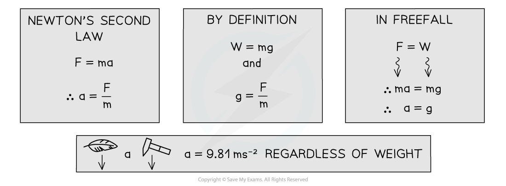

# Mass, Weight & Gravitational Field Strength

## Mass, Weight & Gravitational Field Strength

> **Spec point** — `spcpt_Q7bzRqs43xnMbWVq`

## Mass, Weight & Gravitational Field Strength

#### Mass

- **Mass **is the measure of the amount of matter in an object

  - Consequently, this is the property of an object that resists change in motion
- The greater the mass of a body, the smaller the change produced by an applied force

  - The SI unit for mass is the **kilogram** (kg)

#### Weight

- **Weight **is the force a body experiences due to being in a gravitational field, it is given by the equation

W = mg

- Where

  - m = mass (kg)
  - g = gravitational field strength (N kg−1)

#### Gravitational Field Strength

- Gravitational field strength is the force per kilogram that acts on an object, it is found using the equation

g = $\frac{F}{m}$

- Where

  - F = weight (N)
  - m = mass (kg)
- On the Earth's surface the average gravitational field strength =** 9.81 N kg****−1**

#### Constant Acceleration in Freefall

- **Freefall **is used to describe falling objects where the only force is weight

  - Drag forces are ignored
  - By considering freefall we can see that all objects must fall with exactly the same value for acceleration, regardless of their mass or weight

