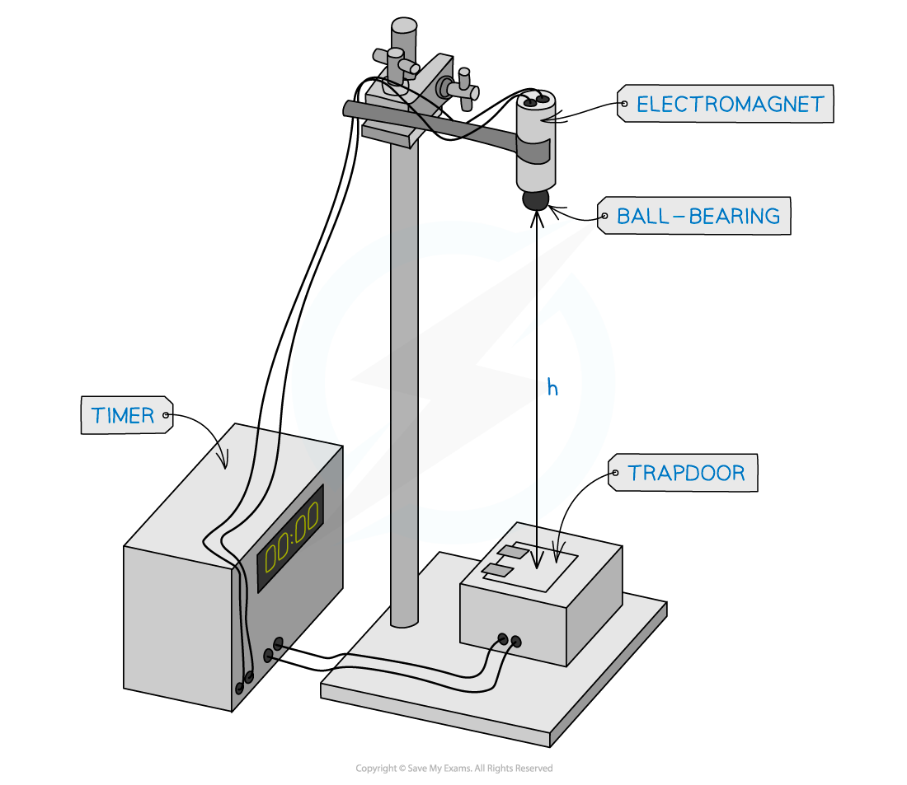
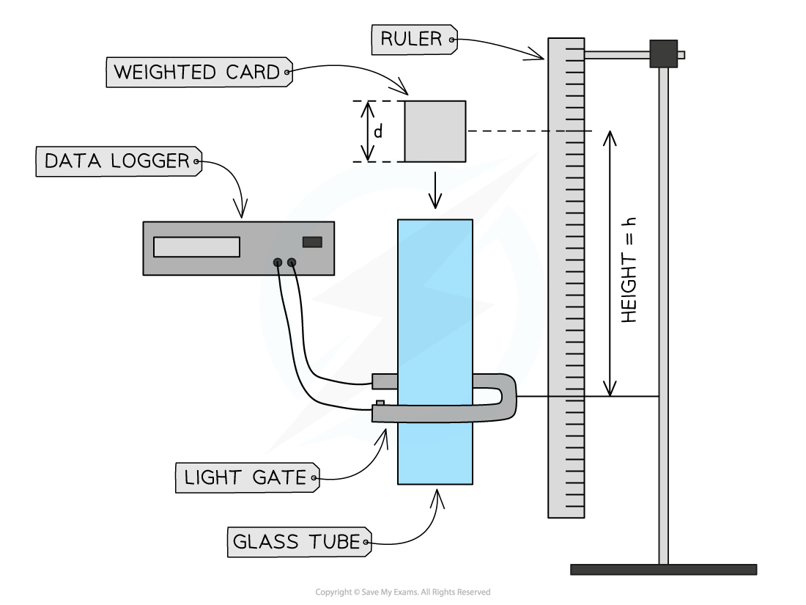
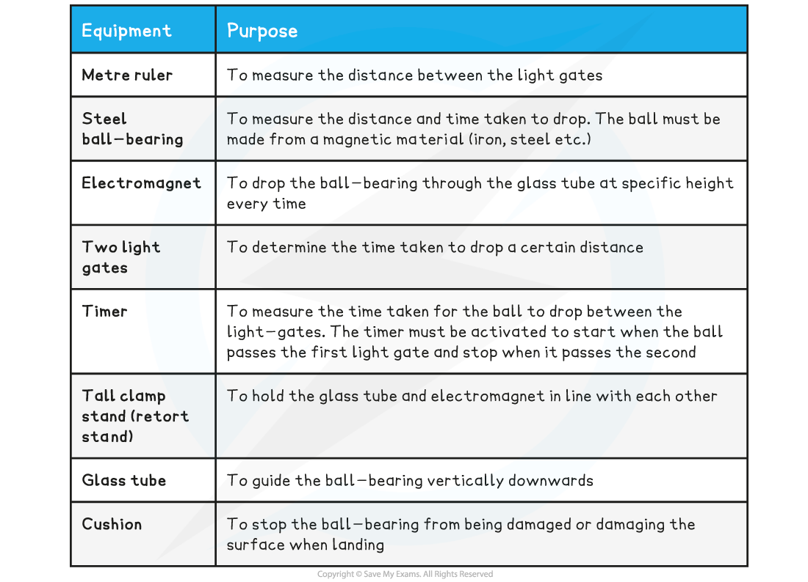
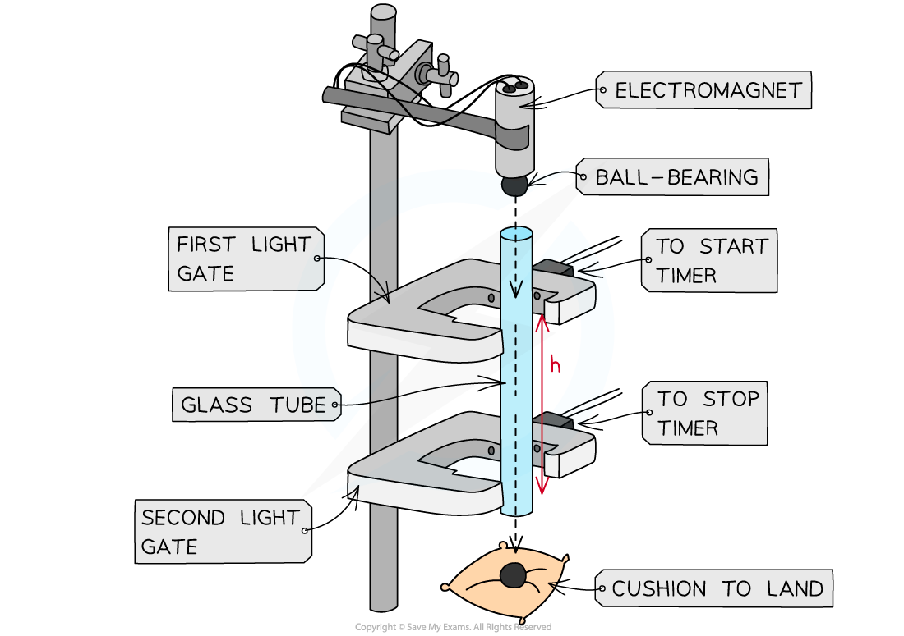
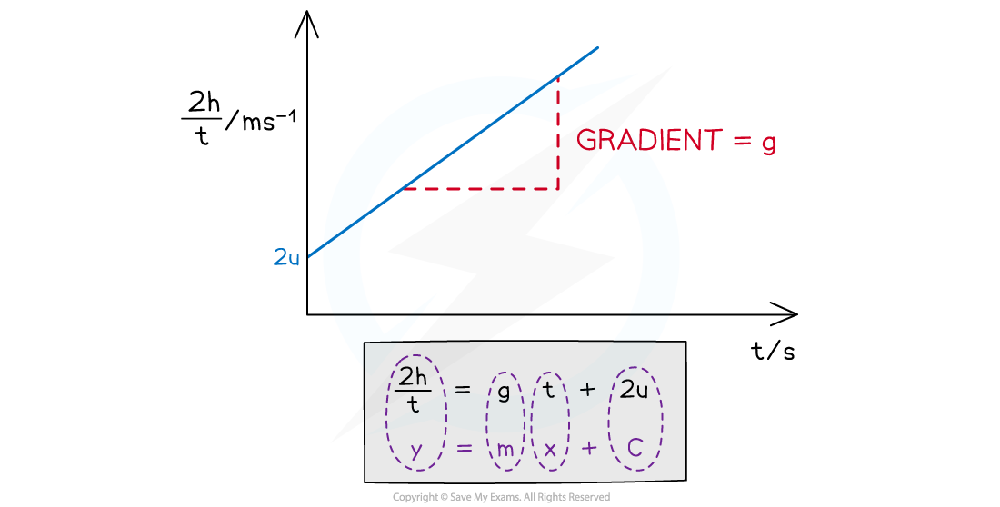
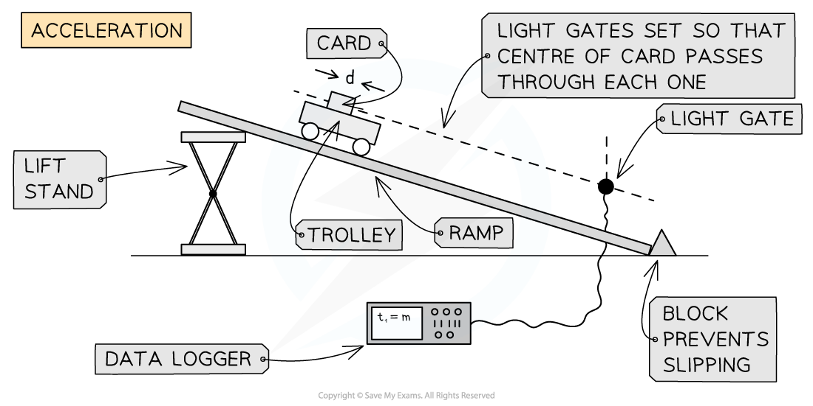
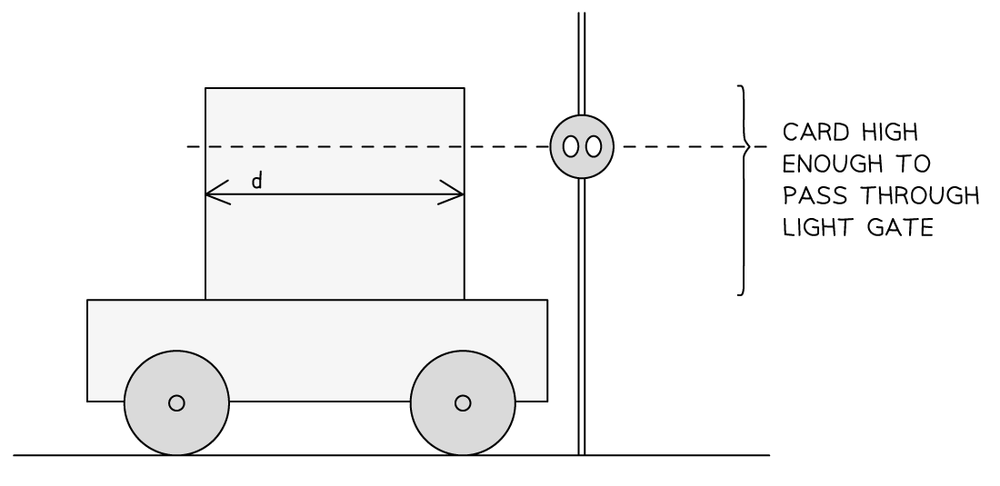
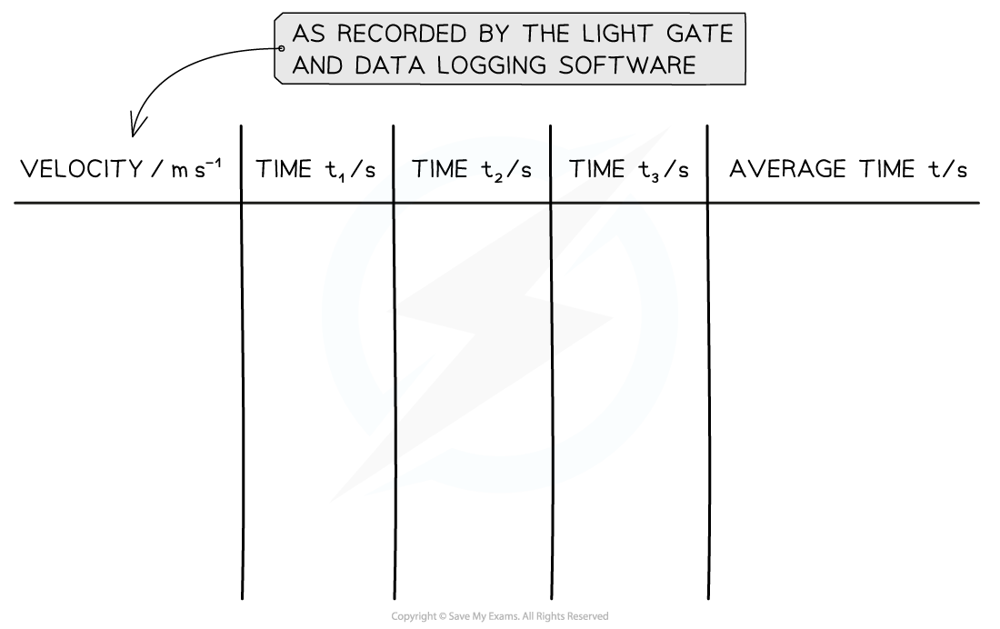

# Core Practical 1: Investigating the Acceleration of Freefall

## Acceleration of Freefall Using Electromagnets & Light Gates

> **Spec point** — `spcpt_xh3sbSCDvzXSbrvG`

## Acceleration of Freefall Using Electromagnets & Light Gates

#### Aim of the Investigations

- The overall aim of these investigations is to calculate the value of the acceleration due to gravity, *g*
- The first two experiments both use the method of dropping an object and either timing its fall, or finding the final velocity

  - Both use the SUVAT equations to produce a straight line graph
- The third experiment, using the **ramp and trolley**, is based on the inclined ramp experiment done by Galileo when he proved that all objects fall at the same rate, regardless of weight

#### Electromagnet Method

#### Variables

- *Independent variable* = height, *h*
- *Dependent variable* = time, *t*
- Control variables:

  - Same object being dropped
  - Same electromagnet and trap door switching system

#### Apparatus

- Metre rule, ball bearing, electromagnet, electronic timer, trapdoor, plumb line

***Apparatus used to measure g using the electromagnet method***

- *Resolution* of measuring equipment:

  - Metre ruler = 1 mm
  - Timer = 0.01 s

#### Method

- By using the plumb line to find the vertical drop, position the trap door switch directly underneath the electromagnet.
- Check that the ball bearing triggers both the trap door switch and the timer when it is released.
- When the equipment is set up correctly;

  - As the current to the magnet switches off, the ball drops and the timer starts
  - When the ball hits the trapdoor, the timer stops
- The reading on the timer indicates the time it takes for the ball to fall a distance, *h*
- Measure the distance from the **bottom **of the ball bearing to the trap door switch with a metre ruler and record this distance as height, *h*
- Increase *h* (eg. by 5 cm) and repeat the experiment. At least 5 – 10 values for *h* should be used
- Repeat this method at least 3 times for each value of *h* and calculate an average *t* for each

#### Table of Results

#### Analysis of Results

- The acceleration is found by using one of the SUVAT equations and rearranging it to create a straight line graph (y = mx + c)
- The known quantities are
- Displacement *s = h*

  - Time taken = *t*
  - Initial velocity = *u*
  - Acceleration *a = g*
- The missing SUVAT value is final velocity, *v*
- Therefore use

$s=ut+\frac{1}{2}at^{2}$

- Replace *a* with *g* and *s* with *h* and then rearrange to fit the equation of a straight line

$h=\frac{1}{2}gt^{2}$ (since initial velocity, u = 0)

- The above equation shows that if *h* is plotted on the y-axis and *t**2* on the x-axis the graph will produce a straight line with gradient = $\frac{1}{2}$*g*

#### Evaluating the experiment

***Systematic Errors:***

- Residue magnetism after the electromagnet is switched off may cause *t* to be recorded as longer than it should be

***Random Errors:***

- Large uncertainty in *h* from using a metre rule with a precision of 1 mm
- Parallax error from reading *h*
- The ball may not fall accurately down the centre of the trap door
- Random errors are reduced through repeating the experiment for each value of *h* at least 3-5 times and finding an average time, *t*

#### Safety Considerations

- The electromagnetic requires current

  - Care must be taken to not have any water near it
  - To reduce the risk of electrocution, only switch on the current to the electromagnet once everything is set up
- A cushion or a soft surface must be used to catch the ball-bearing so it doesn’t roll off / damage the surface
- The tall clamp stand needs to be attached to a surface with a G clamp to keep it stable

#### Card and Light Gates Method

#### Variables

- *Independent variable* = height, *h*
- *Dependent variable* = final velocity, *v*
- Control variables:

  - Same card being dropped
  - All other equipment is the same

#### Apparatus

- Metre rule, clear tube with large enough diameter for card to fall cleanly through it, card, blu-tack, light gate, data logger, plumb line

#### Method

- Clamp the clear tube vertically using the plumb line as a guide
- Attach the light gate about 20 cm above the bench
- Clamp the metre ruler vertically next to the tube so that the vertical distance from the top of the tube to the light gate can be accurately measured
- Record the distance between the light gate and the top of the tube as height,* h*
- Cut a piece of card to approximately 10 cm, measure this length precisely and enter it into the data logger as the distance

  - Weight the card slightly at one end (a large paperclip or small pieces of blu-tack can be used)
- Hold the card at the top of the tube and release it so that it falls inside the tube

  - The data logger will record velocity
- Repeat this measurement from the same height two more times
- Move the light gate up by 5 cm, record the new height, h, and drop the card three more times, recording the velocity each time
- Repeat for five more values of height

#### Analysis of Results

- The acceleration is found by using one of the SUVAT equations and rearranging it to create a straight line graph (y = mx + c)
- The known quantities are

  - Displacement *s = h*
  - Initial velocity = *u *
  - Final velocity *= v*
  - Acceleration *a = g*
- The missing SUVAT value is time, *t*
- Therefore use

$v^{2}=u^{2}+2as$

- Replace *a* with *g* and *s* with *h* and then rearrange to fit the equation of a straight line

$v^{2}=2gh$ (since initial velocity, u = 0)

- The above equation shows that if *v**2* is plotted on the y-axis and *2h* on the x-axis the graph will produce a straight line with gradient = *g*

#### Evaluating the experiment

***Systematic Errors:***

- The metre ruler needs to be fixed vertically and close to the tube
- All height measurements are taken at eye level to avoid parallax errors

***Random Errors:***

- Large uncertainty in *h* from using a metre rule with a precision of 1 mm
- Parallax error from reading *h*
- The card may fall against the sides of the tube, slowing it down
- Dropping the card from the top of the tube can introduce parallax errors
- Random errors are reduced through repeating the experiment for each value of *h* at least 3-5 times and finding an average time, *t*

#### Safety Considerations

- The tall clamp stand needs to be attached to a surface with a G clamp to keep it stable

#### Ball Bearing Method

**Variables**

- *Independent variable* = height, *h*
- *Dependent variable* = time, *t*
- Control variables:

  - Same steel ball–bearing
  - Same electromagnet
  - Distance between ball-bearing and top of the glass tube

#### Equipment List

- *Resolution* of measuring equipment:

  - Metre ruler = 1 mm
  - Timer = 0.01 s

#### Method

***Apparatus set up to measure the distance and time for the ball bearing to drop***

This method is an example of the procedure for varying the height the ball-bearing falls and determining the time taken – this is just one possible relationship that can be tested

1. Set up the apparatus by attaching the electromagnet to the top of a tall clamp stand. Do not switch on the current till everything is set up
2. Place the glass tube directly underneath the electromagnet, leaving space for the ball-bearing. Make sure it faces directly downwards and not at an angle
3. Attach both light gates around the glass tube at a starting distance of around 10 cm
4. Measure this distance between the two light gates as the height, *h* with a metre ruler
5. Place the cushion directly underneath the end of the glass tube to catch the ball-bearing when it falls through
6. Switch the current on the electromagnet and place the ball-bearing directly underneath so it is attracted to it
7. Turn the current to the electromagnet off. The ball should drop
8. When the ball drops through the first light gate, the timer starts
9. When the ball drops through the second light gate, the timer stops
10. Read the time on the timer and record this as time, *t*
11. Increase *h* (eg. by 5 cm) and repeat the experiment. At least 5 – 10 values for *h* should be used
12. Repeat this method at least 3 times for each value of *h* and calculate an average *t* for each

- An example of a table with some possible heights would look like this:

**Example Table of Results**

#### Analysis of Results

- The acceleration is found by using one of the SUVAT equations
- The known quantities are

  - Displacement *s = h*
  - Time taken = *t*
  - Initial velocity *u* = *u*
  - Acceleration *a = g*
- The following SUVAT equation can be rearranged:

- Substituting in the values and rearranging it as a straight line equation gives:

- Comparing this to the equation of a straight line: y = mx + c

  - y = 2h/*t* (m s-1)
  - x = *t*
  - Gradient, m = a = *g* (m s–2)
  - y-intercept = 2*u*

1. Plot a graph of the 2*h*/*t* against *t*
2. Draw a line of best fit
3. Calculate the gradient - this is the acceleration due to gravity *g*
4. Assess the uncertainties in the measurements of *h* and *t*. Carry out any calculations needed to determine the uncertainty in *g* due to these

***The graph of 2h/t against t produces a straight-line graph where the acceleration is the gradient***

#### Evaluating the Experiment

***Systematic Errors:***

- Residue magnetism after the electromagnet is switched off may cause *t* to be recorded as longer than it should be

***Random Errors:***

- Large uncertainty in *h* from using a metre rule with a precision of 1 mm
- Parallax error from reading *h*
- The ball may not fall accurately down the centre of each light gate
- Random errors are reduced through repeating the experiment for each value of *h* at least 3-5 times and finding an average time, *t*

#### Safety Considerations

- The electromagnetic requires current

  - Care must be taken to not have any water near it
  - To reduce the risk of electrocution, only switch on the current to the electromagnet once everything is set up
- A cushion or a soft surface must be used to catch the ball-bearing so it doesn’t roll off / damage the surface
- The tall clamp stand needs to be attached to a surface with a G clamp so it stays rigid

## Acceleration of Freefall Using a Ramp & Trolley

> **Spec point** — `spcpt_s56SN2fkMSXgCBBN`

## Acceleration of Freefall Using a Ramp & Trolley

- This method of finding acceleration due to freefall uses the SUVAT equations, but applies them to a trolley rolling down an inclined ramp.

#### Variables

- *Independent variable* = velocity of the trolley, *v*
- *Dependent variable* = time, *t*
- Control variables:

  - Height of ramp must be constant
  - Same trolley being used

#### Apparatus

- Inclined ramp
- Trolley with ≅10 cm card attached
- Light gate and computer or datalogger
- Stopwatch
- Block to prevent slipping

#### Method

- Carefully cut a piece of card so that it is between 5 – 10 cm in length, and has a height which can break the beam of a light gate as the trolley passes through.
- Measure and record the length, d, of the card

  - Record this in the datalogging software
- Attach the card to the trolley and roll the trolley past the light gate checking the beam is broken by the card

  - Adjust the height of the light gate as needed.

- Start the timing on the software, making sure it is set to record instantaneous velocity
- Release the trolley and simultaneously start the stopwatch.
- As the card passes the light gate stops the stopwatch

  - record the time, *t*
- Repeat procedure 3 times, discard anomalies and calculate mean *t*

  - This reduces errors
- Repeat the procedure at least 5 times, varying the height the trolley is dropped from for each reading

  - This causes a variation in v which is recorded by the light gate, and t which is recorded using the stopwatch.

#### Analysis of Results

- The acceleration is found by using one of the SUVAT equations and rearranging it to create a straight line graph (y = mx + c)
- The known quantities are

  - Time taken, *t* = average *t*
  - Initial velocity, *u* = 0 (the trolley starts from rest)
  - Final velocity *v* = *v *(recorded by the light-gate)
  - Acceleration *a = g*
- The missing SUVAT value is displacement, *s*

  - Therefore use

$v=u+at$

- This matches the equation of a straight line

  - y = velocity, *v*
  - x = average time, *t*
  - gradient = acceleration, *a*
  - y-intercept = initial velocity, *u*
- Plot a graph of v against average t

  - The gradient will be the acceleration
  - This acceleration is provided by gravity, and so will give a value for *g*

#### Evaluating the experiment

***Systematic Errors:***

- Make sure for each repeat reading the trolley is released from the same point
- The card should be measured carefully so value *d* is accurate

***Random Errors:***

- Large uncertainty in *d* from using a ruler with a precision of 1 mm
- Reaction time when starting and stopping the stopwatch

  - Random errors are reduced through repeating the experiment for each value of *v* at least 3 times and finding an average time, *t*
- The card may hit the light gate

  - Discard a result where this occurs
- They trolley may not travel straight down the ramp

  - Discard a result where this occurs

#### Safety Considerations

- The trolley may fly off the end of the ramp

  - Use a block or tray at the bottom of the ramp to prevent this

> **Exam Hint**
> This experiment can be modified by using the light gate to record time through the gate.
> 
> You can then use the time from the light gate to calculate the velocity, *v* of the trolley by calculating with* v* = *d*/*t* where d is the length of the card and the time is the time on the light gate.
> 
> However, most light-gate software should allow you to eliminate this step.
