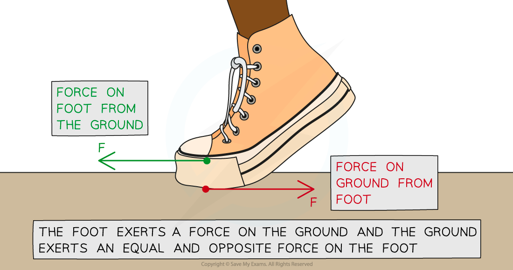

# Newton's Third Law of Motion

## Newton's Third Law of Motion

> **Spec point** — `spcpt_9V6Fw2htbbMSp6Dc`

## Newton's Third Law of Motion

- Newton’s **third law of motion** states: **Whenever two bodies interact, the forces they exert on each other are equal in size, act in opposite directions, and are of the same type**
- Newton’s third law explains the following important principles about forces:

  - All forces arise in **pairs** – if object A exerts a force on object B, then object B exerts an **equal** and **opposite** force on object A
  - Force pairs are of the **same type** – for example, if object A exerts a **gravitational force** on object B, then object B exerts an equal and opposite **gravitational force** on object A

- Newton’s third law explains the forces that enable someone to walk
- The image below shows an example of a pair of equal and opposite forces acting on two objects (the ground and a foot):

***Newton's Third Law: The foot pushes the ground backwards, and the ground pushes the foot forwards***

- One force is from the foot that pushes the ground backwards
- The other is an **equal and opposite **force from the ground that pushes the foot forwards

> **Worked Example**
> A physics textbook is at rest on a dining room table.
> 
> Eugene draws a free body force diagram for the book and labels the forces acting on it.
> 
> 
> 
> Eugene says the diagram is an example of Newton's third law of motion. William disagrees with Eugene and says the diagram is an example of Newton's first law of motion.
> 
> By referring to the free-body force diagram, state and explain who is correct.
> 
> **Answer:**
> 
> **Step 1: State Newton's first law of motion**
> 
> - Objects will remain at rest, or move with a constant velocity unless acted on by a resultant force
> 
> **Step 2: State Newton's third law of motion**
> 
> - Whenever two bodies interact, the forces they exert on each other are equal and opposite
> 
> **Step 3: Check if the diagram satisfies the two conditions for identifying Newton's third law**
> 
> - In each case, Newton's third law identifies pairs of equal and opposite forces, of the same type, acting on two different objects
> - The diagram only involves **one object**
> - Furthermore, the forces acting on the object are different types of force - one is a **contact** **force** (from the table) and the other is a **gravitational force** on the book (from the Earth) - its **weight**
> - The image below shows how to apply Newton's third law correctly in this case, considering the pairs of forces acting:
> 
> 
> 
> **Step 4: Conclude which person is correct**
> 
> - In this case, **William is correct**
> - The free-body force diagram in the question is an example of **Newton's first law **
> - The book is **at rest** because the two forces acting on it are **balanced** - i.e. there is no **resultant force**

> **Exam Hint**
> Remember that pairs of equal and opposite forces in Newton's third law act on **two different objects.** It's a really common mistake to confuse Newton's third law with Newton's first law. That also means it's a really common exam question, which often uses a version of the example below.
> 
> Applying this check will help you distinguish between them.
> 
> Newton's first law involves forces acting on a **single** object.
> 
> These differences are shown in Scenario 1 (Newton's first law) vs. Scenario 2 (Newton's third law)
> 
> 
