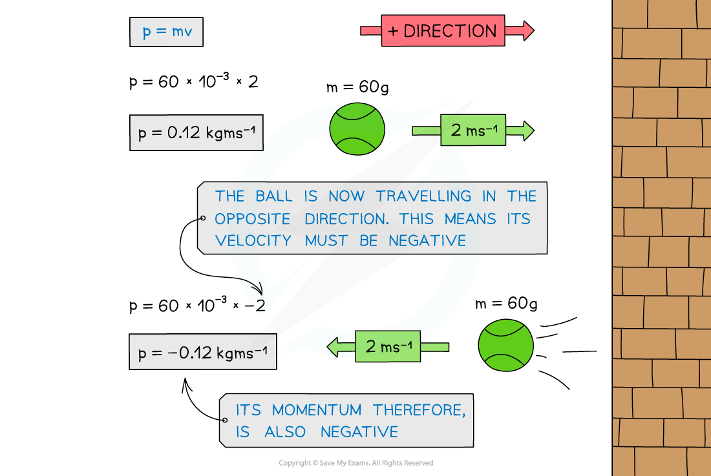

# Momentum

## Defining Momentum

> **Spec point** — `spcpt_4hhTMb5zqnwBrg68`

## Defining Momentum

- Linear momentum (*p*) is defined as the product of mass and velocity

***Momentum is the product of mass and velocity***

- Momentum is a vector quantity - it has both a magnitude and a direction
- This means it can have a negative or positive value

  - If an object travelling to the right has positive momentum, an object travelling to the left (in the opposite direction) has a negative momentum
- The SI unit for momentum is **kg m s****−1**

***When the ball is travelling in the opposite direction, its velocity is negative. Since momentum = mass × velocity, its momentum is also negative***

> **Worked Example**
> Which object has the most momentum?
> 
> 
> 
> **Answer:**
> 
> 
> 
> - Both the tennis ball and the brick have the same momentum
> - Even though the brick is much heavier than the ball, the ball is travelling much faster than the brick
> - This means that on impact, they would both exert a similar force (depending on the time it takes for each to come to rest)

> **Exam Hint**
> Since momentum is in** kg m s****−1**:
> 
> - If the mass is given in grams, make sure to convert to kg by dividing the value by 1000.
> - If the velocity is given in km s−1, make sure to convert to m s−1 by multiplying the value by 1000
> 
> The direction you consider positive is your choice, as long the signs of the numbers (positive or negative) are consistent  throughout the question.
> 
> Sketching a diagram **which includes the signs on positive and negative values** will help you avoid mistakes when calculating
