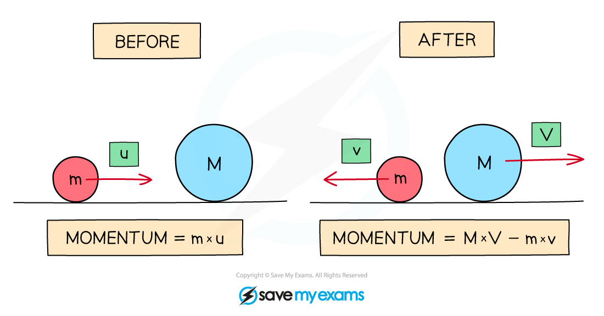

# Conservation of Linear Momentum

## The Principle of Conservation of Linear Momentum

> **Spec point** — `spcpt_VbTCRx9Dws3tXr94`

## The Principle of Conservation of Linear Momentum

- The principle of conservation of momentum states that in a *closed system*, the total momentum before an event is equal to the total momentum after the event

- Momentum is **always **conserved in collisions where no external forces act

- This is usually written as:

**Total momentum before a collision = Total momentum after a collision**

- Since momentum is a ***vector*** quantity, a *system* of objects moving in opposite directions can have an overall momentum of 0

  - This applies to objects moving towards each other or away from each other

- The diagram below shows two masses *m *with velocity *u* and *M *at rest (M has zero velocity)

***The momentum of a system before and after a collision***

- Before the collision:

  - The momentum is only of mass *m* which is moving
  - If the right is taken as the positive direction, the total momentum of the system is ***m***** ×***** u***

- After the collision:

  - Mass *M* also now has momentum
  - The velocity of *m* is now -*v *(since it is now travelling to the left) and the velocity of *M* is *V*
  - The total momentum is now the momentum of *M* + momentum of *m*
  - This is (*M* × *V*) + (*m* × -*v*) or **(*****M***** × *****V*****) – (*****m***** × *****v*****)**

> **Worked Example**
> Trolley **A** of mass 0.80 kg collides head-on with stationary trolley **B** whilst travelling at
> 
> 3.0 m s–1. Trolley **B** has twice the mass of trolley **A**. On impact, the trolleys stick together.
> 
> Using the conversation of momentum, calculate the common velocity of both trolleys after the collision.
> 
> **Answer:**
> 
> 

## Conservation of Linear Momentum & Newton's Third Law

> **Spec point** — `spcpt_NN6QgJKy2Mbjrr7T`

## Conservation of Linear Momentum & Newton's Third Law

- Newton’s third law of motion states: **Whenever two bodies interact, the forces they exert on each other are equal and opposite**
- This means:

  - When one object exerts a force on another object, the second object will exert an equal force on the first object in the opposite direction
  - When two objects collide, both objects will react, generally causing one object to speed up (gain momentum) and the other object to slow down (lose momentum)

 <!-- asset download failed -->

***Newton's third law can be applied to collisions***

- Consider the collision between two trolleys, **A** and **B**:

  - When trolley **A** exerts a force on trolley **B**, trolley **B** will exert an equal force on trolley **A** in the opposite direction
- In this case:

**F****B–A**** = –F****A–B**

- While the forces are equal in magnitude and opposite in direction, the accelerations of the objects are not necessarily equal in magnitude
- From Newton's second law, acceleration depends upon both force and mass, this means:

  - For objects of equal mass, they will have equal accelerations
  - For objects of unequal mass, they will have unequal accelerations

> **Exam Hint**
> Momentum questions are often very long and wordy. Even if you are given a diagram, make a quick sketch representing all the bodies as point masses. Mark the velocities with arrows and include positive and negative signs.
> 
> 
> 
> The Maths of momentum is straightforward, so as long as you have your vector directions clear in your mind, nothing can go wrong!
