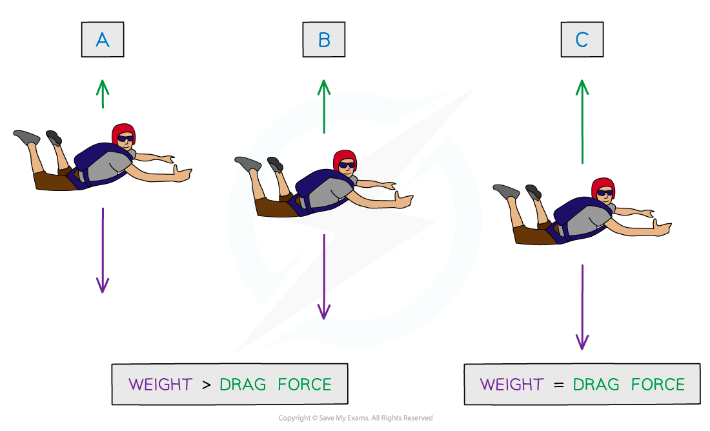
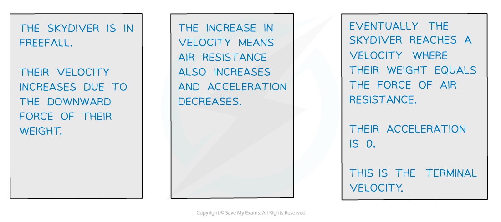

# Force & Acceleration

## Newton's First Law of Motion

> **Spec point** — `spcpt_hH5vjsQGpFTY4bD3`

## Newton's First Law of Motion

- Newton's First Law states: ***A body will remain at rest or move with constant velocity unless acted on by a resultant force***
- The law is used to explain why things move with a **constant** (or **uniform**) **velocity**
- If the **forces** acting on an object are **balanced**, then the **resultant force** is **zero**

  - The forces to the left = the forces to the right
  - The forces up = the forces down
- The velocity (i.e. speed and direction) **can only** **change** if a **resultant force** acts on the object

> **Worked Example**
> If there are no external forces acting on the car, other than friction, and it is moving at a constant velocity, what is the value of the frictional force F?
> 
> 
> 
> **Answer:**
> 
> **Step 1: Identify the prompt (or 'clue') word in the question to choose which rules to apply**
> 
> - The clue in this question is 'constant velocity'
> - This means that forces are perfectly balanced in every direction
> 
> ** Step 2: Calculate the missing force**
> 
> - For constant velocity sum of forces,
> 
> ΣF = 0
> 
> F = D
> 
> ** Step 3: Write the answer including units**
> 
> F = 6 k N

## Newton's Second Law of Motion

> **Spec point** — `spcpt_7kTx4szVYVr7w8jn`

## Newton's Second Law of Motion

- Newton's Second Law states that: **The acceleration of an object with constant mass is directly proportional to the resultant force on it**

- An unbalanced force on a body means it experiences a resultant force

  - If the resultant force is **along the direction of motion**, the body will speed up (**accelerate**) or slow down (**decelerate**)
  - If the resultant force is at an **angle**, the body will change **direction**
- Since resultant force is being considered, the equation is often written ΣF = ma

  - The use of Σ (Sigma) signifies that F is the **sum** of the forces rather than just one force acting alone

> **Worked Example**
> An object with a mass of 750 g accelerates in a straight line at 11 m s−2.
> 
> Determine the resultant force acting on the object.
> 
> **Answer:**
> 
> **Step 1: Write down the known quantities**
> 
> - Mass, *m* = 750 g = 0.750 kg
> - Acceleration, *a* =  11 m s−2.
> 
> **Step 2: Identify the equation needed and substitute in the values**
> 
> Σ*F = ma* = 0.75 × 11 = 8.25
> 
> **Step 3: Write the final answer using the correct significant figures and units**
> 
> Σ*F* = 8.3 N

## Terminal Velocity

> **Spec point** — `spcpt_V8ZWRrvnM4KrY38z`

## Terminal Velocity

- On Earth, moving bodies always do have **some force** acting on them, for example, due to friction caused by;

  - Movement through air or water (drag forces)
  - Movement across a surface (such as tyres on the road)
  - Moving parts within the object itself (such as the engine of a car, or the bearings in a wheel)

- When the drag forces become equal to the driving force the velocity reaches its **maximum** value and the object is said to be moving at **terminal velocity**

  - 'Terminal' means final, meaning there can be no more increases in velocity after it has been reached

- Terminal velocity is reached when the forces in the direction of motion are balanced by the forces opposing motion

  - This is often used in relation to the case of a skydiver falling in freefall, although it can apply to **any **situation where drag forces apply
- In the case of the skydiver the force in the direction of motion is their weight, which remains constant

  - As the skydiver accelerates air resistance increases, until the opposing forces balance

> **Worked Example**
> Suggest two ways in which a designer could increase the maximum velocity of a car.
> 
> **Answer:**
> 
> **Step 1: Identify exactly what the question is asking for**
> 
> - The question asks about 'maximum' (terminal) velocity, this occurs when all forces are balanced
> - To increase the terminal velocity the car either needs to
> 
>   - Increase the forces in the forwards direction, or
>   - Decrease the forces in the backwards direction (the ones which are opposing motion)
> 
> **Step 2: Write down the forces affecting the motion**
> 
> - In the forwards direction the only force is the thrust from the engine
> - The forces opposing motion include:
> 
>   - Friction between the tyres and the road
>   - Air resistance
>   - Friction in the moving parts of the engine
>   - Friction in the moving parts of the wheel system (bearings)
> 
> **Step 3: Suggest changes the designer could make**
> 
> - Increase the forwards thrust by increasing power from the engine
> - Reduce opposing forces by
> 
>   - Using tyres with less grip
>   - Making the car body more streamlined
>   - Reducing friction in the engine (using better oil for example)
>   - Reduce friction in the moving parts with smoother surfaces or better lubricants

> **Exam Hint**
> The direction you consider positive is your choice, as long as the signs of the numbers (positive or negative) are consistent throughout your answer. A clear, labelled diagram will tell both you and the Examiner which direction is positive, so nothing gets mixed up.
> 
> Having said that, there is a general rule to consider the direction the object is initially travelling in as positive. Therefore all vectors in the direction of motion will be positive and opposing vectors, such as drag forces, will be negative.
> 
> If you do get an acceleration in your answer with a negative sign, you have found that the object is slowing down. This is the Super Power of Physics equations!
