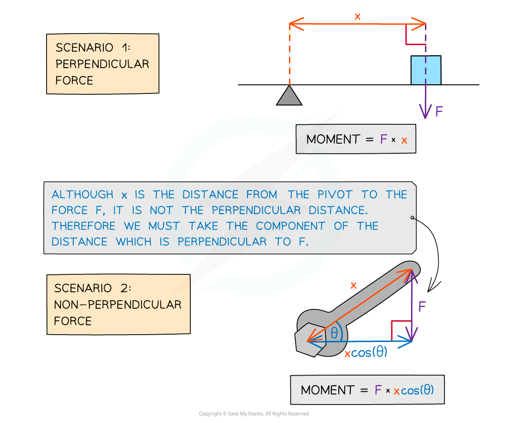

# Moments

## Calculating the Moment of a Force

> **Spec point** — `spcpt_2p9BFnGF45fnzgF6`

## Calculating the Moment of a Force

- A moment is the **turning effect of a force**
- Moments occur when forces cause objects to **rotate** about some pivot
- The moment of a force is given by

Moment (**N m**) = Force (**N**) × perpendicular distance from the pivot (**m**)

- The SI unit for the moment is Newton metres (**N m**). This may also be Newton centimetres (**N cm**) depending on the units given for the distance

***The force might not always be perpendicular to the distance***

- An example of moments in everyday life is opening a door
- The door handle is placed on the other side of the door to the hinge (the pivot) to **maximise** the distance for a given force and therefore provides a greater moment (turning force)

  - This makes it easier to push or pull

> **Worked Example**
> A uniform metre rule is pivoted at the 50 cm mark.
> 
> A 0.5 kg weight is suspended at the 80 cm mark, causing the rule to rotate about the pivot.
> 
> Assuming the weight of the rule is negligible, what is the turning moment about the pivot?
> 
> 
> 
> **Answer:**
> 
> 

> **Exam Hint**
> If not already given, drawing all the forces on an object in the diagram will help you see which ones are perpendicular to the distance from the pivot. Not all the forces will provide a turning effect and it is not unusual for a question to provide more forces than required to throw you off!
