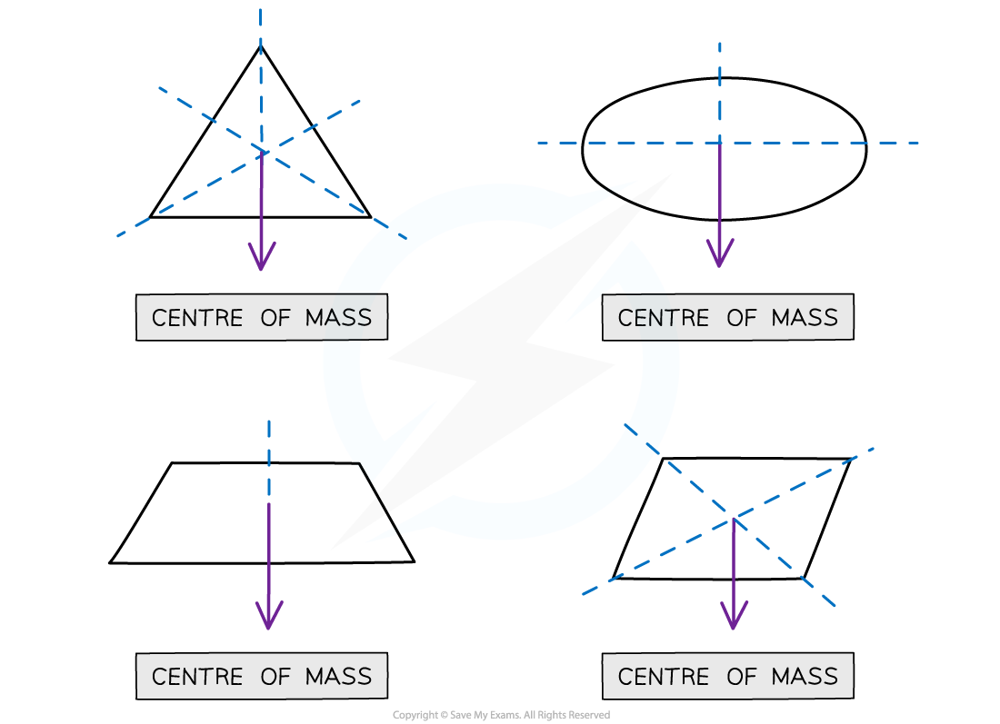
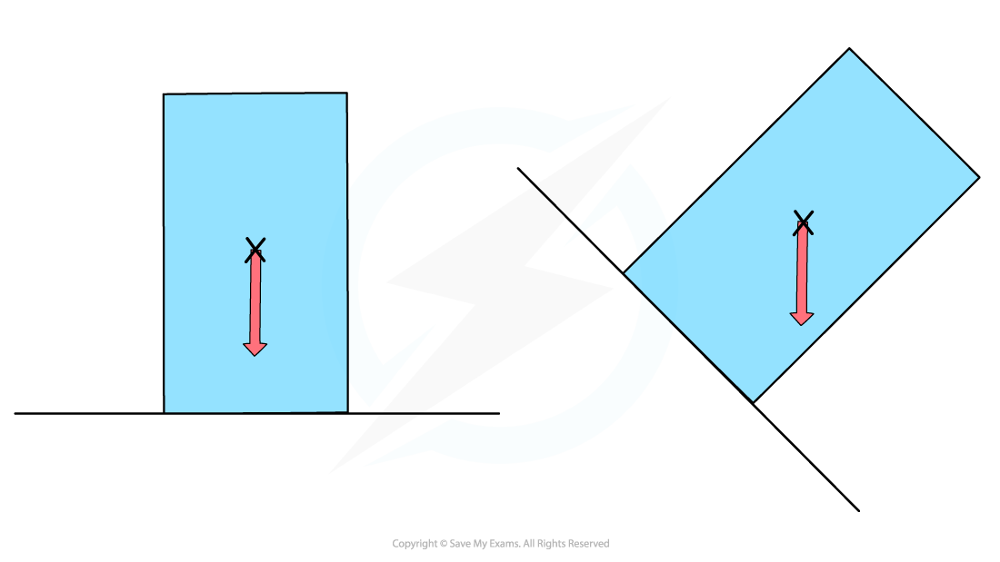
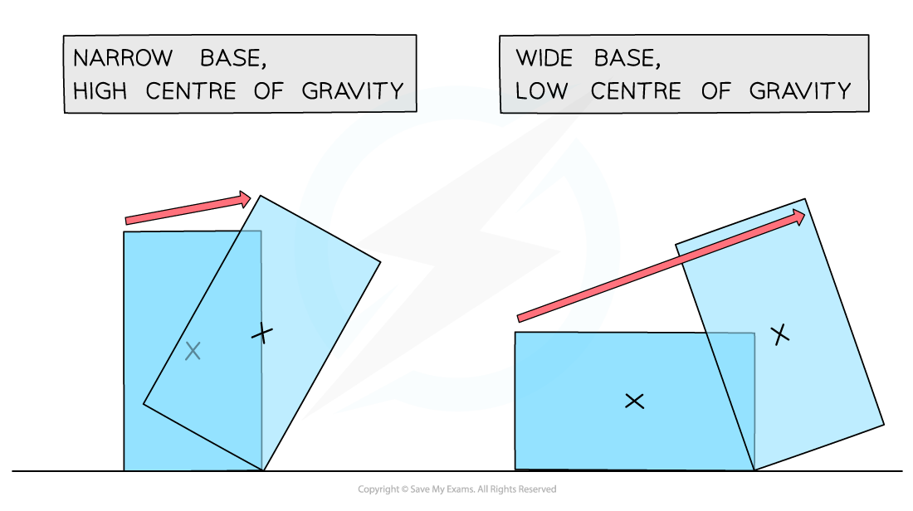
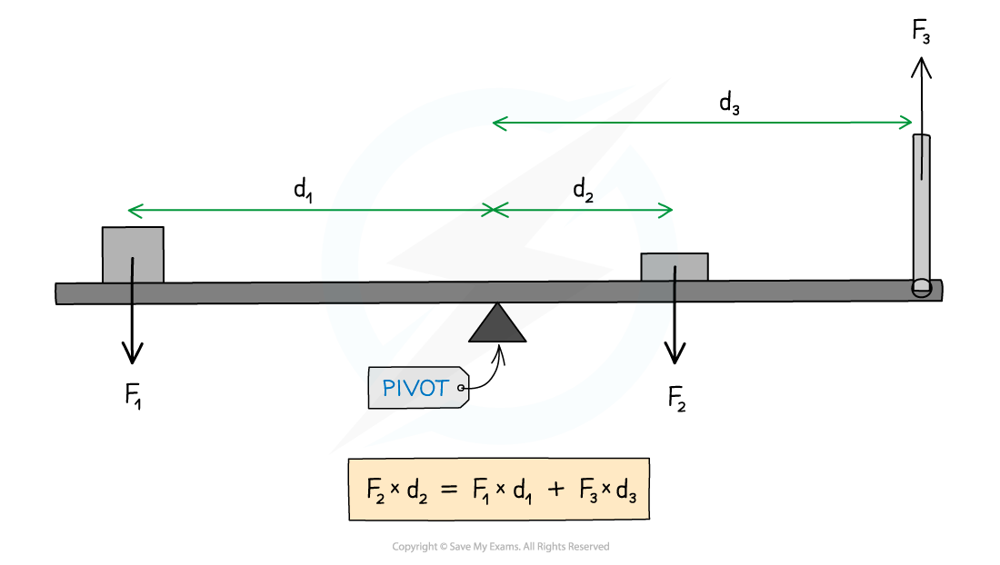

# Centre of Gravity & The Principle of Moments

## Centre of Gravity

> **Spec point** — `spcpt_2wFWVWS5cGvrwhcB`

## Centre of Gravity

- The centre of gravity (sometimes called the centre of mass) of an object is **the point through which all the weight can be considered to act**
- The position of the centre of gravity of uniform regular solid is at its centre

  - For example, for a person standing upright, their centre of gravity is roughly in the middle of the body behind the navel, and for a sphere, it is at the centre
- For symmetrical objects with uniform density, the centre of gravity is located at the **point of symmetry**

***The centre of mass of a shape can be found by symmetry***

#### Stability

- The position of the centre of gravity of an object affects its stability
- An object is stable when its centre of gravity lies above its base

***The object on the right will topple, as its centre of gravity is no longer over its base***

- The **wider **base an object has, the **lower** its centre of gravity and it is more **stable**
- The **narrower** base an object has, the **higher** its centre of gravity and the object is more likely to topple over if pushed

***The most stable objects have wide bases and low centres of mass***

## The Principle of Moments

> **Spec point** — `spcpt_hZ9JNk5sxJqxShM9`

## The Principle of Moments

- The principle of moments states: **For a system to be in equilibrium, the sum of clockwise moments about a point must be equal to the sum of the anticlockwise moments (about the same point)**

***Diagram showing the moments acting on a balanced beam***

- In the above diagram:

  - Force *F**2* is supplying a clockwise moment;
  - Forces *F**1* and *F**3* are supplying anticlockwise moments
- Hence: *F**2* × *d**2* = (*F**1* × *d**1*) + (*F**3* × *d**3*)

> **Worked Example**
> A uniform beam of weight 40 N is 5 m long and is supported by a pivot situated 2 m from one end.
> 
> When a load of weight W is hung from that end, the beam is in equilibrium, as shown in the diagram.
> 
> 
> 
> What is the value of W?
> 
> **A. **10 N
> 
> **B. **50 N
> 
> **C. **25 N
> 
> **D.** 30 N
> 
> 
> 
> 

> **Exam Hint**
> Make sure that all the distances are in the same units and you’re considering the correct forces as clockwise or anticlockwise, as seen in the diagram below
> 
> 
