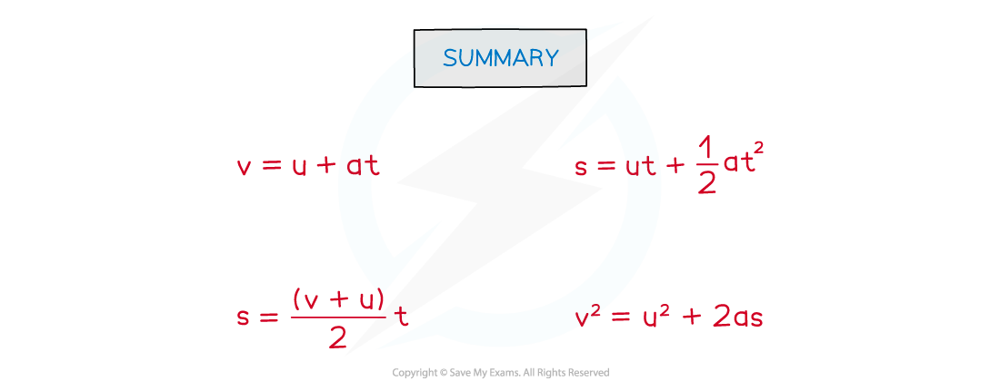

# Equations of Motion

## Equations of Motion

> **Spec point** — `spcpt_WTwxDNr2HNKCB9cp`

## Equations of Motion

- The kinematic equations of motion are a set of four equations which can describe any object moving with **constant** acceleration
- They are often referred to as the 'suvat' equations due to the variables they include
- These are:

  - *s* = **displacement **(m)
  - *u* = **initial velocity **(m s−1)
  - *v* = **final velocity **(m s−1)
  - *a* = **acceleration **(m s−2)
  - *t* = **time interval **(s)

- The four SUVAT equations are:

- These are all given on the data sheet
- All the variables, apart from **time *****t***, are vector quantities

  - This means they can either be positive or negative depending on their direction

#### Mastering the SUVAT Equations

- The SUVAT equations are used when acceleration is constant

  - This includes the case where acceleration is zero, when they reduce to s = ut and v = u

- This is indicated in questions by

  - An explicit statement that an object is **'constantly accelerating'** or **'constantly decelerating'**, or words to that effect
  - A description of an object in freefall where either **'air resistance can be ignored'** or **'air resistance is negligible'**
  - A statement that an accelerating or decelerating force is constant, since *F = ma*, constant force → constant acceleration

- Questions may appear to be missing some information, this should be checked before starting to calculate

  - Objects in motion often start or end at rest, making either *u* or *v* = zero
  - Objects in freefall have a **constant** acceleration of 9.81 m s−2
  - Always define which direction is positive before starting a calculation, and give u, v, s and a signs consistent with that choice
  - When an object is slowing down, its acceleration is opposite in direction to its velocity — so if velocity is positive, acceleration is negative
  - For objects thrown or shot upwards, taking upwards as positive gives a = −9.81 m s⁻², and the velocity is zero at the highest point of the path

> **Worked Example**
> A pilot is landing a small aircraft. The airstrip is only 450 m long and the aircraft decelerates from 40 m s−1 at a constant rate of 2 m s−2.
> 
> Determine if the plane will stop before it reaches the end of the runway.
> 
> **Answer:**
> 
> **Step 1: List the known values**
> 
> - Length of the runway, *s**max* = 450 m (this is the maximum value of displacement)
> - Initial velocity, *u* = 40 m s−1
> - Final velocity, *v* = 0 m s−1 (since the plane will stop)
> - Acceleration, *a* = − 2 m s−2 (the negative sign indicates slowing down)
> 
> **Step 2: Identify the missing values (the unknown answer and the one not given)**
> 
> - Known quantities: *u*, *v* and *a*
> - Unknown quantity: displacement, *s*
> - Time, *t* is not required in this question
> 
> **Step 3: Choose the correct SUVAT equation and rearrange it**
> 
> - The SUVAT equation which contains *u*, *v*, *a* and *s* and omits *t* is:
> 
> *v**2* = *u**2* + 2*as*
> 
> - Rearrange to make *s* the subject:
> 
> $s=\frac{v^{2}-u^{2}}{2a}$
> 
> **Step 4: Substitute the values into the equation and calculate *****s***
> 
> `s equals fraction numerator 0 squared minus 40 squared over denominator 2 cross times open parentheses negative 2 close parentheses end fraction`= 400 m
> 
> **Step 5: Write the full answer to the question**
> 
> - The plane stops after 400 m, which is 50 m before the end of the runway
> 
> - **Note:** In this solution, the negative value produced by *v**2** − u**2* is cancelled out by the negative value for acceleration, giving a positive value for displacement

> **Worked Example**
> A rocket is launched vertically, using motors which give it a constant vertical acceleration of 6.5 m s−2 for 30 s before switching off.
> 
> At the point when the motors switch off, calculate:
> 
> a)   The velocity of the rocket
> 
> b)   The height of the rocket above the launchpad
> 
> **Answer:**
> 
> **Part (a)**
> 
> **Step 1: List the known values**
> 
> - Initial velocity, *u* = 0 m s−1
> - Acceleration, *a* = 6.5 m s−2 (the positive sign indicates the speed is increasing due to the motor)
> - Time, *t* = 30 s
> 
> **Step 2: Identify the missing values (the unknown answer and the one not given)**
> 
> - Known quantities: *u, a*, *t*
> - Unknown quantity: final velocity, *v*
> - Displacement, *s*, is not required in this question
> 
> **Step 3: Choose the correct SUVAT equation**
> 
> - The SUVAT equation which omits displacement, *s*, is:
> 
> *v* = *u* + *at*
> 
> **Step 4: Substitute the values into the equation and calculate**
> 
> *v* = 0 + (6.5 × 30) = 195 m s−1
> 
> **Step 5: Write the full answer to the question, taking care to check significant figures**
> 
> - The final velocity, *v*, at 30 s is 200 m s−1 (2 s.f.)
> 
> **Part (b)**
> 
> **Step 1: List the known values**
> 
> - Initial velocity, *u* = 0 m s−1
> - Acceleration, *a* = 6.5 m s−2
> - Time, *t* = 30 s
> - Final velocity, *v* = 195 m s−1
> 
> **Step 2: Identify the missing values (the unknown answer and the one not given)**
> 
> - Known quantities: *u, a,* *t*, and *v *(from part a)
> - Unknown quantity: final displacement, *s*
> - All the SUVAT values are available in this case, but since *v* was calculated, first look for an equation that doesn't use it (in case of mistakes)
> 
> **Step 3: Choose the correct SUVAT equation**
> 
> - The SUVAT equation which omits velocity is:
> 
> *s* = *ut *+ $\frac{1}{2}$*at**2*
> 
> **Step 4: Substitute the values into the equation and calculate *****s***
> 
> *s *= (0 × 30) + $\frac{1}{2}$(6.5 × 302) = 2925 m
> 
> **Step 5: Write the full answer to the question, taking care to check significant figures**
> 
> - The height, *s*, above the launchpad is 2900 m (2 s.f)

> **Exam Hint**
> SUVAT questions are popular with examiners, who will find all sorts of ways to set these problems. The trick is practice.
> 
> Learn the four equations (even though you are given them) so that you can easily pick the one you need. With lots of practice you will see that often the problem can be simplified, especially when the initial or final velocity is zero.
> 
> Finally, never cut corners with these solutions! It's common for questions to have 5-6 marks available for a long calculation. Your job is to write down every step so that the examiner can award marks for as many elements of your answer as possible.
