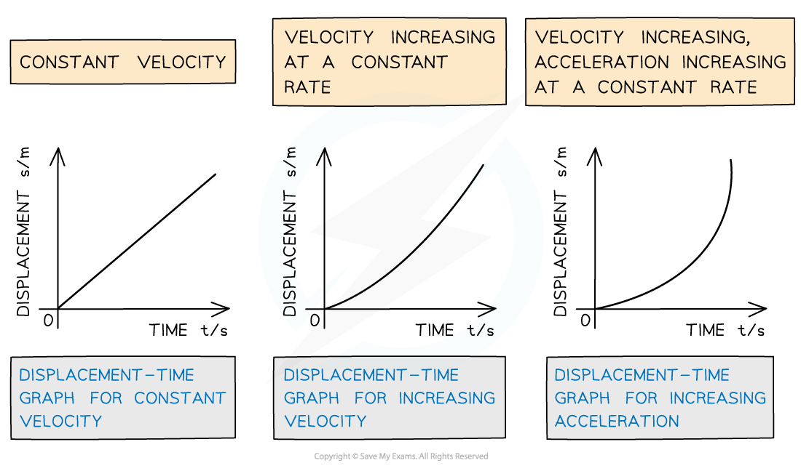
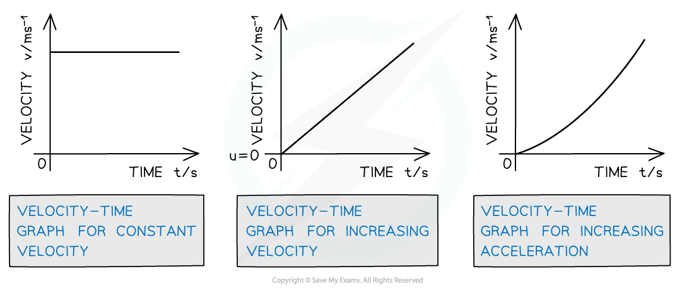
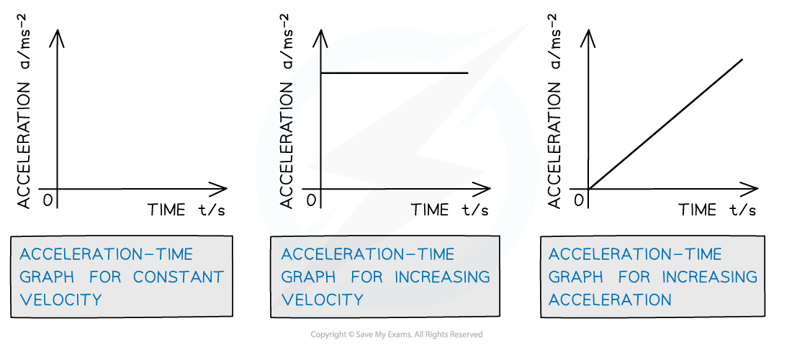

# Motion Graphs

## Motion Graphs

> **Spec point** — `spcpt_wMs9z2YnSgqQJrV3`

## Motion Graphs

- Three types of graph that are used to represent motion are** displacement-time** graphs, **velocity-time **graphs and **acceleration-time **graphs
- Graphs are named 'y-axis - x-axis', so 'displacement-time' simply means 'displacement on the y-axis and time on the x-axis'

- Graphs of motion can be thought of as telling a story of something which has happened in the real world, such as

  - the time, direction and average speed of a journey to school
  - initial and final velocity and acceleration as a rocket takes off from the launchpad
  - movement and speed in various directions as an athlete takes part in an event

- **Interpreting graphs** means using the slope of the line, or the area under the line to find information about that 'story'
- **Drawing graphs** is a skill where careful planning, plotting and line drawing from some data yields further information from an investigation

#### Displacement-Time

- On a **displacement-time graph;**

  - **Slope **equals **velocity**
  
    - A** straight **(diagonal) slope represents a **constant** velocity
    - A **curved** slope represents an **acceleration**
  - A **positive** **slope** represents motion in the **positive** **direction**
  - A **negative** **slope** represents motion in the **negative** **direction**
  - A **zero** slope (horizontal line) represents a state of **rest**
  - The area under the curve is meaningless

#### Velocity-Time

- On a **velocity-time graph…**

  - **Slope **equals **acceleration**
  
    - A **straight** line represents **uniform** acceleration
    - A **curved** line represents **non-uniform acceleration**
  - A **positive** slope represents an **increase** in **velocity** in the **positive** **direction**
  - A **negative** slope represents an **increase** in **velocity** in the **negative** **direction**
  - a **zero** slope (horizontal line) represents motion with **constant** **velocity**
  - The **area** under the curve equals the **displacement **or** distance **travelled

#### Acceleration-Time

- On an **acceleration-time graph…**
- A zero slope (horizontal line) represents an object undergoing constant acceleration
- The area under the curve equals the change in velocity
- The steepness of the slope is meaningless

***How displacement, velocity and acceleration graphs relate to each other***

#### Drawing Graphs

- Drawing a good graph is an important skill

- Good graphs have the following:

  - Each axis has two labels; the name of the variable and the unit (and may include a multiplier, for  example, m × 10−9)
  - Values on the axes are evenly spaced, with the same number of divisions for each amount 

  - The axes start at the origin **only **when this fits the data or the relationship being graphed is directly proportional **or **when specified in the question
  - Increments on the scale are in multiples of 2, 5 and 10 but **never **multiples of 3.
  - The range of values being plotted takes up the length of the axis, so that the plotted line takes up most of the space on the graph
  - Plots are accurate to within half a small square
  - Plots and curves are drawn with sharp pencil so that they are narrow (don't take up more than half a small square) 
  - Lines of best fit match the data, so that lines go through as many of the plots as possible (ignoring outliers) with the remainder evenly spaced above and below the line

> **Worked Example**
> A runner is practicing short sprints between two markers. A displacement-time graph showing part of their training is shown.
> 
> 
> 
> (a)   Find the distance between the markers
> 
> (b)   Determine the speed of the runner at the fastest part of their sprint
> 
> **Answer:**
> 
> **Part (a)**
> 
> **Step 1: Determine the direction of motion from the graph**
> 
> - Initially displacement increases from 0 - 50 m
> 
> - This represents the sprinter running away from the starting position
> 
> - Secondly displacement decreases from 50 - 0 m
> 
> - This represents the sprinter returning towards the starting position
> 
> **Step 2: Identify the sprinter's turning point on the graph **
> 
> - The distance between the markers is from 0 → turning around point
> 
> - This is 50 m from the start point
> 
> **Step 3: Write the correct answer**
> 
> Distance between the markers = 50 m
> 
> **  Part (b)**
> 
> **Step 1: Identify the part of the graph that represents the velocity**
> 
> - The graph shows displacement against time
> - Velocity is equal to:
> 
> $Velocity=\frac{displacement}{time}$
> 
> - Therefore, the slope of the displacement-time graph gives velocity
> - Displacement × time (area under the graph) is not a physical quantity
> 
> **Step 2: Identify the steepest section of the graph**
> 
> - Select the section on the graph where the slope is the steepest
> 
>   - This represents the **fastest velocity**
> 
>   - Clearly mark two points on this line which are as far apart as possible
> 
> 
> 
> **Step 3: Use the coordinates from the graph to calculate the slope**
> 
> slope = $\frac{increaseiny}{increaseinx}=\frac{45}{6}$= 7.5 m s−1
> 
> **Step 4: Write down the answer to the correct number of significant figures**
> 
> The sprinter's fastest speed = 7.5 m s−1

> **Worked Example**
> Motion has been plotted on a displacement-time graph.
> 
> 
> 
> Sketch a velocity-time graph for this motion. Include values and show your calculations.
> 
> **Answer:**
> 
> **Step 1: Calculate each stage:**
> 
> Part A
> 
> **Step 1: Determine the time interval**
> 
> Time from 0 - 10 s
> 
> **Step 2: Calculate the velocity by finding the gradient**
> 
> Gradient = $\frac{Δy}{Δx}$ = $\frac{20}{10}$ = 2 m s−1
> 
> Part B
> 
> **Step 1: Determine the time interval**
> 
> Time from 10 - 30 s
> 
> **Step 2: Calculate the velocity by finding the gradient**
> 
> Gradient = 0 (horizontal line), velocity = 0 m s−1
> 
> Part C
> 
> **Step 1: Determine the time interval**
> 
> Time from 30 - 40 s
> 
> **Step 2: Calculate the velocity by finding the gradient**
> 
> Gradient = $\frac{Δy}{Δx}$ = $\frac{50-20}{40-30}$ = 3 m s−1
> 
> Part D
> 
> **Step 1: Determine the time interval**
> 
> Time from 40 - 60 s
> 
> **Step 2: Calculate the velocity by finding the gradient**
> 
> Gradient = $\frac{Δy}{Δx}$ = $\frac{0-50}{60-40}$ = − 2.5 m s−1
> 
> **Step 2: Use the calculated values to sketch a graph**
> 
> 

> **Exam Hint**
> Interpreting Graphs
> 
> It's common for a question to ask you to solve something **'using a graphical method'**. This just means 'by finding your answer on a graph'.
> 
> In AS Physics most (but not all) graphs will be a straight line, meaning they follow the equation **y = mx + c**
> 
> This means that the 'graphical method' question is asking you to look at the **gradient**, or the **area under the line**. Once you are secure in finding these then graph questions will become much easier!
> 
> Drawing Graphs
> 
> A well-drawn graph will net you four or five quick and easy marks IF you have practiced the skill.
> 
> Common mistakes are starting at the origin when there is no need (so the line takes up less than half of the page) and trying to work with a scale that goes in multiples of three (making it hard to get the plotting right).
