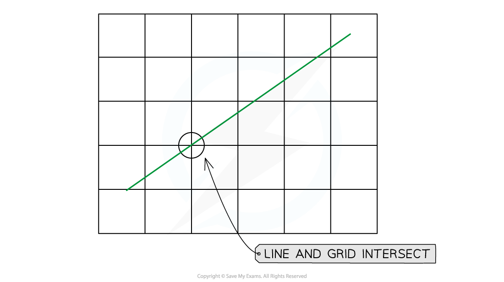
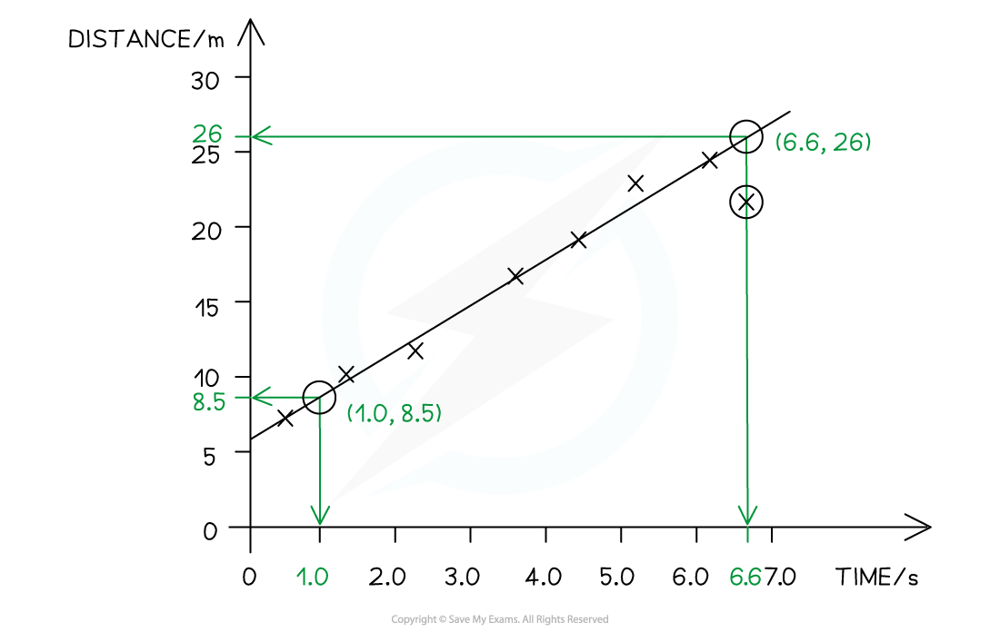
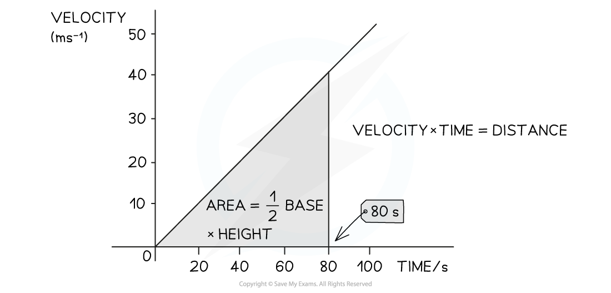
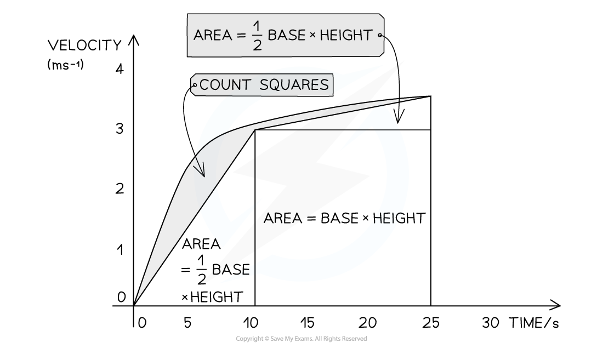
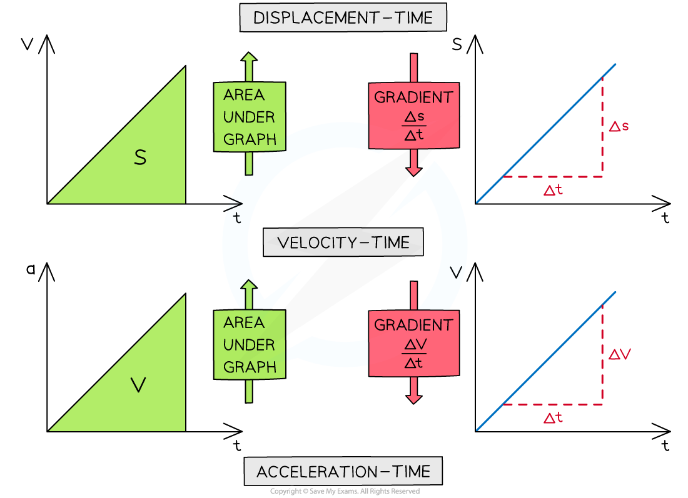
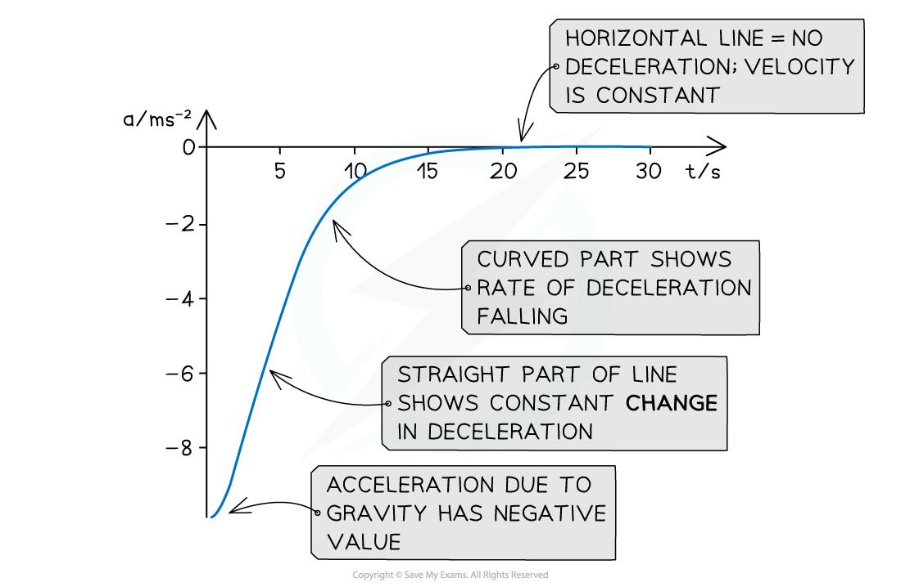
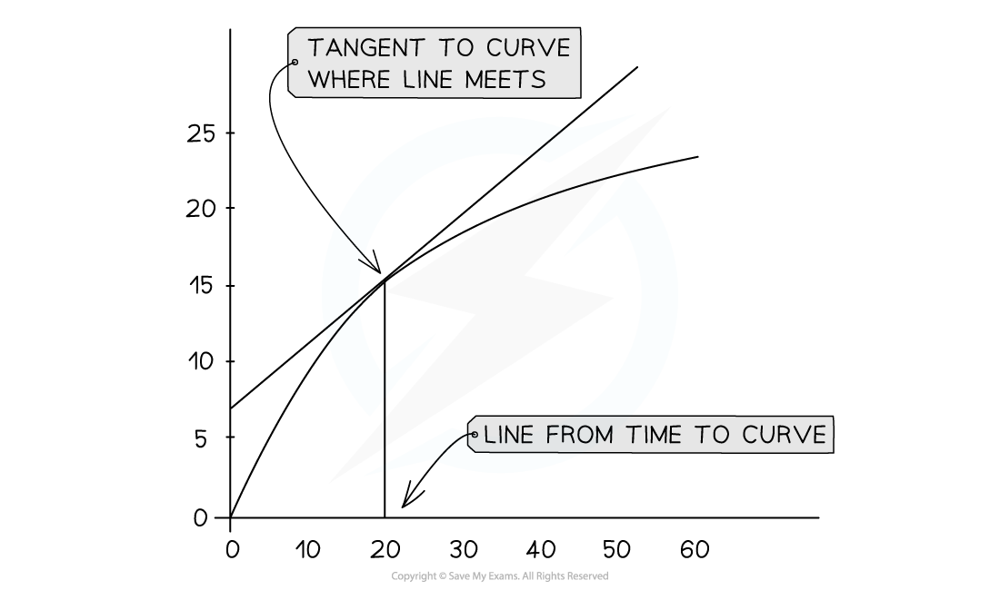

# Slope & Area of Motion Graphs

## Slope & Area of Motion Graphs

> **Spec point** — `spcpt_TqXPqYfYKqcdjPmk`

## Slope & Area of Motion Graphs

#### Slope & Area of Motion Graphs

- Three types of graph that are used to represent motion are** displacement-time** graphs, **velocity-time **graphs and **acceleration-time **graphs

- To interpret these find either the slope or the area

- **Slope **is found using $slope=\frac{changeiny}{changeinx}$, which can be related to any similar algebraic relationship, for example, $v=\frac{d}{t}$

  - The slope of a distance-time graph will equal velocity

- **Area** is found using area = change in y × change in x, which can be related to any similar algebraic relationship, for example, velocity  × time = distance

  - The area under a velocity-time graph will equal distance

#### Finding Slope of a Straight Line

- The slope of a line is found using the formula:

slope =$\frac{rise}{run}$

- This is also written:

slope = $\frac{increaseiny}{increaseinx}$

- To find the slope;

  - Identify two points **as far apart as possible** which intercept with the grid of the graph paper

- The points must be on the line itself, **not **the furthest apart plots

  - Clearly mark the points chosen
  - Find the co-ordinates of the two points
  - Calculate to find the slope

$\frac{increaseiny}{increaseinx}=\frac{(26-8.5)}{(6.6-1.0)}$ = 3.125

- Use the values on the axes of the graph (or in the data) to identify the correct significant figures
- Use the units to find the correct units, which also equal

units of slope = $\frac{unitsofy}{unitsofx}$

- On this graph all values are to 2 significant figures,
- Therefore slope = 3.1 m s−1

#### Finding the Area Under the Line

- The area underneath a line represents the x axis multiplied by the y axis.
- For example, if velocity is plotted on the y-axis and time is on the x-axis, then

  - area = velocity × time = distance
- When the area is a rectangle or a triangle it is easy to find by calculating

area of rectangle = base × height

area of a triangle = ½ base × height

***To find the area under a straight-line graph treat is as any rectangle or triangle***

- When the line is curved, area is found though the following steps

  - Divide the shape into rectangles and triangles as shown
  - Find the area for each by calculating
  - Count the remaining squares
  - Add the totals together

***Find area under a curve by dividing it into sections which reduce the number of squares to be counted to the minimum***

#### Non-uniform Acceleration

- In certain cases, acceleration changes throughout a period of motion
- An example of this is a skydiver falling due to their weight, against air resistance

  - As speed increases, air resistance increases
  - The increasing resultant force against the direction of motion acts to reduce acceleration
  - Eventually the weight and air resistance balance and acceleration become zero
  - Acceleration for a falling object is conventionally shown as a negative value

- Non-uniform acceleration will produce a curved velocity-time graph

#### Finding the Slope of a Curved Line

- Some questions ask for velocity or acceleration at a particular point or time
- This is called 'instantaneous' velocity or acceleration
- It is found by taking the slope of the curved line

- Identify the point on the x-axis which corresponds with the question

  - Draw a line vertically to meet the curve
- Take a *tangent *to the curve at this point

  - Do this carefully, trying out more than one attempt before choosing the correct tangent

***Tangents are a useful way to find the slope of a curved line***

- Draw the tangent in place, making it as long as will fit onto the graph

  - Follow the steps above to find the slope of the tangent

> **Worked Example**
> A skydiver jumps from a plane and reaches terminal velocity after 15 seconds. A graph of her motion is shown.
> 
> Use the graph to find the acceleration at 5 seconds.
> 
> 
> 
> **Answer:**
> 
> **Step 1: Draw a tangent to the curve at the point where t = 5 s**
> 
> 
> 
> **Step 2: Select points on the graph which are very far apart, and determine the corresponding values of x and y, write these down**
> 
> Increase in y = (58 -20) = 38 m s−1
> 
> Increase in x = (9.75 - 0.75) = 9.0 s
> 
> **Step 3: Calculate the slope**
> 
> slope = $\frac{increaseiny}{inreaseinx}=\frac{38}{9}$ = 4.222  m s−2
> 
> **Step 4: Write the answer to the correct significant figures**
> 
> The acceleration at 5.0 s = 4.2 m s−2 (2 sf)

> **Exam Hint**
> When working with graphs follow the advice, 'show don't tell'. The examiner will want to see that you used the graph to find your answer, as this skill is part of the toolkit of a good scientist.
> 
> Mark very clearly on the graph any points you use to calculate and indicate with clear lines or large triangles where you chose your data from.
> 
> And always remember to use the largest section of the graph that you can to find the slope.
> 
> You will be given an exam paper with pristine graphs. Don't leave them that way! By the time you finish with the paper, it should be clearly annotated with your method, so the examiner can see exactly where you have earned marks.
> 
> 
