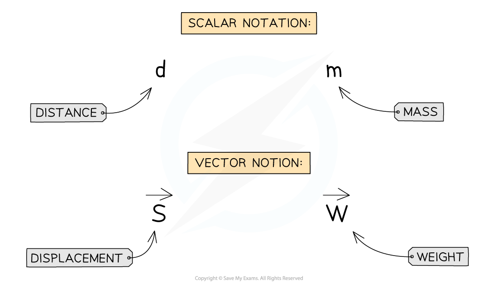

# Scalars & Vectors

## Scalars & Vectors

> **Spec point** — `spcpt_WQPB5Cz8NQgzScvV`

## Scalars & Vectors

- All quantities can be one of two types:

  - a **scalar**
  - a **vector**

### Scalars

- Scalars are quantities that have ***magnitude*** but not direction

  - For example, **mass** is a **scalar **quantity because it has **magnitude **but no direction

### Vectors

- Vectors are quantities that have both **magnitude** and **direction**

  - For example, **weight **is a **vector **quantity because it is a force and has **both **magnitude and direction

### Distance and displacement

- **Distance **is a measure of how far an object has travelled, **regardless of direction**

  - Distance is the total length of the path taken
  - Distance, therefore, has a **magnitude **but **no direction**
  - So, distance is a **scalar **quantity

- **Displacement **is a measure of how far it is between two points in space, **including the direction**

  - Displacement is the **length **and **direction** of a **straight line** drawn from the starting point to the finishing point
  - Displacement, therefore, has a **magnitude **and a **direction**
  - So, displacement is a **vector **quantity

#### What is the difference between distance and displacement?

***Displacement is a vector quantity while distance is a scalar quantity***

- When a student travels to school, there will probably be a **difference **in the distance they travel and their displacement

  - The **overall distance** they travel includes the total lengths of all the roads, including any twists and turns
  - The **overall displacement **of the student would be a straight line between their home and school, regardless of any obstacles, such as buildings, lakes or motorways, along the way

### Speed and velocity

- **Speed **is a measure of the **distance **travelled by an object per unit time, **regardless of the direction**

  - The speed of an object describes how fast it is moving, but **not **the direction it is travelling in
  - Speed, therefore, has **magnitude **but **no direction**
  - So, speed is a **scalar **quantity

- **Velocity **is a measure of the **displacement **of an object per unit time,** including the direction**

  - The velocity of an object describes how fast it is moving **and **which direction it is travelling in
  - An object can have a **constant speed** but a **changing velocity** if the object is **changing direction**
  - Velocity, therefore, has **magnitude and direction**
  - So, velocity is a **vector **quantity

### Examples of scalars & vectors

- The table below lists some common examples of scalar and vector quantities

#### Table of scalars and vectors

| **Scalars** | **Vectors** |
|---|---|
| distance | displacement |
| speed | velocity |
| mass | acceleration |
| time | force |
| energy | momentum |
| volume |   |
| density |   |
| pressure |   |
| electric charge |   |
| temperature |   |

### Vector notation

- Sometimes, vector quantities are written in a certain way to distinguish them from scalar quantities
- Some examples of scalar and vector notation are shown below:

***The arrow on vector notation does not indicate an actual direction, just that the quantity has a direction***

- This means writing the quantity to make it clear that it is a vector
- In textbooks, vectors are often shown as bold and italic, for example, ***F*** or ***s***
- Another form of notation, and easier to do in handwriting, is putting an arrow over the top of the quantity, for example, or $\overset{\rightarrow}{s}$

  - The arrow does **not **indicate the actual direction of the vector, only that it **has **a direction
