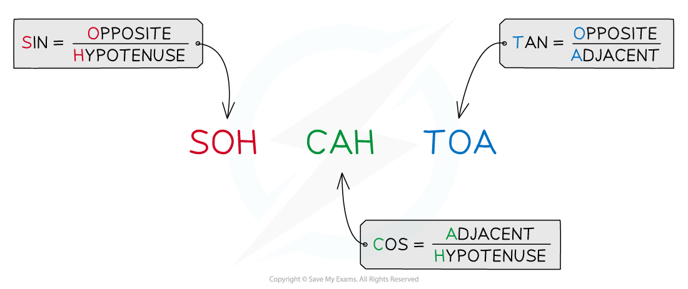

# Resolving Vectors

## Resolving Vectors

> **Spec point** — `spcpt_Khq5QyMfHHPRxXtf`

## Resolving Vectors

- **Vectors** are represented by an arrow

  - The **arrowhead** indicates the **direction** of the vector
  - The **length** of the arrow represents the **magnitude**
  - **Component **vectors are sometimes drawn with a dotted line and a **subscript **indicating horizontal or vertical for example *F**v* is the vertical component of the force F

#### Resolving Vectors

- A single resultant vector can be resolved

  - This means it can be represented by **two** vectors, which in combination have the same effect as the original one
  - Resolving vectors makes calculating much easier when working with projectiles or any motion or force at an angle
- When a single resultant vector is broken down into its **parts**, those parts are called **components**
- A vector of **magnitude *****F*** at **angle theta** to the horizontal is shown

#### Resolving Vectors by Scale Drawing

- To resolve vectors by scale drawing means carefully producing a scale drawing with all lengths and angles correct

  - This should be done using a sharp** pencil**, **ruler **and **protractor**
- Follow these steps

  - Choose a scale which fits to the page. For example, if resolving a resultant displacement of 100 m, use 1 cm = 10 m so that the resultant drawing is around 10 cm high
  - Clearly mark the starting point and a line to represent either the vertical or horizontal direction. This will depend on the angle given in the question, for example if the direction is '30o east of north' then start with a vertical line representing north
  - Carefully measure the angle and start by drawing the resultant vector
  - Draw a triangle using two of the sides of this rectangle

> **Worked Example**
> A hiker walks a distance of 6 km due east and 10 km due north.
> 
> By making a scale drawing of their route, find the magnitude of their displacement and its direction from the horizontal.
> 
> **Answer:**
> 
> **Step 1: Choose a sensible scale**
> 
> The distances are 6 and 10 km, so a scale of 1 cm = 1 km will fit easily on the page, but be large enough for an accurate scale drawing
> 
> **Step 2: Draw the two components using a ruler and making the measurements accurate to 1 mm**
> 
> 
> 
> **Step 3: Add the resultant vector, remembering the start and finish points of the journey**
> 
> 
> 
> **Step 4: Carefully measure the length of the resultant and convert using the scale**
> 
> 
> 
> **Step 5: Measure the angle between the vector and the horizontal line**
> 
> 
> 
> **Step 6: Write the complete answer, giving both magnitude and direction**
> 
> *R* = 11.7 = 12 km
> 
> θ = 59**°**east and upwards from the horizontal

#### Resolving Vectors by Calculation

- In this method a diagram is still essential but it does **not **need to be exactly to scale
- The diagram can take the form of a sketch, as long as the resultant, component and sides are clearly labelled
- Use **trigonometry **to resolve the two sides
- The mnemonic '**soh-cah-toa**' is used to remember how to apply sines and cosines to resolving sides of a triangle

- It is possible to **resolve** this vector into its **horizontal** and **vertical** components using trigonometry

***The resultant force F can be split into its horizontal and vertical components***

- For the **horizontal** component, ***F******x***** = *****F *****cos *****θ***
- For the **vertical** component, ***F******y***** = *****F *****sin *****θ***

> **Worked Example**
> A hiker walks a distance of 6 km due east and 10 km due north.
> 
> Calculate the magnitude of their displacement and its direction from the horizontal.
> 
> **Answer:**
> 
> 
> 
> 
> 
> **Step 4: State the final answer complete with direction**
> 
> *R* = 2√34 = 11.66 = 12 km
> 
> θ = 59**°**east and upwards from the horizontal

> **Exam Hint**
> Did you notice that the two worked examples above were the same question, being solved in two different ways?
> 
> If the question specifies calculation or scale drawing you must solve the problem as asked. However, if the choice is left up to you then any correct method will lead to the correct answer.
> 
> Scale drawing sometimes feels easier than calculating, but once you are confident with trigonometry and Pythagoras you will find calculating quicker and more accurate.
> 
> A quick tip to remember whether to use sin or cos is that when the resultant is closing down onto the angle, use cos.
> 
> 
