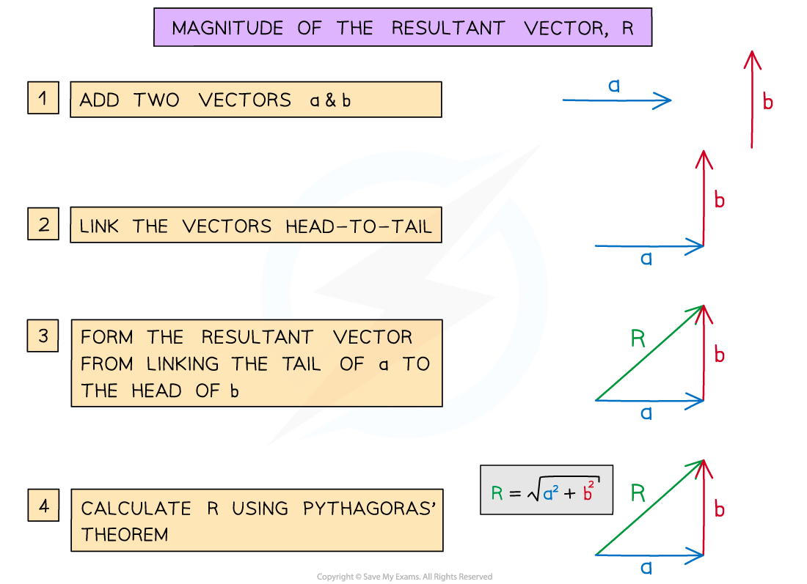
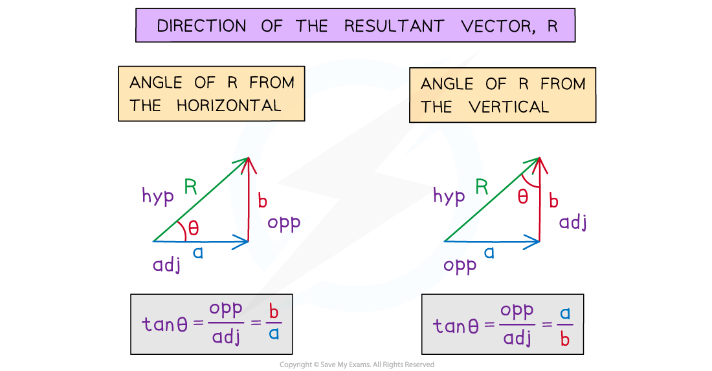

# Adding Vectors

## Adding Vectors

> **Spec point** — `spcpt_Fm7MhrkFfpZvmq5C`

## Adding Vectors

- Vectors can be combined by **adding **or **subtracting** them to produce the resultant vector

  - The resultant vector is sometimes known as the ‘net’ vector (eg. the net force)
- There are two methods that can be used to add vectors

  - **Calculation** – if the vectors are perpendicular
  - **Scale drawing** – if the vectors are not perpendicular

#### Combining Vectors Using a Scale Diagram

- There are two methods that can be used to combine vectors using a scale diagram: the **triangle method** and the** parallelogram method**

- To combine vectors using the triangle method:

  - **Step 1:** link the vectors head-to-tail
  - **Step 2:** the resultant vector is formed by connecting the tail of the first vector to the head of the second vector

- To combine vectors using the parallelogram method:

  - **Step 1:** link the vectors tail-to-tail
  - **Step 2:** complete the resulting parallelogram
  - **Step 3:** the resultant vector is the diagonal of the parallelogram

> **Worked Example**
> Draw the vector c = a + b
> 
> **Answer:**
> 
> 

> **Worked Example**
> Draw the vector c = a – b
> 
> **Answer:**
> 
> 
> 
> 

#### Combining Vectors by Calculating

- Combining vectors by calculation is a two-step process

  - Finding the direction of the resultant using trigonometry
  - Finding the magnitude of the resultant using Pythagoras

***The magnitude of the resultant vector is found by using Pythagoras’ Theorem***

- The direction of the resultant vector is found from the angle it makes with the horizontal or vertical

  - The question should imply which angle it is referring to (ie. Calculate the angle from the x-axis)
- Calculating the angle of this resultant vector from the horizontal or vertical can be done using **trigonometry**

  - Either the sine, cosine or tangent formula can be used depending on which vector magnitudes are calculated

***The direction of vectors is found by using trigonometry***

> **Worked Example**
> A swimmer is crossing a river by swimming due north at 2 m s−1. The current flows east at 5 m s−1.
> 
> Determine the resultant velocity of the swimmer's motion.
> 
> **Answer:**
> 
> **Step 1: Sketch a diagram, including all known values**
> 
> 
> 
> **Step 2: Calculate the magnitude of the resultant using Pythagoras**
> 
> $R=\sqrt{V_{s}^{2}+V_{c}^{2}}=\sqrt{4+25}$= 5.4
> 
> **Step 3: Calculate the angle using trigonometry**
> 
> `table attributes columnalign left end attributes row cell t a n theta equals 2 over 5 equals 0.4 end cell row cell theta equals tan to the power of negative 1 end exponent left parenthesis 0.4 right parenthesis end cell end table`
> 
> *θ* = 21.8
> 
> **Step 4: Write the answer in full giving both magnitude and direction of the velocity and all units**
> 
> The swimmer's velocity is 5.4 ms-1 at 22o to the horizontal direction
