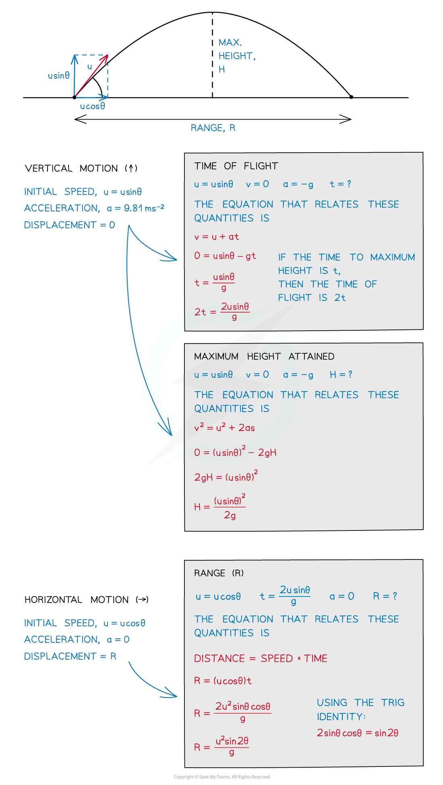

# Components of Velocity

## Components of Velocity

> **Spec point** — `spcpt_MPWS6DHwmBMNVcdm`

## Components of Velocity

- The trajectory of an object undergoing projectile motion consists of a **vertical** component and a **horizontal** component

  - These need to be evaluated separately
- Some key terms to know, and how to calculate them, are:

  - **Time of flight:** how long the projectile is in the air
  - **Maximum height attained: **the height at which the projectile is momentarily at rest
  - **Range:** the horizontal distance traveled by the projectile

***How to find the time of flight, maximum height and range***

#### Problems Involving Projectile Motion

- There are two main considerations for solving problems involving two-dimensional motion of a projectile

  - Constant velocity in the horizontal direction
  - Constant acceleration in a perpendicular direction

- The only force acting on the projectile, after it has been released, is **gravity**
- There are three possible scenarios for projectile motion:

  - **Vertical** projection
  - **Horizontal** projection
  - **Projection** at an **angle**

> **Worked Example**
> #### To Calculate Vertical Projection (Free Fall)
> 
> A science museum designed an experiment to show the fall of a feather in a vertical glass vacuum tube.
> 
> The time of fall from rest is 0.5 s.
> 
> 
> 
> What is the length of the tube, L?
> 
> **Answer:**
> 
> 

> **Worked Example**
> #### To Calculate Horizontal Projection
> 
> A motorcycle stunt-rider moving horizontally takes off from a point 1.25 m above the ground, landing 10 m away as shown.
> 
> What was the speed at take-off? (ignoring air resistance)
> 
> 
> 
> **Answer:**
> 
> 

> **Worked Example**
> #### To calculate projection at an angle
> 
> A ball is thrown from a point P with an initial velocity u of 12 m s-1 at 50° to the horizontal.
> 
> What is the value of the maximum height at Q? (ignoring air resistance)
> 
> 
> 
> **Answer:**
> 
> 

> **Exam Hint**
> In almost every question using the SUVAT equations one component of velocity will have constant acceleration (for example, the vertical component of projectile motion) and the other will have no acceleration (for example the horizontal component of projectile motion when we ignore air resistance).
> 
> The trick which you nearly always have to remember is find the common value - time - first, then substitute it into the second part of your calculation.
> 
> As long as your working is clear, even if you forget, you are likely to still achieve half marks. But writing good clear Maths and remembering this tip should get you to the end of your calculation - and full marks!
> 
> And finally.... don't forget that deceleration is **negative **as the object rises.
