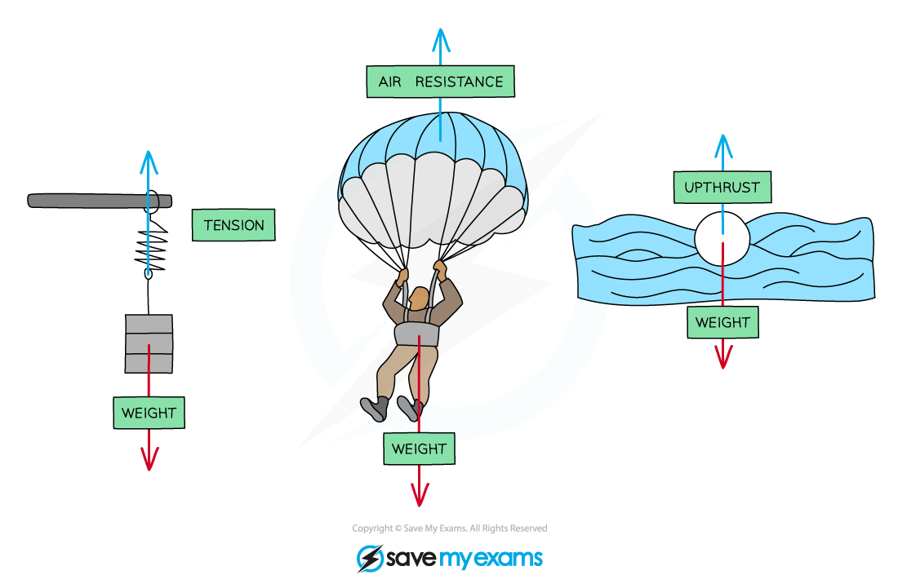
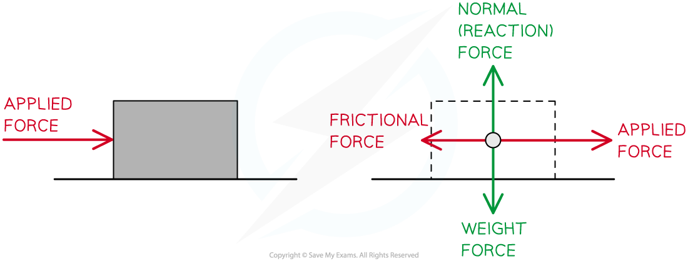
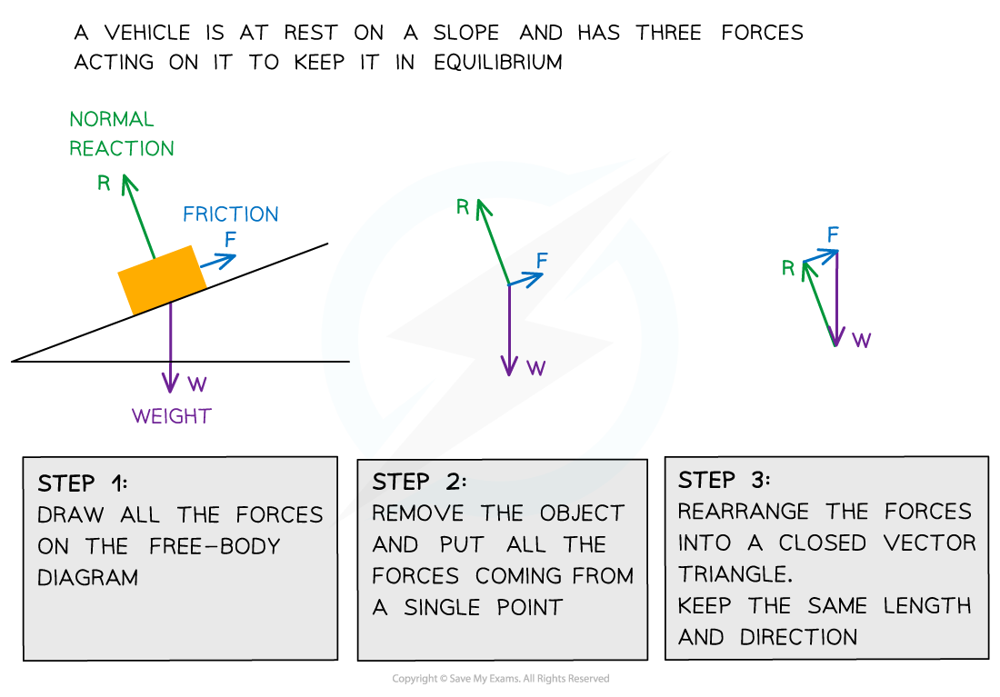

# Free-body Force Diagrams

## Free-body Force Diagrams

> **Spec point** — `spcpt_9mkJMnKBzyz9NCSR`

## Free-body Force Diagrams

- Free body diagrams are useful for modeling the forces that are acting on an object
- Each force is represented as a **vector** arrow, where each arrow:

  - Is scaled to the **magnitude** of the force it represents
  - Points in the **direction** that the force acts
  - Is **labelled** with the name of the force it represents or an appropriate symbol

- Free body diagrams can be used:

  - To identify which forces act in which plane
  - To resolve the net force in a particular direction

#### Simple Free Body Diagrams

- The rules for drawing a free-body diagram are the following:

  - **Rule 1:** Draw a point in the *centre of mass* of the body
  - **Rule 2:** Draw the body free from contact with any other object
  - **Rule 3:** Draw the forces acting on that body using vectors with correct direction and proportional length

***Free body diagrams can be used to show the various forces acting on objects***

#### Forces on a Particle or an Extended but Rigid Body

- Free body diagrams simplify problems by reducing complex shapes into simple one
- Any object can be thought of as a particle

  - Even something as large as the Earth can be modelled as a point mass for most calculations
- Objects can also be thought of as being **extended but rigid bodies**

  - This simply means that all parts stay in the same position relative to each other when the object moves

***Point particle representation of the forces acting on a moving object***

- The below example shows an object sitting on a slope in equilibrium

***Three forces on an object in equilibrium form a closed vector triangle***

> **Worked Example**
> Draw free-body diagrams for the following scenarios:
> 
> a) A picture frame hanging from a nail
> 
> b) A box sliding down a slope
> 
> **Answer:**
> 
> **Part (a)**
> 
> **A picture frame hanging from a nail:**
> 
> 
> 
> - The size of the arrows should be such that the 3 forces would make a closed triangle as they are **balanced**
> 
> **Part (b)**
> 
> **A box sliding down a slope:**
> 
> 
> 
> - There are three forces acting on the box:
> 
>   - The **normal contact force**, *R*, acts perpendicular to the slope
>   - **Friction**, *F*, acts parallel to the slope and in the opposite direction to the direction of motion
>   - **Weight**, *W*, acts down towards the Earth

> **Exam Hint**
> When labeling force vectors, it is important to use conventional and appropriate naming or symbols such as:
> 
> - ***w ***or Weight force or ***mg***
> - ***N**** or* ***R ***for normal reaction force (depending on your local context either of these could be acceptable)
> 
> Getting used to this notation will make labelling free-body diagrams automatic - leaving you time to focus on the Physics rather than the process. This is crucial as a good diagram will show you exactly what to include in your calculations.
