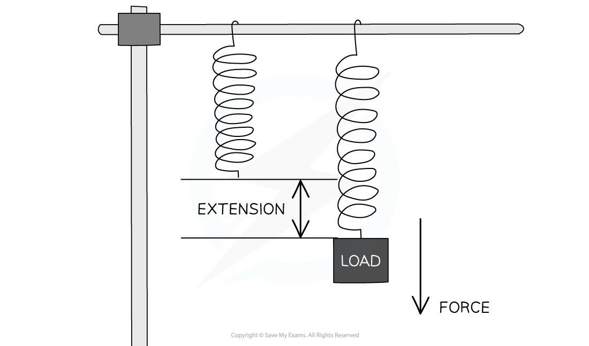
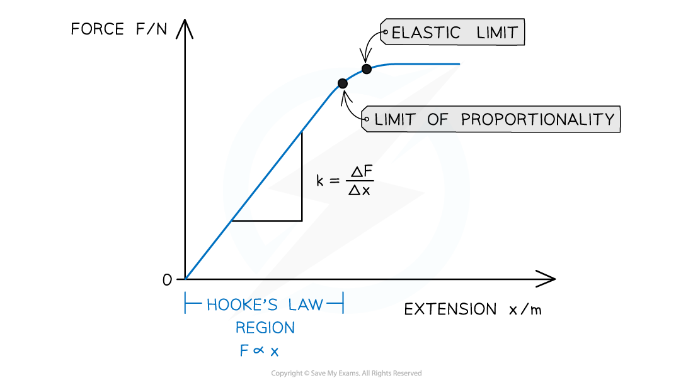

# Hooke's Law

## Hooke's Law

> **Spec point** — `spcpt_rGp523545KcHTjhP`

## Hooke's Law

- When a force *F* is added to the bottom of a vertical metal wire of length *L*, the wire **stretches**
- A material obeys Hooke’s Law if: **The extension of the material is directly proportional to the applied force (load) up to the limit of proportionality**
- This linear relationship is represented by the Hooke’s law equation:

*ΔF* = *k*Δ*x*

- Where:

  - *F* = applied force (N)
  - *k* = spring constant (N m–1)
  - Δ*x* = extension (m)

- The spring constant is a property of the material being stretched and measures the **stiffness** of a material

  - The larger the spring constant, the stiffer the material
- Hooke's Law applies to both **extensions** and **compressions**:

  - The extension of an object is determined by how much it has **increased** in length
  - The compression of an object is determined by how much it has **decreased** in length

***Stretching a spring with a load produces a force that leads to an extension***

#### Force–Extension Graphs

- The way a material responds to a given force can be shown on a force-extension graph
- A material may obey Hooke's Law up to a point

  - This is shown on its force-extension graph by a **straight line through the origin**
- As more force is added, the graph may start to curve slightly

***The Hooke's Law region of a force-extension graph is a straight line. The spring constant is the gradient of that region***

- The key features of the graph are:

  - **The limit of proportionality: **The point beyond which Hooke's law is no longer true when stretching a material i.e. the extension is no longer proportional to the applied force
  
    - The point is identified on the graph where the line starts to curve (flattens out)
  - **Elastic limit:** The maximum amount a material can be stretched and still return to its original length (above which the material will no longer be *elastic*). This point is always **after** the limit of proportionality
  
    - The **gradient** of this graph is equal to the **spring constant *****k***

> **Worked Example**
> A spring was stretched with increasing load.
> 
> The graph of the results is shown below.
> 
> 
> 
> What is the spring constant?
> 
> **Answer:**
> 
> **Step 1: Rearrange Hooke's Law to make the spring constant the subject**
> 
> $k=\frac{ΔF}{Δx}$
> 
> **Step 2: Compare the gradient to the equation in Step 1**
> 
> - This graph is length - extension, so the gradient gives:
> 
> $\frac{increaseiny}{increaseinx}=\frac{Δx}{ΔF}$
> 
> - Therefore k is the reciprocal of the gradient
> 
> **Step 3:  Find the gradient**
> 
> 
> 
> **Step 4: Calculate gradient**
> 
> $gradient=\frac{Δx}{ΔF}=\frac{(0.145-0.10)}{0.36}=0.125$
> 
> **Step 5: Calculate the spring constant by finding the reciprocal of the gradient**
> 
> $k=\frac{1}{0.125}=8.0$
> 
> **Step 6: Write the answer, including units**
> 
> - Spring constant, k = 8.0 N m−1

> **Exam Hint**
> Always double check the axes before finding the spring constant as the gradient of a force-extension graph. Exam questions often swap the force (or load) onto the x-axis and extension (or length) on the y-axis.
> 
> In this case, the gradient is **not** the spring constant, it is **1 ÷ gradient** instead.
