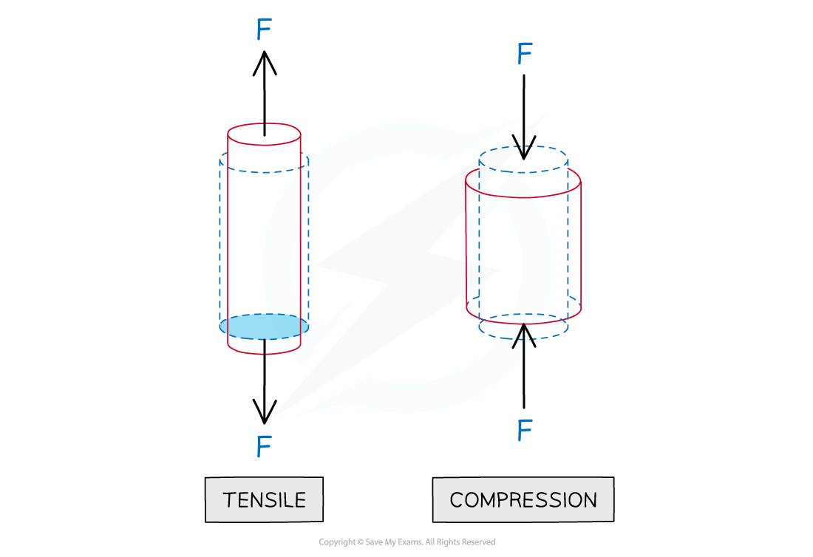
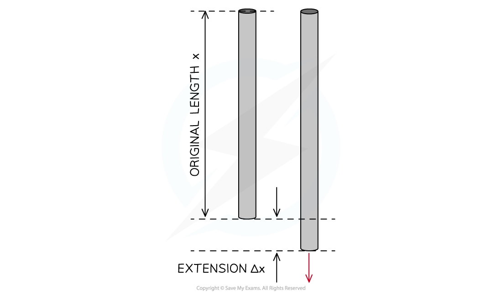

# Stress, Strain & The Young Modulus

## Stress & Strain

> **Spec point** — `spcpt_JzjPh7wgdbYKkgxH`

## Stress & Strain

#### Stress

- Stress is the **applied force per unit cross sectional area** of a material
- Forces can be;

  - Tensile forces, which pull on an object and extend it
  - Compressive forces, which push onto an object and compress (or squash) it

- The equation for stress is the force per unit area, and so the units are N m−2, or Pascals, the same unit as pressure 

***Stress equation***

- The **ultimate tensile stress** is the **maximum** force per original cross-sectional area a wire is able to support until it breaks

#### Strain

- Strain is the **extension per unit length**

***Strain is the ratio of the extension (or compression) and the original length***

- This is a deformation of a solid due to stress in the form of elongation or contraction
- Note that strain is a **dimensionless** unit because it’s the ratio of lengths

***Strain equation***

## The Young Modulus

> **Spec point** — `spcpt_GBPjQFZwby7X6wtb`

## The Young Modulus

#### Young Modulus

- The Young modulus (sometimes called Young's Modulus) is the measure of the ability of a material to withstand changes in length with an added load ie. how stiff a material is
- This gives information about the elasticity of a material
- The Young Modulus is defined as the** ratio of stress and strain**

***Young Modulus equation***

- Its unit is the same as stress: **Pa** (since strain is unitless)
- Just like the Force-Extension graph, stress and strain are directly proportional to one another for a material exhibiting *elastic* behaviour

***A stress-strain graph is a straight line with its gradient equal to Young modulus***

- The **gradient** of a stress-strain graph when it is linear is the **Young Modulus**

> **Worked Example**
> A metal wire that is supported vertically from a fixed point has a load of 92 N applied to the lower end.
> 
> The wire has a cross-sectional area of 0.04 mm2 and obeys Hooke’s law.
> 
> The length of the wire increases by 0.50%.What is the Young modulus of the metal wire?
> 
> **A.** 4.6 × 107Pa
> 
> **B. **4.6 × 1012 Pa
> 
> **C. **4.6 × 109 Pa
> 
> **D.** 4.6 × 1011 Pa
> 
> 

> **Exam Hint**
> To remember whether stress or strain comes first in the Young modulus equation, try thinking of the phrase ‘When you’re stressed, you show the strain’ i.e. Stress ÷ strain.
