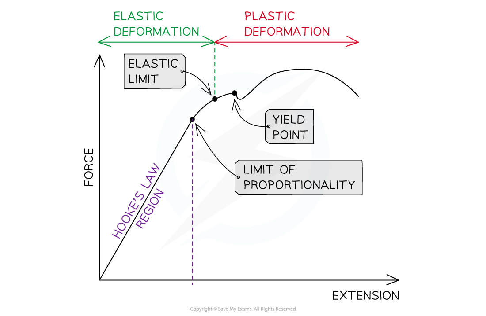

# Force-Extension Graphs

## Force-Extension Graphs

> **Spec point** — `spcpt_kWTdjNmyQxYjFgvb`

## Force-Extension Graphs

- The way a material responds to a tensile or compressive force can be shown on a force-extension, or a force-compression graph

  - Although compression can be put into **equations **as a **negative **value, the graphs have the same shaped curves
  - Compression is plotted on the **graph **as a **positive**, increasing value

- Every material will have a unique force-extension graph depending on how ***brittle*** or ***ductile*** it is
- In the same way, materials have unique force-compression graphs, which will not be the same as their force-extension graph

  - This is because materials behave differently under tensile and compressive strain

#### Simple Force-Extension Graphs

***Simple force-extension graph showing the Hooke's Law region, and the calculation to find k, the spring constant***

- A material may obey Hooke's Law up to a point

  - This is shown on its force-extension graph by a **straight line through the origin**
- As more force is added, the graph may start to curve slightly

The key features of the graph are:

- **The limit of proportionality**

  - The point **beyond **which Hooke's law is no longer true when stretching or compressing a material i.e. the extension/ compression is no longer proportional to the applied force
  - The point is identified on the graph where the line starts to curve

- **The elastic limit**

  - The point **before **which a material will** return to its original length or shape** when the deforming force is removed
  - This point is always **after** the limit of proportionality

- **The spring constant *****k*** is found from the **gradient **of the straight part of the graph

#### More Detailed Force-Extension Graphs

- Graphs of applied load-extension can give more detailed information about materials

  - This will apply when loads were continued well past the elastic limit

***Detailed force-extension graph showing a material under loads which exceed the elastic limit***

- **The yield point** is where the material continues to stretch even though no extra force is being applied to it
- **Elastic deformation** is a change of shape where the material **will return to its original shape** when the load is removed
- **Plastic deformation** occurs after the yield point

  - It is a change of shape where the material will **not return to its original shape** when the load is removed

> **Worked Example**
> The graph below shows force plotted against extension for a material under compressive forces.
> 
> 
> 
> Use the letters marked to identify the elastic limit and yield point, and define both terms.
> 
> **Answer:**
> 
> **Step 1: Define both terms**
> 
> - Elastic limit: point before which a material will return to its original length or shape when the deforming force is removed
> - Yield point: the point at which the continues to stretch even though no extra force is being applied to it
> 
> **Step 2: Using your definitions as prompts, select the correct point on the graph**
> 
> - Elastic limit is at **B** because the line has curved slightly after the Hooke's law region but not started to extend with no extra force
> - Yield point is at **C** because the line increases in the x-direction (extension is increasing) but not in the y-direction (no extra force is being added)

> **Exam Hint**
> The detailed graph looks confusing at first because it is such an unusual shape. Try tracing out the line with your finger to see how force and extension are related at each point on the graph.
> 
> When defining the terms, be very careful to state whether the material behaves in certain ways either **before **or **after **reaching that point.
> 
> For example, the limit of proportionality is the point '**beyond which'** Hooke's Law no longer applies, **not '**at which'.
