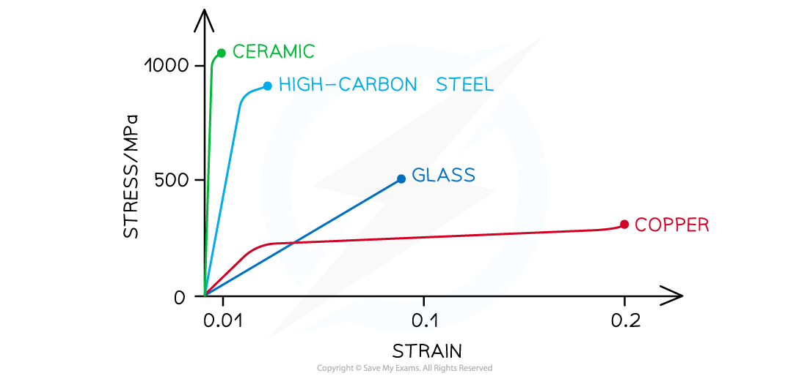
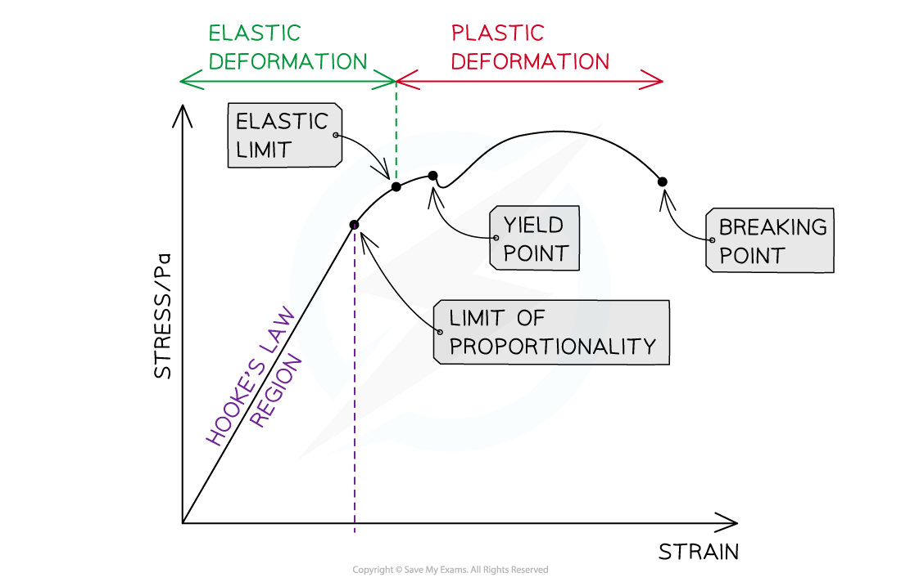

# Stress-Strain Graphs

## Stress-Strain Graphs

> **Spec point** — `spcpt_8gzTdShg6mrsHTg8`

## Stress-Strain Graphs

- Stress-strain curves give an indication of the properties of materials such as

  - Up to what stress and strain they obey Hooke's Law
  - Whether they exhibit elastic and/or plastic behaviour
  - The value of their *Young Modulus*
  - The value of their **breaking stress**
- Each material has a unique stress-strain curve

***Stress-strain graph for different materials up to their breaking stress***

#### Comparing Force-Extension to Stress-Strain Graphs

The key features of the graph which are also on the force-extension graph are:

- **Limit of proportionality**, beyond which Hooke's law no longer applies
- **The elastic limit**, before which a material returns to its original length or shape when the deforming force is removed
- The** yield point** beyond which the material continues to stretch (more strain is seen) even though no extra force is being applied to it (without additional stress)
- **Elastic deformation** where the material **will return to its original shape** when the load is removed
- **Plastic deformation** where the material will **not return to its original shape** when the load is removed

***The important points shown on a stress-strain graph***

The stress-strain graph is also used to find;

- The **Young Modulus **is found from the gradient of the straight part of the graph
- **Breaking stress** (also called fracture stress) is the stress at the point where the material breaks

  - At the yield point the atoms in the material had started to move relative to each other, at the breaking stress they separate completely
  - Breaking stress is not the same as ultimate tensile stress which is marked on many graphs

> **Worked Example**
> The graph below shows a stress-strain curve for a copper wire.
> 
> 
> 
> From the graph, state the value of:
> 
> (a) The breaking stress
> 
> (b) The stress at which plastic deformation begins
> 
> **Answer:**
> 
> **Part (a)**
> 
> **Step 1: Define breaking stress**
> 
> - The breaking stress is the maximum stress a material can stand before it fractures. This is the stress at the final point on the graph
> 
> **Step 2: Determine breaking stress from the graph**
> 
> - Draw a line to the y axis at the point of fracture
> 
> 
> 
> The breaking stress is 190 MPa
> 
> **Part (b)**
> 
> **Step 1: Define plastic deformation**
> 
> - Plastic deformation is when the material is deformed permanently and will not return to its original shape once the applied force is removed
> - This is shown on the graph where it is curved
> 
> **Step 2: Determine the stress of where plastic deformation beings on the graph**
> 
> - Draw a line to the y axis at the point where the graph starts to curve
> 
> 
> 
> Plastic deformation begins at a stress of 130 MPa

> **Exam Hint**
> It is a very common exam question to be asked to define some of the key points on this graph, or to identify them from a graph.
> 
> Make sure you have cleared up exactly what the differences are between the limit of proportionality, elastic limit and yield point. It's easy to get confused between them so practice sketching the graph, and labelling the points with their definitions.
