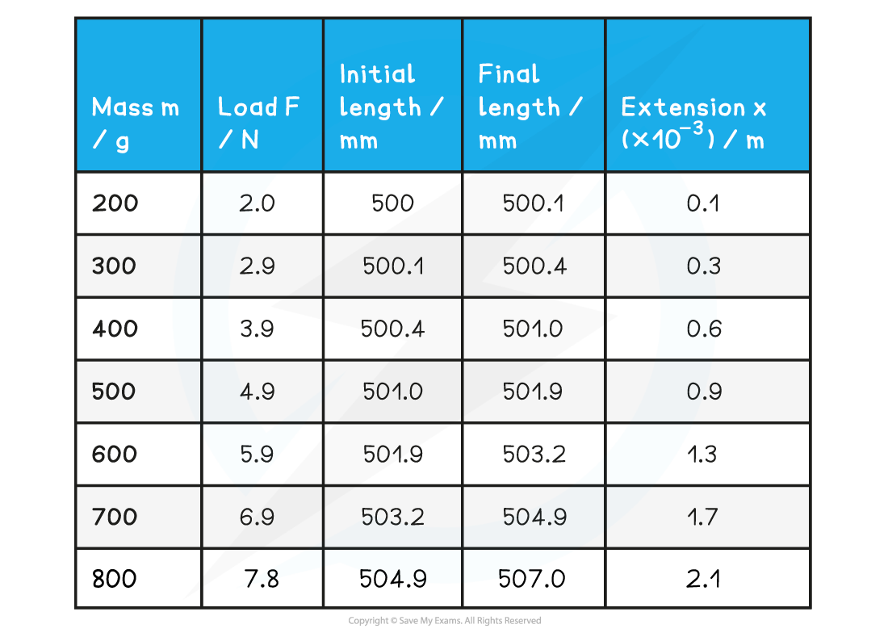
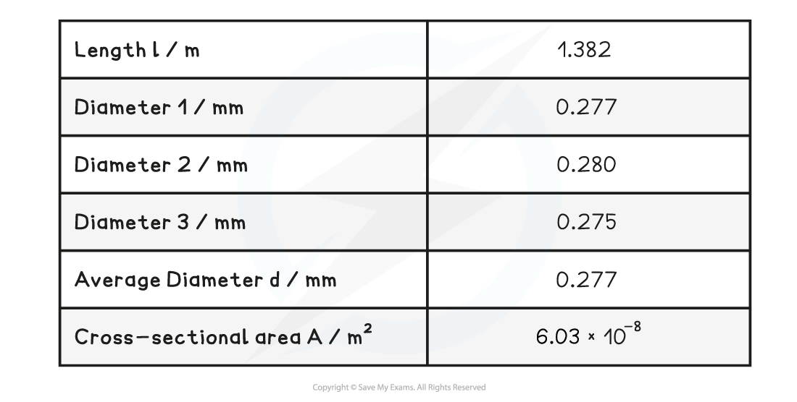
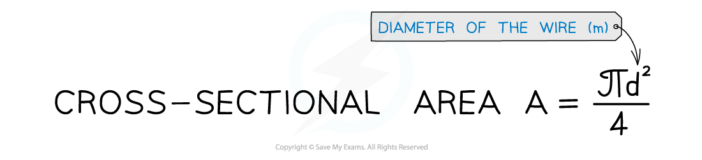
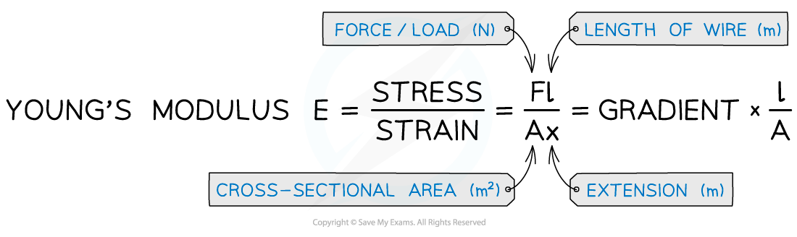

# Core Practical 3: Investigating Young Modulus

## Core Practical 3: Investigating Young Modulus of a Material

> **Spec point** — `spcpt_rk28rd5xSWYrqpf3`

## Core Practical 3: Investigating Young Modulus of a Material

- To measure the Young Modulus of a metal in the form of a wire requires a clamped horizontal wire over a pulley (or vertical wire attached to the ceiling with a mass attached) as shown in the diagram below

- A reference marker is needed on the wire. This is used to accurately measure the extension with the applied load
- The independent variable is the **load**
- The dependent variable is the **extension**

#### Method

1. Measure the original length of the wire using a metre ruler and mark this reference point with tape
2. Measure the diameter of the wire with micrometer screw gauge or digital calipers
3. Measure or record the mass or weight used for the extension e.g. 300 g
4. Record initial reading on the ruler where the reference point is
5. Add mass and record the new scale reading from the metre ruler
6. Record final reading from the new position of the reference point on the ruler
7. Add another mass and repeat method

#### Reducing Uncertainty

- To reduce the uncertainty in the final answer, take the following precautions when measuring

  - Take pairs of readings of the diameter right angles to each other, to ensure the wire is circular
  - Six to ten readings altogether is enough to get an average value
  - Remove the load and check the wire returns to the original limit after each reading. A little 'creep' is acceptable but a large amount indicates that the elastic limit has been exceeded
  - Take several readings with different loads and find average
  - Use a Vernier scale to measure the extension of the wire

#### Measurements to Determine the Young Modulus

1. Determine extension *x* from final and initial readings

**Example table of results:**

**Table with additional data**

2. Plot a graph of force against extension and draw line of best fit

3. Determine gradient of the force v extension graph

4. Calculate cross-sectional area from:

5. Calculate the Young modulus from:

#### Safety Considerations

- Safety glasses should be worn in case of the wire snapping
- Protect feet and the floor from falling weights by cushioning the area underneath the weights

> **Exam Hint**
> Although every care should be taken to make the experiment as reliable as possible, you will be expected to suggest improvements in producing more accurate and reliable results
> 
> Good examples of improvements in any experiment are:
> 
> - Take repeat readings and take an average to improve accuracy
> - Measure longer distances, such as using a longer length of wire, to reduce percentage error
