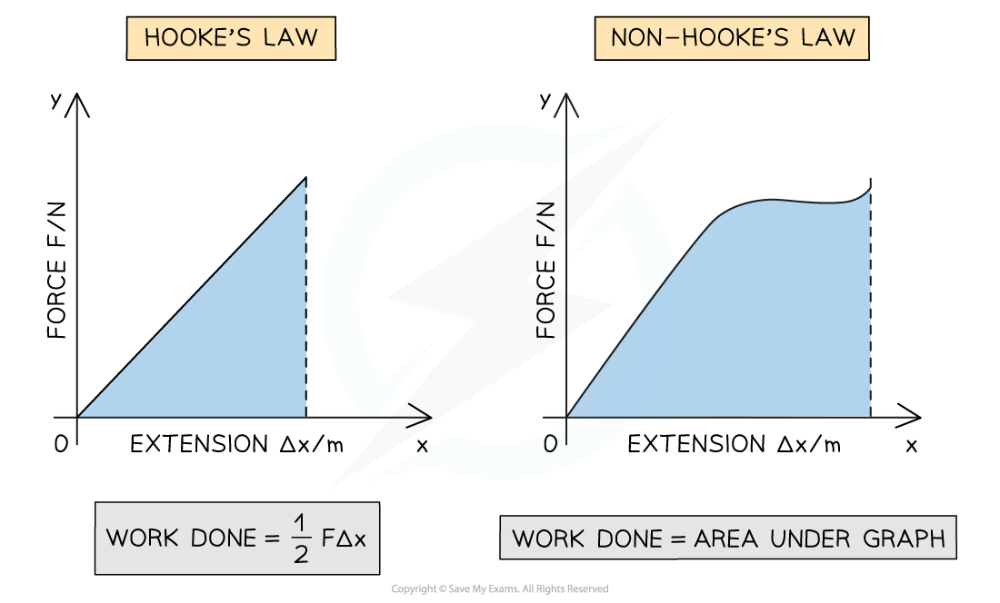

# Elastic Strain Energy

## Area Under a Force-Extension Graph

> **Spec point** — `spcpt_F79kYx4g4RHWMkJQ`

## Area Under a Force-Extension Graph

- For a material which obeys Hooke's law, the elastic strain energy, *E**el* can be determined by finding the area under the force-extension graph

  - Since this area will be a triangle with sides *F* (force) and *x *(extension) the equation is:

$ΔE_{el}=\frac{1}{2}FΔx$

- Where:

  - *E**el** = *elastic strain energy (or work done) (J)
  - *F* = average force (N)
  - Δ*x = *extension (m)
- Since Hooke's Law states that ***F***** = *****k*****Δ*****x***, the elastic strain energy can also be written as: * *

$ΔE_{el}=\frac{1}{2}k(Δx)^{2}$

- Where:

  - *k* = spring constant (N m–1)

> **Worked Example**
> The graph shows the behaviour of a sample of a metal when it is stretched until it starts to undergo plastic deformation.
> 
> 
> 
> What is the total work done in stretching the sample from zero to 13.5 mm extension?
> 
> Simplify the calculation by treating the curve XY as a straight line.
> 
> **Answer:**
> 
> 
> 
> 

> **Exam Hint**
> Make sure that you are familiar with the area of common 2D shapes such as a square, rectangle, right-angled triangle and trapezium. Don't forgot to split the area of the graph up into these easier shapes and add up the area of each section for more complicated graphs! Always look at the units of the extension and the force, and check any unit conversions before giving your final answer.

## Elastic Strain Energy

> **Spec point** — `spcpt_btrWXdyKjmfCsnfj`

## Elastic Strain Energy

- Work has to be done to stretch a material
- Before a material reaches its *elastic limit* (whilst it obeys Hooke's Law), all the work is done is stored as **elastic strain energy**
- The work done, or the elastic strain energy is the **area under the force-extension graph**

***Work done is the area under the force-extension graph***

- This is true for whether the material obeys Hooke's law or not

#### Linear Graphs

- For the region where the material **obeys** Hooke's law, the work done is the area of a **right-angled triangle** under the graph

#### Non-linear Graphs

- For the region where the material **doesn't obey Hooke's law, the area is the full region **under the graph.
- To calculate this area, split the graph into separate segments and add up the individual areas of each
- For the remaining part, **count the squares** left over

  - Before adding squares to the total they must be converted using the values on the axes
  - For example, if each division on the y-axis = 0.1 N and each division on the x-axis = 0.2 m, then each square = 0.1 × 0.2 N m = 0.02 N m

> **Worked Example**
> For the force extension graph shown, determine the work done in stretching the material.
> 
> 
> 
> **Answer:**
> 
> **Step 1: Choose which aspect of the graph will give the answer**
> 
> - This is a force-extension graph,
> - Since work done = force × distance, find the area under the graph
> 
> **Step 2: Divide the area under the line into geometric shapes, using as much of the space as possible**
> 
> 
> 
> **Step 3: For each shape calculate the area and find the total**
> 
> Total of geometric shapes = 0.025 + 0.05 + 0.75 + 1.5 +0.015 = 2.34
> 
> 
> 
> **Step 4: For the remaining area count squares then convert**
> 
> - Total of counted squares
> 
> 7 + 13 = 20
> 
> - Value of each small square
> 
> 0.1 N × 0.01 m = 0.001 N m
> 
> - Multiply to find value of area of counted squares
> 
> 20 × 0.001 = 0.02
> 
> **Step 5: Add the totals together to find the area**
> 
> 2.34 + 0.02 = 2.36
> 
> **Step 6: Write the final answer to the same significant figures as the data from the graph and include units**
> 
> - Work done stretching the material = 2.4 J

> **Exam Hint**
> As you add up your final totals you may find that the value of the left over squares is more than the rest of the graph. This means you have forgotten to convert the number of squares into their actual value. Go back and do that step and your answer will come out right!
